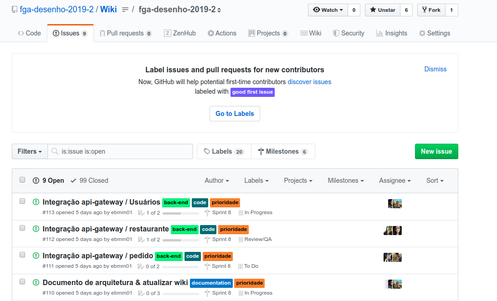

## Histórico de Contribuição da Equipe

| Data       | Versão | Descrição                                                               | Autor                                              |
| ---------- | ------ | ----------------------------------------------------------------------- | -------------------------------------------------- |
| 17/11/2019 | 0.1    | Subindo o modelo padrão do documento                                    | [Saleh Kader](https://github.com/devsalula)        |
| 17/11/2019 | 0.2    | Adicionando Fluxo de Trabalho da Equipe                                 | [Saleh Kader](https://github.com/devsalula)        |

## 1 Introdução

O presente documento tem por responsabilidade explicitar o desempenho dos membros da equipe no projeto QrComer, mostrando o gráfico de commits de cada um dos repositórios criados pelo grupo.

## 2 Fluxo de Trabalho da Equipe

A equipe buscou trabalhar separando em sprints semanais e distribuindo papéis de Scrum Master e Product Owner para os integrantes da equipe. A cada sprint, um membro do grupo assumia um dos papéis, aumentando a gestão do conhecimento e diminuindo a sobrecarga da gerência para o restante da equipe.

### 2.1 Organização por Issues

A equipe buscava gerenciar todas as suas atividades através das Issues do Github, o que tornava o gerenciamento do fluxo de trabalho da equipe mais dinâmico e centralizava as informações necessárias dentro do Github.

### 2.2 Histórico de Commit

O histórico de commit da equipe não representa necessariamente o seu fluxo de trabalho. Muitas atividades pesadas e necessárias, como a configuração do CI/CD, para que o projeto pudesse encaminhar ficaram na mão de alguns integrantes, prejudicando o seu fluxo de commit dentro do projeto.

## Repositório da Wiki

### [Wiki](https://github.com/fga-desenho-2019-2/Wiki)

## Repositórios do Backend

### [api-gateway](https://github.com/fga-desenho-2019-2/api-gateway)

### [restaurant-service](https://github.com/fga-desenho-2019-2/restaurant-service)

### [user-service](https://github.com/fga-desenho-2019-2/user-service)

### [order-service](https://github.com/fga-desenho-2019-2/order-service)

## Repositório do Front End

### [qrcomer-front](https://github.com/fga-desenho-2019-2/qrcomer-front)