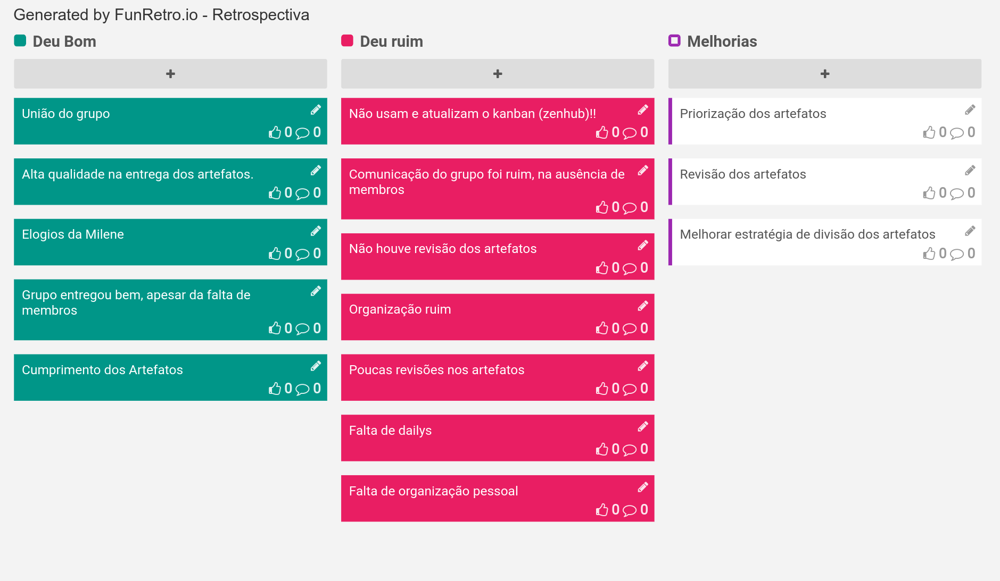

# Planejamento da Sprint 1

| Membros presentes no planejamento da Sprint  |
|---------------------|
| Alan  |
| Guilherme |
| Leonardo  |
| Pedro Rodrigues|
| Saleh  |
| Sara  |
| Shayane|

__Faltantes:__ Elias, Matheus e Pedro Féo.

## Dados gerais

**Data de início:** 02/09/2019

**Data de término:** 08/19/2019

**Pontos Planejados:** Não se aplica no momento

**Pontos Adicionados:** Não se aplica no momento

**Pontos totais:** Não se aplica no momento

## Pareamentos e issues correspondentes

- Todos presentes na reunião [#44](https://github.com/fga-desenho-2019-2/Wiki/issues/44)
- Todos presentes na reunião [#34](https://github.com/fga-desenho-2019-2/Wiki/issues/34)
- Shayane, Elias e Guilherme [#43](https://github.com/fga-desenho-2019-2/Wiki/issues/43)
- Shayane [#42](https://github.com/fga-desenho-2019-2/Wiki/issues/42)
- Elias [#41](https://github.com/fga-desenho-2019-2/Wiki/issues/41)
- Leonardo [#40](https://github.com/fga-desenho-2019-2/Wiki/issues/40)
- Pedro Féo, Matheus e Saleh [#39](https://github.com/fga-desenho-2019-2/Wiki/issues/39)
- Sara e Pedro Rodrigues [#38](https://github.com/fga-desenho-2019-2/Wiki/issues/38)
- Pedro Rodrigues e Guilherme [#37](https://github.com/fga-desenho-2019-2/Wiki/issues/37)
- Alan [#36](https://github.com/fga-desenho-2019-2/Wiki/issues/36)
- Guilherme [#35](https://github.com/fga-desenho-2019-2/Wiki/issues/35)

### Dívidas/refatoração geradas

[#43](https://github.com/fga-desenho-2019-2/Wiki/issues/43): refatoração por não constar detalhamento da documentação da metodologia Lean.

# Resultados

## Velocity

Não se aplica no momento, pois não está sendo realizada a pontuação relacionada a documentação.

## Dívidas entregues

Não há.

## Retrospectiva da Sprint

## Análise

11 issues foram priorizadas para esta sprint, deixando a maioria das issues para cada membro do grupo, visto algumas ressalvas, como as issues de decisão em grupo ou presencial, como [#44](https://github.com/fga-desenho-2019-2/Wiki/issues/44) e a [#34](https://github.com/fga-desenho-2019-2/Wiki/issues/34). Os artefatos da dinâmica da semana tiveram um nível de qualidade muito bom, apesar da ausência de 3 membros durante a semana, sendo que eles trabalharam juntos, porém de forma remota. Por este fato, foi notória e dita por eles que sentiram falta de integração com o restante da equipe em relação às decisões. Além disso, houve o esquecimento das dailies e falta de revisão proativa dos membros sobre os artefatos dos outros membros. 

Sobre o processo de reunião de planejamento, é notória a necessidade de melhoria, em questão de foco e organização. Outros pontos da sprint não podem ser descritos, visto que alguns rastros foram perdidos por causa do atraso nesta descrição.