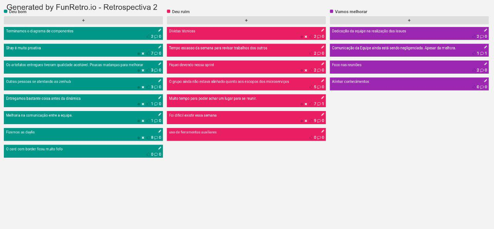

# Planejamento da Sprint 1

| Membros presentes no planejamento da Sprint  |
|---------------------|
| Alan  |
| Guilherme |
| Leonardo  |
| Matheus |
| Pedro Féo |
| Pedro Rodrigues|
| Saleh  |
| Sara  |
| Shayane|

__Faltantes:__ Elias

## Dados gerais

**Data de início:** 09/09/2019

**Data de término:** 15/19/2019

**Pontos Planejados:** Não se aplica no momento

**Pontos Adicionados:** Não se aplica no momento

**Pontos totais:** Não se aplica no momento

## Pareamentos e issues correspondentes
- Saleh e Matheus [#46](https://github.com/fga-desenho-2019-2/Wiki/issues/46)
- Shayane e Elias [#49](https://github.com/fga-desenho-2019-2/Wiki/issues/49)
- Shayane e Saleh [#52](https://github.com/fga-desenho-2019-2/Wiki/issues/52)
- Sara e Pedro [#45](https://github.com/fga-desenho-2019-2/Wiki/issues/45)
- Guilherme e Pedro Féo [#50](https://github.com/fga-desenho-2019-2/Wiki/issues/50)
- Leonardo e Elias [#47](https://github.com/fga-desenho-2019-2/Wiki/issues/47)
- Alan, Leonardo, Pedro R., Pedro Féo e Matheus [#25](https://github.com/fga-desenho-2019-2/Wiki/issues/25)
- Guilherme [#56](https://github.com/fga-desenho-2019-2/Wiki/issues/56)
- Pedro e Matheus [#55](https://github.com/fga-desenho-2019-2/Wiki/issues/55)
- Alan e Leonardo [#51]((https://github.com/fga-desenho-2019-2/Wiki/issues/51)

OBS.: Possível perca de rastro de algum registro.

### Dívidas/refatoração geradas
[#49](https://github.com/fga-desenho-2019-2/Wiki/issues/49) e [#55](https://github.com/fga-desenho-2019-2/Wiki/issues/55), [#51](https://github.com/fga-desenho-2019-2/Wiki/issues/51), [#47](https://github.com/fga-desenho-2019-2/Wiki/issues/47) e [#50](https://github.com/fga-desenho-2019-2/Wiki/issues/50).

# Resultados

## Velocity

Não se aplica no momento, pois não está sendo realizada a pontuação relacionada a documentação.

## Dívidas entregues

Não há registro concreto.

## Retrospectiva da Sprint

## Análise

Cerca de 10 issues foram priorizadas para esta sprint, deixando 2 issues para cada dupla de pareamento, visto algumas ressalvas, como a issue de devops [#56](https://github.com/fga-desenho-2019-2/Wiki/issues/56) que foi atribuída a 1 pessoa responsável. Os artefatos da dinâmica da semana tiveram um nível de qualidade muito bom, apesar do tempo escasso entre os membros da equipe. Houveram algumas dívidas técnicas, em relação a não realizar a issue e outras não estarem na Wiki ou inacabadas, causando prejuízo considerável na Review.

Sobre o processo de reunião de planejamento, é notória a necessidade de melhoria, em questão de foco e respeito para dar oportunidade para outras pessoas falarem e saberem escutar também, sem conversas paralelas e desvencilhando do assunto principal do momento. Muito importante salientar que a documentação da sprint não deve ser acumulada, visto que causa grande prejuízo no documento, como acarretar na perca de registro e organização. Esta documentação deve ocorrer antes da reunião de planejamento da próxima sprint, em que as issues encontram-se com suas milestones originais.