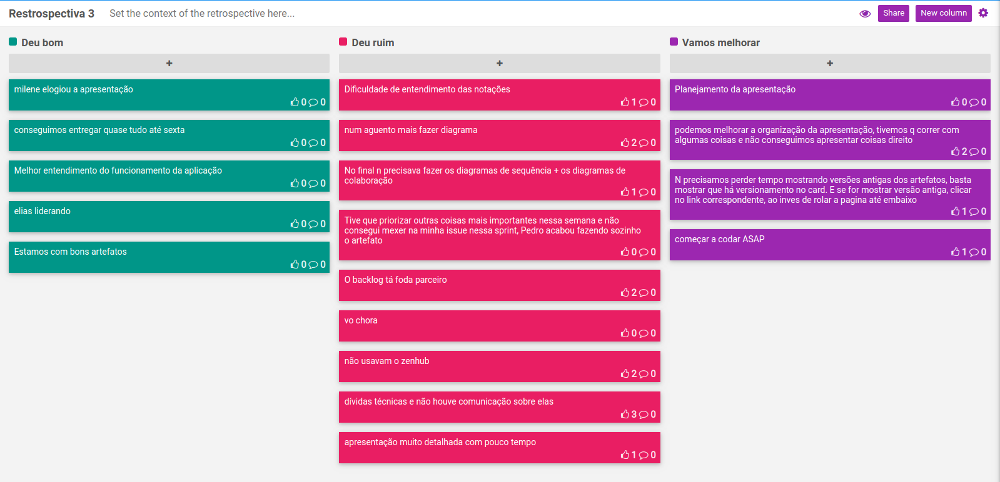

# Planejamento da Sprint 2

| Membros presentes no planejamento da Sprint  |
|---------------------|
| Alan  |
| Elias |
| Guilherme |
| Leonardo  |
| Matheus |
| Pedro Féo |
| Pedro Rodrigues|
| Saleh  |
| Sara  |
| Shayane|

__Faltantes:__ Não houve.

## Dados gerais

**Data de início:** 16/09/2019

**Data de término:** 22/19/2019

**Pontos Planejados:** Não se aplica no momento

**Pontos Adicionados:** Não se aplica no momento

**Pontos totais:** Não se aplica no momento

## Pareamentos e issues correspondentes
| Issue | Pareamento | Pontuação |
|-------|------------|-----------|
| [#69](https://github.com/fga-desenho-2019-2/Wiki/issues/69) | Pedro Rodrigues  |  |
| [#68](https://github.com/fga-desenho-2019-2/Wiki/issues/68) | Pedro Rodrigues e Shayane |  |
| [#67](https://github.com/fga-desenho-2019-2/Wiki/issues/67) | Pedro Rodrigues e Shayane |  |
| [#63](https://github.com/fga-desenho-2019-2/Wiki/issues/63) | Saleh e Pedro Féo |  |
| [#62](https://github.com/fga-desenho-2019-2/Wiki/issues/62) | Shayane e Guilherme Marques  | |
| [#61](https://github.com/fga-desenho-2019-2/Wiki/issues/61) | Guilherme  Marques e Alan  |  |
| [#60](https://github.com/fga-desenho-2019-2/Wiki/issues/60) | Matheus Blanco e Saleh | |
| [#59](https://github.com/fga-desenho-2019-2/Wiki/issues/59) | Pedro Rodrigues e Sara | |
| [#58](https://github.com/fga-desenho-2019-2/Wiki/issues/58) | Leonardo e Elias  | |
| [#57](https://github.com/fga-desenho-2019-2/Wiki/issues/57) | Matheus Blanco e Pedro Féo  | |

### Dívidas/refatoração geradas
[#55](https://github.com/fga-desenho-2019-2/Wiki/issues/55) e [#51](https://github.com/fga-desenho-2019-2/Wiki/issues/51).

# Resultados

## Velocity

Não se aplica no momento, pois não está sendo realizada a pontuação relacionada a documentação.

## Dívidas entregues

Não há registro concreto.

## Retrospectiva da Sprint

## Análise

Foram planejadas 10 issues para essa sprint, sendo estas divididas em geral como duas para cada apunhado de dois membros. Os artefatos supreenderam na qualidade e no volume, o que gerou pano na manga para uma boa apresentação dos mesmo no seminário 3. As dívidas técnicas não foram expressivas.

No sprint planning tivemos melhorias, mas ainda se registra o extremo descontrole da reunião. Os membros não possuem homogeneidade suficiente para uma reunião organizada e objetiva. Se fazendo necessário estabelecer tempo para cada um falar e frequentemente a chamada de atenção.