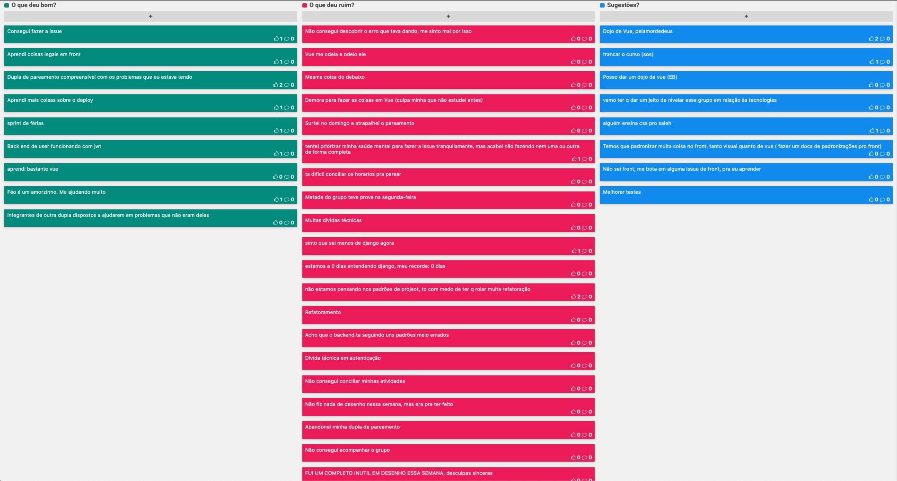

# Planejamento da Sprint 4

| Membros presentes no planejamento da Sprint  |
|---------------------|
| Alan  |
| Guilherme |
| Leonardo  |
| Matheus |
| Pedro Féo |
| Pedro Rodrigues|
| Saleh  |
| Sara  |
| Shayane|

__Faltantes:__ Elias.

## Dados gerais

**Data de início:** 30/09/2019

**Data de término:** 14/10/2019

**Pontos Planejados:** Não se aplica no momento

**Pontos Adicionados:** Não se aplica no momento

**Pontos totais:** Não se aplica no momento

## Pareamentos e issues correspondentes
| Issue | Pareamento | Pontuação |
|-------|------------|-----------|
| [#90](https://github.com/fga-desenho-2019-2/Wiki/issues/90) | Matheus Blanco e Shayane | | 
| [#89](https://github.com/fga-desenho-2019-2/Wiki/issues/89) | Saleh e Sara | | 
| [#88](https://github.com/fga-desenho-2019-2/Wiki/issues/88) | Saleh e Sara | | 
| [#87](https://github.com/fga-desenho-2019-2/Wiki/issues/87) | Guilherme Marques e Pedro Féo | | 
| [#85](https://github.com/fga-desenho-2019-2/Wiki/issues/85) | Alan, Leonardo e Elias | | 
| [#84](https://github.com/fga-desenho-2019-2/Wiki/issues/84) | Alan, Leonardo e Elias | | 
| [#83](https://github.com/fga-desenho-2019-2/Wiki/issues/84) | Pedro Féo e Matheus Blanco | | 
| [#82](https://github.com/fga-desenho-2019-2/Wiki/issues/82) | Pedro Rodrigues | | 

### Dívidas/refatoração geradas

[#85](https://github.com/fga-desenho-2019-2/Wiki/issues/85): Dívida técnica 
[#88](https://github.com/fga-desenho-2019-2/Wiki/issues/88): Dívida técnica 
[#89](https://github.com/fga-desenho-2019-2/Wiki/issues/89): Dívida técnica 

# Resultados

## Velocity

Não se aplica no momento, pois não está sendo realizada a pontuação relacionada a documentação.

## Dívidas entregues

Não há.

## Retrospectiva da Sprint

## Análise

8 issues foram destacadas para estar sprint, de modo a formar duplas e trios responsáveis pela execucação das tarefas. Tendo em vista que todas as issues diziam respeito diretamente ao código ou partes envolvidas, foi definido que cada dupla/trio ficasse responsável pela parte de front-end e back-end que se possuisem ligações diretas com o intuíto de agilizar a conclusão das mesmas. Porém devido a problemas de falta de tempo / excesso de conteúdo de outras matérias / provas e problemas pessoais, grande parte das issues não foram completadas. Devido a este fato foi acordado em um reunião que esta sprint teria duração de 2 semanas.

Concluí-se que a equipe se encontra fadigada e com pouca inspiração. É notória a necessidade de um incentivo a mais para a conclusão de um bom produto final.