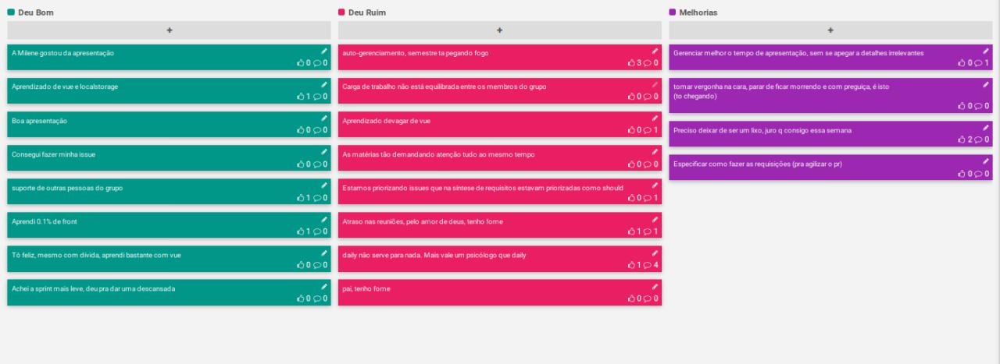

# Planejamento da Sprint 5

| Membros presentes no planejamento da Sprint  |
|---------------------|
| Alan  |
| Guilherme |
| Leonardo  |
| Matheus |
| Pedro Féo |
| Pedro Rodrigues|
| Saleh  |
| Sara  |
| Shayane|

__Faltantes:__ Elias.

## Dados gerais

**Data de início:** 21/10/2019

**Data de término:** 28/10/2019

**Pontos Planejados:** Não se aplica no momento

**Pontos Adicionados:** Não se aplica no momento

**Pontos totais:** Não se aplica no momento

## Pareamentos e issues correspondentes
| Issue | Pareamento | Pontuação |
|-------|------------|-----------|
| [#89](https://github.com/fga-desenho-2019-2/Wiki/issues/#89) | Sara e Saleh | | 
| [#88](https://github.com/fga-desenho-2019-2/Wiki/issues/#88) | Sara e Saleh | | 
| [#91](https://github.com/fga-desenho-2019-2/Wiki/issues/#91) | Alan e Leonardo | | 
| [#92](https://github.com/fga-desenho-2019-2/Wiki/issues/#92) | Matheus Blanco, Pedro Feo e Pedro Rodrigues | | 
| [#94](https://github.com/fga-desenho-2019-2/Wiki/issues/94) | Pedro Feo e Shayane | | 

### Dívidas/refatoração geradas

[#91](https://github.com/fga-desenho-2019-2/Wiki/issues/91): Dívida técnica 

# Resultados

## Velocity

Não se aplica no momento, pois não está sendo realizada a pontuação relacionada a documentação.

## Dívidas entregues

Não há.

## Retrospectiva da Sprint

## Análise

Nesta sprint foram destacadas 5 issues, de modo que os integrantes do grupo trabalhassem em grupos de 2 e 3 pessoas. Nesta sprint destaca-se a prioridade a resolução de dividas técnicas e refatoramento de funcionalidades já existentes, e também a prioridade em desenvolver artefatos a respeito de padrões, facade e proxy. 

Levando em consideração a sprint review, observa-se que nesta sprint os integrantes do grupo se sentiram mais confortaveis e também, positivamente, o quadro apresenta-se com mais aspectos positivos a que a sprint review anterior.

Concluímos que nesta sprint obtivemos indicadores positivos de produção ainda tenhamos dado foco para os artefatos para apresentação. 
