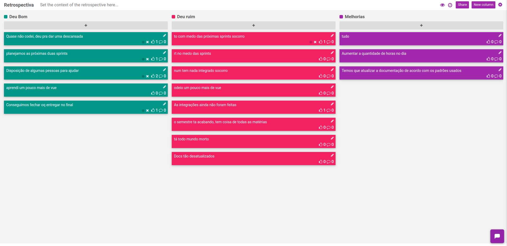

# Planejamento da Sprint 6

| Membros presentes no planejamento da Sprint  |
|---------------------|
| Alan  |
| Guilherme |
| Leonardo  |
| Matheus |
| Pedro Féo |
| Pedro Rodrigues|
| Saleh  |
| Sara  |
| Shayane|

__Faltantes:__ Elias.

## Dados gerais

**Data de início:** 21/10/2019

**Data de término:** 04/11/2019

**Pontos Planejados:** Não se aplica no momento

**Pontos Adicionados:** Não se aplica no momento

**Pontos totais:** Não se aplica no momento

## Pareamentos
| Pareamento | Pontuação |
|----------|-----------|
Pedro Féo e Matheus Blanco | | 
Saleh e Guilherme | | 
Leonardo e Sara | | 
Alan e Elias | | 
Pedro Rodrigues e Shayane | | 

### Dívidas/refatoração geradas

[#97](https://github.com/fga-desenho-2019-2/Wiki/issues/97): Dívida técnica 

# Resultados

## Velocity

Não se aplica no momento, pois não está sendo realizada a pontuação relacionada a documentação.

## Dívidas entregues

Não há.

## Retrospectiva da Sprint

## Análise

Nessa sprint a equipe utilizou para poder estudar os padrões de projeto e como poderiam estar sendo aplicados dentro do Projeto. Foram aplicados uma série de Padrões, porém ainda restaram alguns padrões estudados porém não utilizado, tornando a issue uma dívida. A equipe se demonstra muito fatigada, não conseguindo mais fazer as entregas de qualidade que apresentava no início do semestre.

Todos os Padrões implementados, foram documentados dentro da [Wiki do Grupo](https://fga-desenho-2019-2.github.io/Wiki/seminario4/criacionais/).