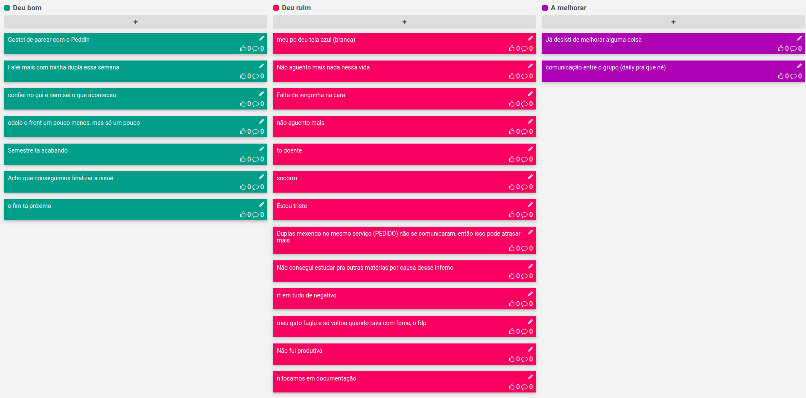

# Planejamento da Sprint 6

| Membros presentes no planejamento da Sprint |
| ------------------------------------------- |
| Alan                                        |
| Bernardo Elias                              |
| Guilherme                                   |
| Leonardo                                    |
| Matheus                                     |
| Pedro Féo                                   |
| Pedro Rodrigues                             |
| Saleh                                       |
| Sara                                        |
| Shayane                                     |

## Dados gerais

**Data de início:** 04/11/2019

**Data de término:** 11/11/2019

**Pontos Planejados:** Não se aplica no momento

**Pontos Adicionados:** Não se aplica no momento

**Pontos totais:** Não se aplica no momento

## Pareamentos

| Issues Correspondentes                                                                                                       | Pareamento                         |
| ---------------------------------------------------------------------------------------------------------------------------- | ---------------------------------- |
| [#100](https://github.com/fga-desenho-2019-2/Wiki/issues/100)                                                                | Shayane Alcântara e Matheus Blanco |
| [#101](https://github.com/fga-desenho-2019-2/Wiki/issues/101)                                                                | Pedro Féo e Guilherme Marques      |
| [#102](https://github.com/fga-desenho-2019-2/Wiki/issues/102)                                                                | Saleh Nazih e Pedro rodrigues      |
| [#103](https://github.com/fga-desenho-2019-2/Wiki/issues/103)                                                                | Alan Lima e Elias Bernardo         |
| [#104](https://github.com/fga-desenho-2019-2/Wiki/issues/104), [#105](https://github.com/fga-desenho-2019-2/Wiki/issues/105) | Leonardo Santos e Sara Silva       |

### Dívidas/refatoração geradas

[#102](https://github.com/fga-desenho-2019-2/Wiki/issues/102): Dívida técnica

[#103](https://github.com/fga-desenho-2019-2/Wiki/issues/103): Dívida Técnica

[#104](https://github.com/fga-desenho-2019-2/Wiki/issues/104): Dívida Técnica

[#105](https://github.com/fga-desenho-2019-2/Wiki/issues/105): Dívida Técnica

# Resultados

## Velocity

Não se aplica no momento, pois não está sendo realizada a pontuação relacionada a documentação.

## Dívidas entregues

Não há.

## Retrospectiva da Sprint

## Análise

Nesta sprint, a equipe preferiu focar nas funcionalidades restantes mais importantes para que se fosse possível entregar um produto mínimamente viável. Foram escolhidas 6 Issues, dentre as quais se encontravam páginas não criadas, adição de imagens no banco de dados, integração do front-end para fácil navegação,entre outras. Entretanto, por motivos de cansaço, entregas de outras matérias e dificuldades de resolução de problemas no próprio projeto, uma grande quantidade de Issues não pode ser entregue por completo. Os membros vão se esforçar para entregar as dívidas técnicas, pelo fato de a 8ª sprint ser a última antes da apresentação final.
