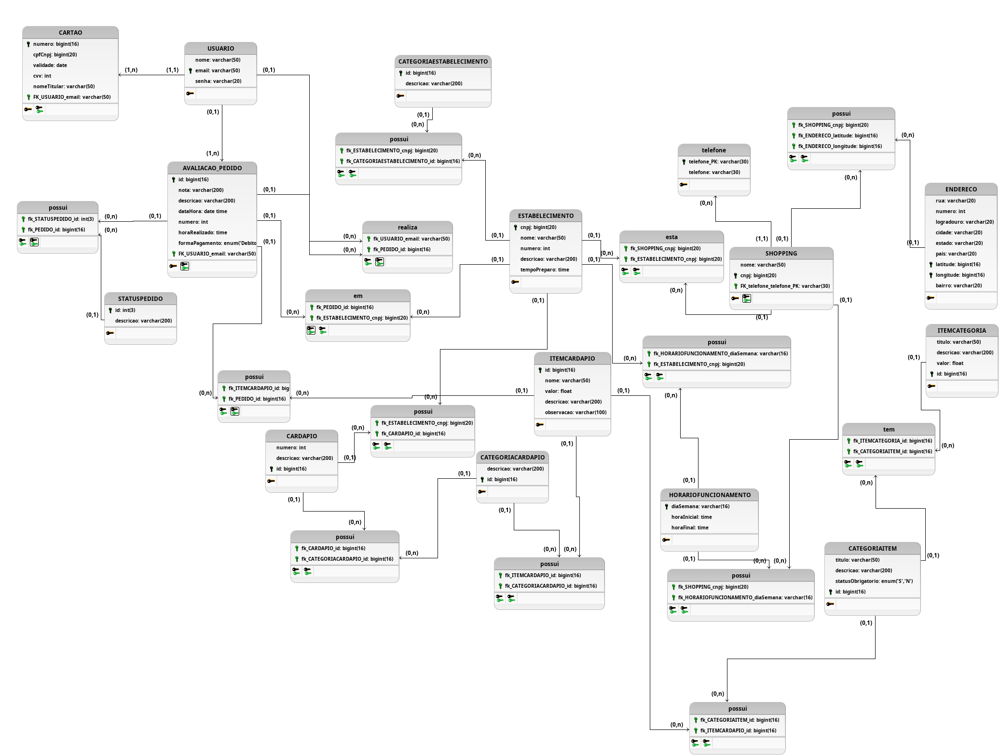

## Introdução

Os modelos de dados a seguir servem para descrever como será projetado a arquitetura do banco de dados do aplicativo QR Comer. A fim de estabelecer estratégias para desenvolvimento, a modelagem faz-se necessário para manipulação dos dados do sistema, tornando pragmático a visibilidade dos objetos e relacionamentos do sistema.

## Versão 1.0

### Modelo Entidade Relacionamento

| **Entidade** | **Atributo**|
|:--:|:--:|
| SHOPPING | <u>cnpj</u> nomeShopping telefone(multivalorado) endereco(composto)|
| CATEGORIARESTAURANTE | <u>idCategoria</u> nomeCategoria descricao |
| RESTAURANTE | <u>cnpjRestaurante</u> nomeRestaurante numero bloco descricao idCategoria |
| USUARIO | <u>cpf</u> nomeUsuario email senha |
| CARDAPIO | <u>idCardapio</u> nomeCardapio descricao cnpjRestaurante |
| CARTAO | <u>numero</u> nomeTitular validade cvv |
| CATEGORIAITEM | <u>idCategoriaItem</u> nomeCategoriaItem descricao |
| ITEM | <u>idItem</u> nomeItem descricao valorUnitario quantidade idCategoriaItem cnpjRestaurante idCardapio |
| PEDIDO | <u>codigo</u> dataHoraRealizado valorTotal statusPedido cpf cnpjShopping cnpjRestaurante |

| **Entidade** | **relação** | **Entidade**| **Descrição** | **Cardinalidade**|
|:--:|:--:|:--:|:--:|:--:|
| **SHOPPING** | possui | **RESTAURANTE** |Um shopping possui um ou mais restaurantes cadastrados. Um restaurante pode estar associado a um ou mais shoppings | **N:M** |
| **RESTAURANTE** | possui | **CATEGORIARESTAURANTE** | Um restaurante possui uma ou mais categorias. Uma categoria pode estar associada a um ou mais restaurantes. | **N:M** |
| **RESTAURANTE** | possui | **CARDAPIO** | Um restaurante possui um ou mais cardapios. Um cardapio pode estar associada a um ou mais restaurante. | **N:M** |
| **RESTAURANTE** | possui | **ITEM** | Um restaurante possui um ou mais itens. Um item pode estar associada a um ou mais restaurantes. | **N:M** |
| **CARDAPIO** | possui | **ITEM** | Um cardapio possui um ou mais itens. Um item pode estar associada a um ou mais cardapios. | **N:M** |
| **ITEM** | possui | **CATEGORIAITEM** | Um item possui um ou mais categorias. Uma categoria pode estar associada a um ou mais itens. | **N:M** |
| **USUARIO** | realiza | **PEDIDO** | Um usuario realiza um ou mais pedidos. Um pedido pode estar associada a um ou mais usuarios. | **N:M** |
| **PEDIDO** | possui | **ITEM** | Um pedido possui um ou mais itens. Um item pode estar associado a um ou mais pedidos. | **N:M** |

| **MER01** | **MER**  |
|--|--|
| **Versão**| Atual: 1.0 (16/09)   Anterior: - | 
| **Descrição** | Modelo Entidade Relacionamento | 
|**Autor**| [Leonardo Barreiros](https://github.com/leossb36) | 

### Diagrama Entidade Relacionamento

| **DER01** | **DER**  |
|--|--|
| **Versão**| Atual: 1.0 (26/08)   Anterior: - | 
| **Descrição** | Diagrama Entidade Relacionamento para a aplicação | 
|**Autor**| [Alan Lima](https://github.com/alanrslima) | 

### Diagrama Lógico

| **DL01** | **DL**  |
|--|--|
| **Versão**| Atual: 1.0 (26/08)   Anterior: - | 
| **Descrição** | Diagrama Lógico baseado no Diagrama Entidade Relacionamento inicial de dados | 
|**Autor**| [Matheus Blanco](https://github.com/MatheusBlanco) |

### Dicionário de dados

#### Entidade: Cartão

**Descrição**: Modo de pagamento utilizado pelo cliente

|Atributo|Propriedades do Atributo| Tipo de dado|Tamanho|Descrição|
|-|-|-|-|-|
|numero|chave primária obrigatória|bigint|16|Número da frente do cartão|
|cpfcnpj|obrigatória|bigint|20|Dados jurídicos do dono|
|validade|obrigatória|date||Validade do cartão|
|cvv|obrigatória|int||Código de segurança|
|nomeTitular|obrigatória||varchar|50|Nome do titular da conta do cartão|
|email|chave estrangeira obrigatória|varchar|50|E-mail do usuário|

#### Entidade: Usuário

**Descrição**: Usuário da aplicação, público-alvo

|Atributo|Propriedades do Atributo| Tipo de dado|Tamanho|Descrição|
|-|-|-|-|-|
|nome|obrigatória|varchar|50|Nome do Usuário|
|email|chave primária obrigatória|varchar|50|E-mail do Usuário|
|senha|obrigatória|varchar|20|Senha do Usuário na aplicação|

#### Entidade: Avaliação_Pedido

**Descrição**: Momento de visualização do pedido pelo restaurante

|Atributo|Propriedades do Atributo| Tipo de dado|Tamanho|Descrição|
|-|-|-|-|-|
|id|chave primária obrigatória|bigint|16|Identificação do pedido|
|nota|obrigatória|varchar|200|Nota fiscal|
|descricao|obrigatória|varchar|200|Descrição do pedido|
|dataHora|obrigatória|date time||Hora e dia do registro do pedido|
|numero|obrigatória|int||Número do pedido a ser chamado|
|horaRealizado|obrigatória|time||Hora da montagem do pedido|
|formaPagamento|obrigatória|enum('Debito', 'Credito', 'Dinheiro')||Forma na qual o pedido foi pago|
|email|chave estrangeira obrigatória|varchar|50|E-mail do usuário|

#### Relacionamento: possui

**Descrição**: Possessão de status de pedido

|Atributo|Propriedades do Atributo| Tipo de dado|Tamanho|Descrição|
|-|-|-|-|-|
|id|chave estrangeira obrigatória|int|3|Identificação do status do pedido|
|id|chave estrangeira obrigatória|bigint|16|Identificação do pedido|

#### Entidade: StatusPedido

**Descrição**: Status de um pedido

|Atributo|Propriedades do Atributo| Tipo de dado|Tamanho|Descrição|
|-|-|-|-|-|
|id|chave primária obrigatória|int|3|Identificação do status do pedido|
|descricao|obrigatória|varchar|200|Descrição do status|

#### Relacionamento: possui

**Descrição**: Possessão de item no cardápio referente ao pedido

|Atributo|Propriedades do Atributo| Tipo de dado|Tamanho|Descrição|
|-|-|-|-|-|
|id|chave estrangeira obrigatória|bigint|16|Identificação do item no cardápio|
|id|chave estrangeira obrigatória|bigint|16|Identificação do pedido|

#### Entidade: ItemCardapio

**Descrição**: Representa um item contido no cardápio

|Atributo|Propriedades do Atributo| Tipo de dado|Tamanho|Descrição|
|-|-|-|-|-|
|id|chave primária obrigatória|bigint|16|Identificação do item no cardápio|
|nome|obrigatória|varchar|50|Nome do item|
|valor|obrigatória|float||Preço do item|
|descricao|obrigatória|varchar|200|Descrição do item|
|observação|obrigatória|varchar|200|Observação em referência ao item pedido|

#### Relacionamento: possui

**Descrição**: Possessão de categoria referente a cardápios

|Atributo|Propriedades do Atributo| Tipo de dado|Tamanho|Descrição|
|-|-|-|-|-|
|id|chave estrangeira obrigatória|bigint|16|Identificação do item no cardápio|
|id|chave estrangeira obrigatória|bigint|16|Identificação da categoria de cardápio|

#### Entidade: CategoriaCardapio

**Descrição**: Representa uma categoria que identifica o cardápio

|Atributo|Propriedades do Atributo| Tipo de dado|Tamanho|Descrição|
|-|-|-|-|-|
|id|chave primária obrigatória|bigint|16|Identificação da categoria de cardápio|
|descricao|obrigatória|varchar|200|Descrição da categoria do cardápio|

#### Relacionamento: possui

**Descrição**: Possessão de cardápios referente a categorias

|Atributo|Propriedades do Atributo| Tipo de dado|Tamanho|Descrição|
|-|-|-|-|-|
|id|chave estrangeira obrigatória|bigint|16|Identificação do cardápio em questão|
|id|chave estrangeira obrigatória|bigint|16|Identificação da categoria de cardápio|

#### Entidade: Cardapio

**Descrição**: Representa um cardápio de determinado restaurante

|Atributo|Propriedades do Atributo| Tipo de dado|Tamanho|Descrição|
|-|-|-|-|-|
|numero|obrigatória|int||Número id do restaurante|
|descricao|obrigatória|varchar|200|Descrição do cardápio e seus itens|
|id|chave primária obrigatória|bigint|16|Identificação do cardápio em questão|

#### Relacionamento: possui

**Descrição**: Possessão de cardápios referente a estabelecimentos

|Atributo|Propriedades do Atributo| Tipo de dado|Tamanho|Descrição|
|-|-|-|-|-|
|cnpj|chave estrangeira obrigatória|bigint|20|CNPJ do estabelecimento|
|id|chave estrangeira obrigatória|bigint|16|Identificação do cardápio em questão|

#### Entidade: Estabelecimento

**Descrição**: Representa um estabelecimento restaurante

|Atributo|Propriedades do Atributo| Tipo de dado|Tamanho|Descrição|
|-|-|-|-|-|
|cnpj|chave primária obrigatória|bigint|20|CNPJ do estabelecimento|
|nome|obrigatória|varchar|50|Nome do estabelecimento|
|numero|obrigatória|int||Número da loja, em questão de endereço|
|descricao|obrigatória|varchar|200|Descrição do estabelecimento e seus alimentos|
|tempoPreparo|obrigatória|time||Tempo necessário para se preparar um alimento|

#### Relacionamento: possui

**Descrição**: Possessão de estabelecimentos em relação a categorias

|Atributo|Propriedades do Atributo| Tipo de dado|Tamanho|Descrição|
|-|-|-|-|-|
|cnpj|chave estrangeira obrigatória|bigint|20|CNPJ do estabelecimento|
|id|chave estrangeira obrigatória|bigint|16|Identificação da categoria|

#### Entidade: CategoriaEstabelecimento

**Descrição**: Representa a categoria de um estabelecimento

|Atributo|Propriedades do Atributo| Tipo de dado|Tamanho|Descrição|
|-|-|-|-|-|
|id|chave primária obrigatória|bigint|16|Identificação da categoria|
|descricao|obrigatória|varchar|200|Descrição da categoria do estabelecimento|

#### Relacionamento: realiza

**Descrição**: Realização de pedidos

|Atributo|Propriedades do Atributo| Tipo de dado|Tamanho|Descrição|
|-|-|-|-|-|
|email|chave estrangeira obrigatória|varchar|50|E-mail do Usuário|
|id|chave estrangeira obrigatória|bigint|16|Identificação do pedido|

#### Relacionamento: em

**Descrição**: Possessão de local de realização de pedidos

|Atributo|Propriedades do Atributo| Tipo de dado|Tamanho|Descrição|
|-|-|-|-|-|
|cnpj|chave estrangeira obrigatória|bigint|20|CNPJ do estabelecimento|
|id|chave estrangeira obrigatória|bigint|16|Identificação do pedido|

#### Relacionamento: possui

**Descrição**: Possessão de categoria de itens

|Atributo|Propriedades do Atributo| Tipo de dado|Tamanho|Descrição|
|-|-|-|-|-|
|id|chave estrangeira obrigatória|bigint|16|Identificação do item no cardápio|
|id|chave estrangeira obrigatória|bigint|16|Identificação da categoria do item|

#### Entidade: CategoriaItem

**Descrição**: Representa a categoria de um item

|Atributo|Propriedades do Atributo| Tipo de dado|Tamanho|Descrição|
|-|-|-|-|-|
|titulo|obrigatória|varchar|50|Título da categoria do item|
|descricao|obrigatória|varchar|200|Descrição da categoria do item|
|statusObrigatório|obrigatória|enum('S','N')||?|
|id|chave primária obrigatória|bigint|16|Identificação da categoria do item|

#### Relacionamento: tem

**Descrição**: Possessão de item por categoria

|Atributo|Propriedades do Atributo| Tipo de dado|Tamanho|Descrição|
|-|-|-|-|-|
|id|chave estrangeira obrigatória|bigint|16|Identificação da categoria do item|
|id|chave estrangeira obrigatória|bigint|16|Identificação do item da categoria|

#### Entidade: ItemCategoria

**Descrição**: Representa o item de uma categoria

|Atributo|Propriedades do Atributo| Tipo de dado|Tamanho|Descrição|
|-|-|-|-|-|
|titulo|obrigatória|varchar|50|Título do item da categoria|
|descricao|obrigatória|varchar|200|Descrição do item da categoria|
|valor|obrigatória|float||Preço do item da categoria|
|id|chave primária obrigatória|bigint|16|Identificação do item da categoria|

#### Relacionamento: possui

**Descrição**: Possessão de horários

|Atributo|Propriedades do Atributo| Tipo de dado|Tamanho|Descrição|
|-|-|-|-|-|
|diaSemana|chave estrangeira obrigatória|varchar|16|Dias da semana que o estabelecimento funciona|
|cnpj|chave estrangeira obrigatória|bigint|20|CNPJ do estabelecimento|

#### Entidade: HorarioFuncionamento

**Descrição**: Representa o horário de funcionamento de um estabelecimento

|Atributo|Propriedades do Atributo| Tipo de dado|Tamanho|Descrição|
|-|-|-|-|-|
|diaSemana|chave primária obrigatória|varchar|16|Dias da semana que o estabelecimento funciona|
|horaInicial|obrigatória|time||Hora de abertura|
|horaFinal|obrigatória|time||Hora de fechamento|

#### Relacionamento: possui

**Descrição**: Possessão de horários por parte do Shopping

|Atributo|Propriedades do Atributo| Tipo de dado|Tamanho|Descrição|
|-|-|-|-|-|
|diaSemana|chave estrangeira obrigatória|varchar|16|Dias da semana que o Shopping funciona|
|cnpj|chave estrangeira obrigatória|bigint|20|CNPJ do Shopping|

#### Entidade: Shopping

**Descrição**: Representa o shopping que abriga um estabelecimento

|Atributo|Propriedades do Atributo| Tipo de dado|Tamanho|Descrição|
|-|-|-|-|-|
|nome|obrigatória|varchar|50|Nome do shopping|
|cnpj|chave primária obrigatória|bigint|20|CNPJ do Shopping|
|telefone|chave estrangeira obrigatória|varchar|30|Identificação do telefone do shopping|

#### Entidade: telefone

**Descrição**: Representa o telefone de um shopping

|Atributo|Propriedades do Atributo| Tipo de dado|Tamanho|Descrição|
|-|-|-|-|-|
|telefone|chave primária obrigatória|varchar|30|Identificação do telefone do shopping|
|telefone|obrigatória|varchar|30|Identificação do telefone do shopping|

#### Relacionamento: possui

**Descrição**: Possessão de endereço por parte do Shopping

|Atributo|Propriedades do Atributo| Tipo de dado|Tamanho|Descrição|
|-|-|-|-|-|
|cnpj|chave estrangeira obrigatória|bigint|20|CNPJ do Shopping|
|latitude|chave estrangeira obrigatória|bigint|16|Latitude da localização do endereço|
|longitude|chave estrangeira obrigatória|bigint|16|Longitude da localização do endereço|

#### Entidade: Endereço

**Descrição**: Representa o endereço de um shopping

|Atributo|Propriedades do Atributo| Tipo de dado|Tamanho|Descrição|
|-|-|-|-|-|
|rua|obrigatória|varchar|20|Rua do shopping|
|numero|obrigatória|int||Número do shopping|
|logradouro|obrigatória|varchar|20|Logradouro do shopping|
|cidade|obrigatória|varchar|20|Cidade onde o shopping se localiza|
|estado|obrigatória|varchar|20|Estado onde o shopping se localiza|
|pais|obrigatória|varchar|20|Pais onde o shopping se localiza|
|latitude|chave estrangeira obrigatória|bigint|16|Latitude da localização do endereço|
|longitude|chave estrangeira obrigatória|bigint|16|Longitude da localização do endereço|
|bairro|obrigatória|varchar|20|Bairro onde o shopping se localiza|

## Versão 2.0

Após um planejamento do grupo e analisado as vantagens e desvantagens das possíveis arquiteturas, foi acordado que o modelo de microserviços seria utilizado para o desenvolvimento do backend da aplicação QR Comer. Portanto o modelo de dados foi fragmentado e será apresentado abaixo fazendo referência ao seu microserviço correspondente.

### Costumer Service

#### Diagrama Entidade Relacionamento

| **DER01** | **DER**  |
|--|--|
| **Versão**| Atual: 1.0 (16/09)   Anterior: - | 
| **Descrição** | Diagrama Entidade Relacionamento para o microserviço de usuário | 
|**Autor**| [Alan Lima](https://github.com/alanrslima) | 

#### Diagrama Lógico

| **DL01** | **DL**  |
|--|--|
| **Versão**| Atual: 1.0 (16/09)   Anterior: - | 
| **Descrição** | Diagrama Entidade Relacionamento para a aplicação | 
|**Autor**| [Alan Lima](https://github.com/alanrslima) | 

### Restaurant Service

#### Diagrama Entidade Relacionamento

| **DER01** | **DER**  |
|--|--|
| **Versão**| Atual: 1.0 (16/09)   Anterior: - | 
| **Descrição** | Diagrama Entidade Relacionamento para o microserviço de restaurante | 
|**Autor**| [Alan Lima](https://github.com/alanrslima) | 

#### Diagrama Lógico

| **DL01** | **DL**  |
|--|--|
| **Versão**| Atual: 1.0 (16/09)   Anterior: - | 
| **Descrição** | Diagrama Entidade Relacionamento para o microserviço de restaurante | 
|**Autor**| [Alan Lima](https://github.com/alanrslima) | 

### Order Service

#### Diagrama Entidade Relacionamento

| **DER01** | **DER**  |
|--|--|
| **Versão**| Atual: 1.0 (16/09)   Anterior: - | 
| **Descrição** | Diagrama Entidade Relacionamento para o microserviço de pedidos | 
|**Autor**| [Alan Lima](https://github.com/alanrslima) | 

#### Diagrama Lógico

| **DL01** | **DL**  |
|--|--|
| **Versão**| Atual: 1.0 (16/09)   Anterior: - | 
| **Descrição** | Diagrama Entidade Relacionamento para o microserviço de pedidos | 
|**Autor**| [Alan Lima](https://github.com/alanrslima) | 