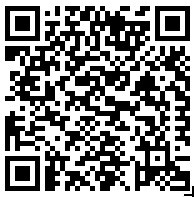

## Roteiro - Testes de Usabilidade V1

Roteiro utilizado para a melhor aplicação dos testes de usabilidade feitos com a [primeira versão do protótipo de alta fidelidade](https://www.figma.com/proto/unhRDokaYlRCUGswOKZ6Jo/Untitled?node-id=6%3A3&scaling=min-zoom)

O Roteiro abrange uma fase de preparação, que diz o que deve ser feito antes do teste ser aplicado, um contexto para inserir o testador, um conjunto de tarefas que o testador deverá cumprir e uma avaliação que deverá ser respondida pelo testador.

### Preparação 
 - Abra uma imagem no computador, ou mesmo impressa explicando como fazer o pedido usando o QR Comer mostrando o seguinte QR code:

 

  - Peça para que a pessoa use o próprio celular para fazer o teste de usabilidade

### Cenário

Você está no seu horário de almoço e foi ao shopping almoçar com seus colegas, chegando lá se deparam com filas enormes nos restaurantes da praça de alimentação. Você decide sentar em uma mesa para guardar lugar enquanto seus amigos pedem seus almoços. Chegando na mesa você vê o seguinte (mostrar instruções do QR Comer) 

### Tarefas
 - Tente acessar a aplicação pelo seu celular
 - Para utilizar a aplicação você terá que se cadastrar primeiro
 - Agora que você já fez o cadastro e possui acesso à aplicação, verifique em qual shopping você se encontra
 - Como você ainda está na dúvida de onde comer, deseja visualizar que tipos de comida tem no shopping
 - Você decidiu que deseja comer um hambúrguer, selecione um restaurante para fazer seu pedido
 - Faça o seu pedido usando cartão de crédito
 - O restaurante que você pediu disponibiliza uma senha, descubra qual é ela
 - Agora que você já fez seu pedido você deseja ver seus pedidos anteriores
 - Agora cadastre um novo cartão na aplicação
 - Escreva uma dúvida para que a equipe do QR Comer possa te responder
 - Por último, cheque seu perfil 

### Avaliação 

A etapa de avaliação é dividida em três etapas, Simplicidade, que diz respeito à facilidade de utilizar e entender uma tarefa, Usabilidade, que diz respeito à experiência ao se realizar a atividade e o Design , que diz respeito à questôes estéticas e de layout

A avaliação consiste de perguntar ao testador sua opinião à respeito de cada uma das tarefas, de 0 a 10, nos tópicos de Simplicidade, Usabilidade e Design, além de uma avaliação geral da aplicação.

| **-** | **Roteiro do teste de Usabilidade** |
|--|--|
| **Versão** | Atual: 1.0 (28/08/19)   Anterior: - |
| **Descrição** | Roteiro do teste de Usabilidade  |
| **Autor** | [Pedro Féo](https://github.com/Phe0), [Pedro Rodrigues Pereira](https://github.com/pedro-prp), [Matheus Salles Blanco](https://github.com/MatheusBlanco) |