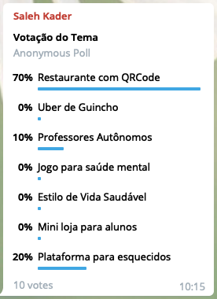

# Design Sprint

## Histórico de Revisão:

|Data|Versão|Descrição|Autor|
|-|-|-|-|
|20/08/2019|0.1|Criação do documento, adição dos tópicos | Pedro Rodrigues |
|20/08/2019|0.2|Adição no tópico 4 e colocação das três principais propostas| Pedro Rodrigues |
|20/08/2019|0.3|Adição do tópico 5 de decisão de tema e Adição do tópico de Artefatos| Pedro Rodrigues |
|21/08/2019|0.4| Adição no tópico 3 sobre 5W2H, Questionário e Protótipo.|Shayane Alcântara|
|21/08/2019|0.5| Adição do Richpicture Pedido no celular vs fila |Elias Bernardo|
|22/08/2019|0.6| Restruturação do tópico Artefatos(6) e algumas correções |Sara Silva|
|22/08/2019|0.7| Adição do protótipo de baixa fidelidade |Alan Lima|

## 1. Introdução

## 2. Design Sprint

### 2.1 Unpack (Entenda)
Nesta etapa, o grupo reúne informações com o objetivo de entender a proposta, elaborar hipóteses e ideias. Além disso, ter um espaço definido e adequado é importante para manter as dinâmicas eficientes.

### 2.2 Sketch (Desenhe)
Nesta etapa, a equipe realiza esboços das ideias, como um "mapa do desafio" e as aprimora com o auxílio dos especialistas da empresa. É interesse que no espaço definido na etapa anterior tenha meios para facilitar estas ações. 

### 2.3 Decide (Decida)
A partir das ideias apresentadas, esta etapa é responsável pela escolha da ideia mais adequada para a equipe. Comumente, é desenhado um storyboard como um pré-protótipo, a fim de visualizar os possíveis detalhes do plano escolhido.

### 2.4 Prototype (Prototipe)
Nesta etapa, é desenvolvido o protótipo baseado no storyboard da etapa anterior. É feito também um roteiro de entrevistas para preparação da validação com os potenciais clientes.

### 2.5 Validate (Valide)
Nesta etapa, é realizada a validação com os potenciais clientes com testes, por meio do protótipo criado na etapa anterior. Caso necessário, a ideia é aprimorada. Com essa etapa concluída, já é possível direcionar a equipe para ações mais concretas no desenvolvimento da ideia.

## 3. Artefatos Construídos

### Brainstorm

### Rich Picture

### 5W2H
Este método auxilia na tomada de decisão sobre os principais elementos que orientarão a implementação do plano. Quando algo deve ser implantado, entram em cena as seguintes definições: 

* O que (What) deve ser feito? 
* Por que (Why) deve ser implementado? 
* Quem (Who) é o responsável pela ação? 
* Onde (Where) deve ser executado? 
* Quando (When) deve ser implementado? 
* Como (How) deve ser conduzido? 
* Quanto (How much) vai custar a implementação?

### Entrevista

### Questionário
De fundamental importância para o êxito de um projeto, o questionário vem como uma ferramenta para colher informações de um público alvo, com o objetivo de perceber necessidades e assim, propor soluções baseadas nas questões abordadas no questionário. 

### NFR

### Storytelling

### Protótipo
A prototipagem auxilia no entendimento do potencial cliente em relação à solução proposta a ele. Ele é a ferramenta mais concreta antes da produção do produto, sendo possível realizar diversas correções e aprimoramentos para aumentar a qualidade.

## 4. Propostas de Tema

Neste tópico está contido todos os temas levantados pelo grupo, tendo eles como objetivo aplicar os padrões de Arquitetura e Desenho de software em um projeto real.

Os temas são bastante diversos e a maioria dos mesmos foi desenvolvido de forma individual, detonando um grupo bem heterogêneo, já que cada indivíduo expressa uma visão pessoal diferente sobre um assunto.

### 4.1 Professores autônomos

#### **Situação Problema**
Professores autônomos possuem dificuldade para gerenciar alunos ou fazem o controle de forma manual.

#### **Solução**
Um software que facilite a gerência de alunos e permita a adição de tarefas, dentre outras features. (Para professores do 6º ao 3º ano do ensino médio).

#### **Principais funcionalidades**
* Cadastro de alunos por professor (o professor se cadastra e  posteriormente cadastra seus alunos na plataforma, fornecendo para eles os dados de login gerados);
* Grade horária;
* Inserção de atividades e compartilhamento colaborativo (um professor poderá acessar a atividade de outro desde que compartilhe as suas);
* Desempenho dos alunos;
* Cálculo financeiro;

#### **Tecnologias e padrões**
API: NodeJS (Express)
Front: Vue

Criação: Singleton e Factory Method 
Estruturais: Decorator, ...
 
Comportamentais:   

* Command (Tarefas);
* Memento (Log de atividades / refazer tarefa);
* Observer (notificar alunos de tarefas);

### 4.2 Restaurante com QR code

#### **Situação Problema**
Restaurantes de Shoppings apresentam longas filas de esperas para fazerem seus pedidos, além da baixa comodidade do cliente de ter que sair da própria mesa para fazer ou pegar o próprio pedido.
	
#### **Solução**
 Uma aplicação web que ficaria responsável por gerenciar os pedidos de um determinado shopping, onde as mesas da área de alimentação terão um QR Code, responsável por abrir a aplicação web e fornecer uma lista de restaurantes do shopping para o usuário.
#### **Solução pela perspectiva de Usuário:**
A intenção é que o usuário possa fazer o pedido na própria mesa, sem se preocupar em gerar filas para os restaurantes e mantendo a sua comodidade. Após o pedido o restaurante pode entregar o produto em sua mesa ou a aplicação web pode gerar uma senha para o próprio cliente ir buscá-lo no restaurante.
#### **Solução pela perspectiva do Restaurante:**
O restaurante poderá gerenciar os seus pedidos com uma facilidade maior. No seu sistema poderá conter um mapa com as mesas do shopping onde mandará uma notificação do local onde foi feito o pedido. Outra alternativa ao mapa é apenas uma notificação do número da mesa, facilitando o trabalho para o lojista. E também tem a opção do restaurante gerar uma senha e mandar para o cliente buscar o próprio pedido.

#### **Possíveis Concorrentes:**
Onyo - App de Pedidos em Praças de Alimentação: https://www.site.onyo.com/
Aplicativo apresenta alguns bugs. E tem um banco de restaurantes bem limitados, não sendo possível testá-lo.

#### **Principais Funcionalidades:**

##### Web do Restaurante:

* Cadastro e Login
* Integração com banco de dados de informações dos clientes
* Notificação de pedido do cliente
* Integração com o sistema de pagamento
* Mapa de mesas do restaurante
* Chat de comunicação com o cliente

##### Web do cliente: 

* Cadastro e Login
* Tela com os restaurantes
* Tela com o cardápio dos restaurantes
* Chat de comunicação com o restaurante
* Integração com sistemas de pagamentos
* Perfil de usuário

### 4.3 Uber de guincho

#### **Situação problema**
Operadores independentes de guincho que apenas conseguem se comunicar com seu cliente por telefone, além de cobrarem por seus serviços a partir de um padrão ou estimativa ao invés do valor da viagem.

#### **Solução**
Um aplicativo que facilitasse a contratação desse tipo de serviço, onde o operador de guincho poderia registrar seu caminhão-guincho no aplicativo. Neste, o mesmo receberia notificações de serviço junto de informações como local, tipo de veículo a ser resgatado e problema registrado. O app faria então um cálculo sobre o preço do serviço prestado.

#### **Possível concorrente**
CadêGuincho: https://cadeguincho.com

* App não possui um mapa para mostragem da localização dos usuários;
* App tem outras opções, como posto de gasolina, reparo de baterias;
* Multi-funcional, mas não tão intuitivo como seria um aplicativo que desse foco na requisição de serviços. 

#### **Principais funcionalidades**

##### App do motorista com
* Login, cadastro;
* Integração com banco de dados;
* Mapa para mostrar os locais de acidentes/problemas
* Notificações de um acidente/problema com as informações necessárias para se calcular o preço do serviço
* Serviço de chat, onde o motorista pode ver as informações de contato do cliente
* Integração com bancos e cartão de crédito

##### App do cliente com:
* Login, cadastro;
* Integração com banco de dados;
* Mapa para mostrar os motoristas que se encontram nas redondezas;
* Requerimento de serviço, onde o cliente deve inserir informações como tipo de carro, telefone, problema registrado e local;
* Possibilidade de chat e visualização de informações do motorista contratado;
* Integração com bancos e cartão de crédito.

## 5. Definição de Tema
Os temas anteriormente propostas sofreram críticas e elogios pelos membros do grupo e com isso um levantamento de pontos positivos e negativos a cerca de cada proposta.

### 5.1 Professores autônomos 

##### Pontos Positivos
* Traz suporte para um nicho de mercado. 
* Explora área de conhecimentos nova para o grupo.
* Permite a aplicação dos padrões de Desenho de Software.

##### Pontos Negativos
* Concorrência suficientemente expressiva.
* Exige adesão de um público retraido com tecnologias novas.

### 5.2 Restaurante com QR code

##### Pontos Positivos
* Inovador
* Explora área de conhecimentos nova para o grupo.
* Permite a aplicação dos padrões de Desenho de Software.
* Concorrência não expressiva

##### Pontos Negativos
* Exige pesquisa sobre questões legais
* Exige integração do sistema com o restaurante

### 5.3 Uber de guincho

##### Pontos Positivos
* Concorrência baixa
* Permite a aquisição de novos conhecimentos
* Preenche uma lacuna de mercado

##### Pontos Negativos
* Assunto não conhecido amplamente pela equipe
* Limita desenvolvimento exclusivo mobile

### 5.4 Votação e escolha do Tema
Após um período de debate entre o grupo, foi-se decidido que o tema seria escolhido a partir de uma votação pelo ferramenta **Poll Telegram**. 
  

##### Resultado após votação:

* Como pode ser visto, o tema escolhido foi o **Restaurante QRcode.**

## 6. Artefatos

### 6.1 [RichPicture](./richpicture.md)

### 6.2 [5W2H](./5w2h.md)

### 6.3 [Protótipos](./prototipos.md)

## 7. Conclusão

## 8. Referências

Saiba Mais. The Design Sprint. Disponível em: <https://www.gv.com/sprint/>. Acesso em: 21 de agosto de 2019.

Chief of design. Design Sprint – O que é e para que serve o Design Sprint Google?. Disponível em: <https://www.chiefofdesign.com.br/design-sprint/>. Acesso em: 21 de agosto de 2019.

Translate Me. Design Sprint. Disponível em: <https://translate-me.github.io/docs/def_tema/#2-design-sprint>. Acesso em: 21 de agosto de 2019.

Sebrae. 5W2H. Disponível em: <https://m.sebrae.com.br/Sebrae/Portal%20Sebrae/Anexos/5W2H.pdf>. Acesso em: 21 de agosto de 2019.

