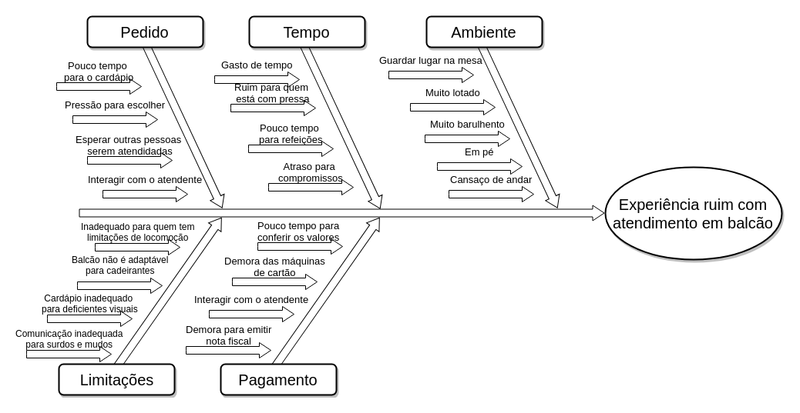

### Diagrama de Ishikawa

 **RP01** | **Pedido na visão do cliente**  |
|--|--|
| **Versão**| Atual: 1.0 (21/08)   Anterior: - | 
| **Descrição** | Diagrama de causa e feito, descrevendo possíveis causas de uma experiência ruim com atendimento em balcão | 
|**Autor**| [Pedro Féo](https://github.com/Phe0), [Sara Silva](https://github.com/silvasara) |