# Questionário 
  
## Histórico de Revisão:

|Data|Versão|Descrição|Autor|
|-|-|-|-|
|22/08/2019|0.1|Criação do documento, adição da Introdução(1), Metodologia(2), Perguntas(4) e Referência(6) | [Sara Silva](https://github.com/silvasara) |
|22/08/2019|0.2|Adição da análise das respostas| [Shayane Alcântara](https://github.com/shayanealcantara)|

## 1. Introdução

Questionário é uma técnica inflexível de elicitação de requisitos, pois impossibilita análises subjetivas, mas é bastante útil porque é capaz de ser aplicada a várias pessoas. Neste trabalho, um questionário foi desenvolvido a fim de elicitar e priorizar requisitos do aplictivo Guiabolso.

## 2. Metodologia

O questionário possui perguntas que tem por ojetivo entender melhor os incômodos de pessoas que frequentam praças de alimentações e se elas gostariam que alguns dos problemas fossem resolvidos através do celular, por meio da aplicação proposta pelo grupo.
O questionário foi divulgado em grupos da faculdade e de familiares dos integrantes do grupo e até o momento, 27 pessoas responderam.

## 3. Perguntas 

Abaixo estão as perguntas e estatísticas das respostas:

### Pergunta 1
[ 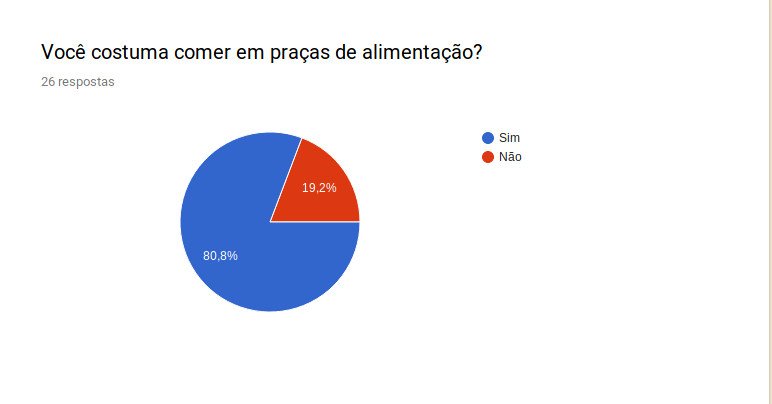 ](../images/questionario/pergunta1.png)

### Pergunta 2
[ 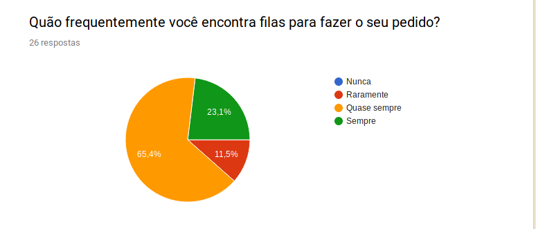 ](../images/questionario/pergunta2.png)

### Pergunta 3
[ 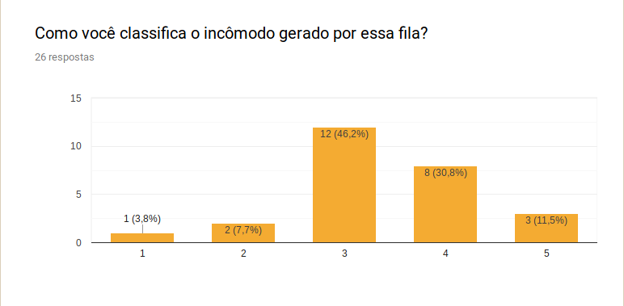 ](../images/questionario/pergunta3.png)

### Pergunta 4
[ 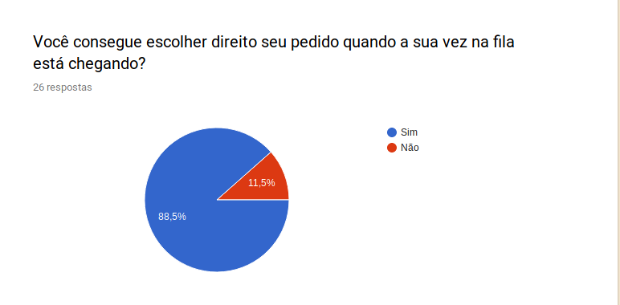 ](../images/questionario/pergunta4.png)

### Pergunta 5
[ 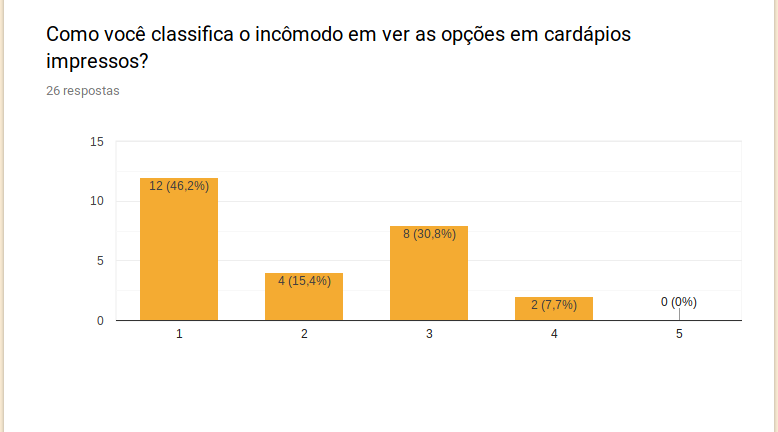 ](../images/questionario/pergunta5.png)

### Pergunta 6
[ 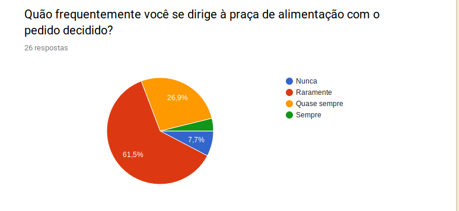 ](../images/questionario/pergunta6.png)

### Pergunta 7
[ 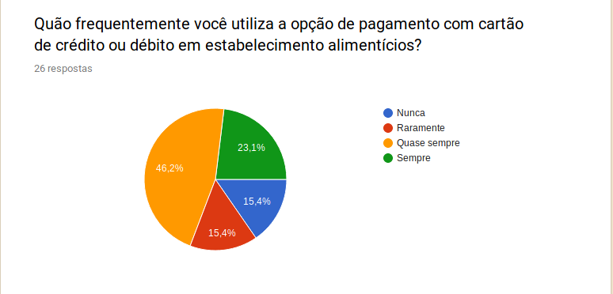 ](../images/questionario/pergunta7.png)

### Pergunta 8
[ 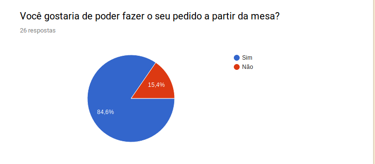 ](../images/questionario/pergunta8.png)

### Pergunta 9
[ 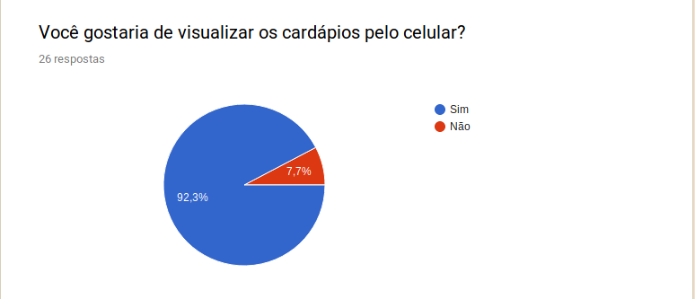 ](../images/questionario/pergunta9.png)

### Pergunta 10
[ 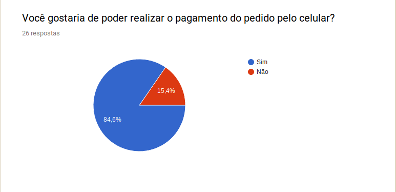 ](../images/questionario/pergunta10.png)

### Pergunta 11
[ 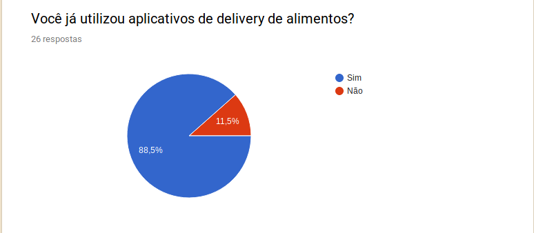 ](../images/questionario/pergunta11.png)

### Pergunta 12
[ 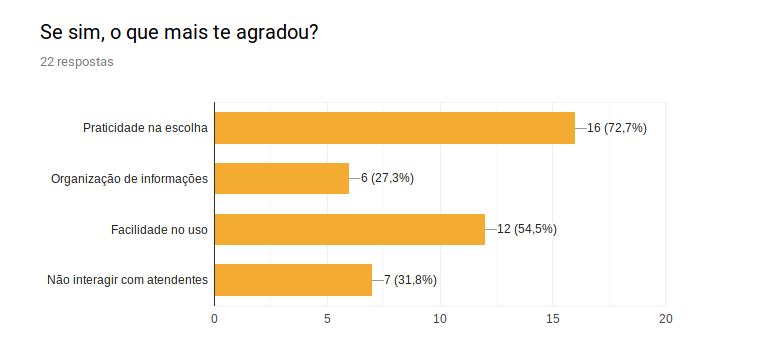 ](../images/questionario/pergunta12.png)

## 4. Análise

De acordo com os resultados levantados com o questionário, pode-se notar que há muita demanda nas praças de alimentação por parte dos consumidores, sendo que, 67,9% do público alvo apontou que quase sempre encontram filas para conseguir realizar um pedido.

Aliado a este fato, o incômodo gerado a partir destas filas foi classificado em uma escala de 1 a 5 com sua média de 3 a 4 pontos. Este valor confirma a hipótese problema que a aplicação tenta solucionar, que é diminuir as filas para consumir produtos em praças de alimentação.

Para isso, a proposta é incluir um cardápio com os produtos no celular, o que é visto como positivo pelo público alvo, com 85,7%. Já a forma de pagamento teve em sua maioria uma parcela de pessoas que já costumar utilzar seus cartões para pagar estabelecimentos deste ramo.

Por fim, a maior parte do público alvo, com 89,3% já utilizou algum aplicativo de delivery de alimentos, ou seja, há uma familiaridade com este tipo de aplicação e de como suas informações são dispostas na tela, como uma espécie de cardápio virtual e sistema de pagamento. Todos estes fatos podem validar algumas informações e aprimorar outras, portanto, as respostas foram coincidentes com grande parte das hipóteses geradas nas etapas do Design Sprint.

## 6. Referências

SEQ18RRANO, Maurício; SERRANO, Milene. Requisitos - Aula 07. 1º/2019. 50 slides. Material apresentado para a disciplina de Requisitos de Software no curso de Engenharia de Software da UnB, FGA.

