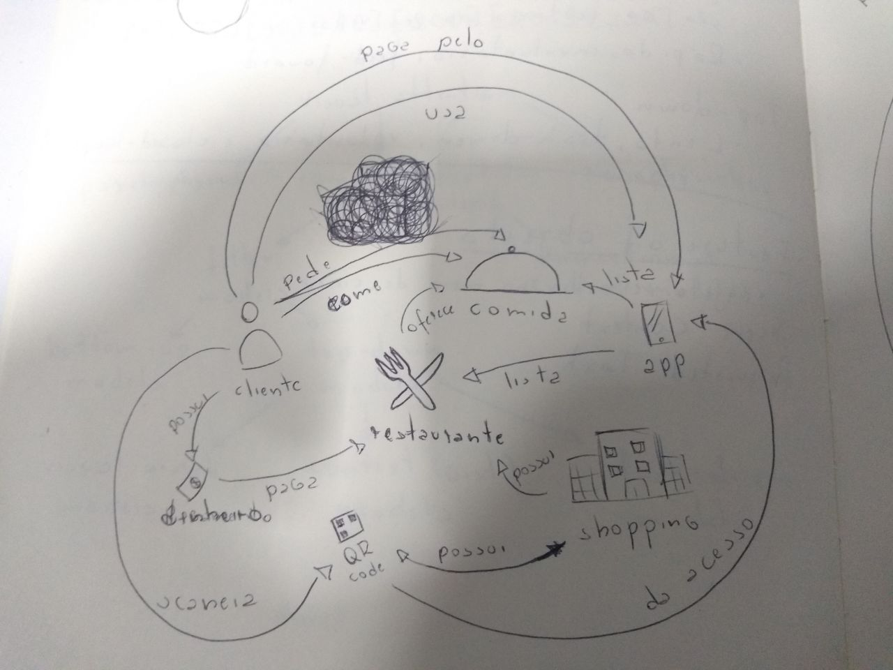

## RichPictures

### RichPicture 01 - Pedido na visão do cliente

 **RP01** | **Pedido na visão do cliente**  |
|--|--|
| **Versão**| Atual: 3.0 (21/08)   Anterior: [2.0](#richpicture-01-pedido-na-visao-do-cliente_1) | 
| **Descrição** | Pedido na visão do cliente. | 
|**Autor**| [Pedro Rodrigues Pereira](https://github.com/pedro-prp) |

### RichPicture 02 - Pedido no celular vs fila

 **RP02** | **Pedido no celular vs fila**  |
|--|--|
| **Versão**| Atual: 1.0 (21/08)   Anterior: - | 
| **Descrição** | Comparação do pedido no celular VS fila. | 
|**Autor**| [Elias Bernardo](https://github.com/ebmm01) | 

### RichPicture 03 - Sistema de segurança básico da aplicação

 **RP03** | **Sistema de segurança básico da aplicação**  |
|--|--|
| **Versão**| Atual: 2.0 (22/08)   Anterior: [1.0](#richpicture-03-sistema-de-seguranca-basico-da-aplicacao) | 
| **Descrição** | Sistema de segurança básico da aplicação. | 
|**Autor**| [Shayane Marques Alcântara](https://github.com/shayanealcantara) | 

### RichPicture 04 - Visão do Restaurante sem QR Comer

 **RP04** | **Restaurante sem QR Comer**  |
|--|--|
| **Versão**| Atual: 2.0 (22/08)   Anterior: [2.0](#richpicture-04-visao-do-restaurante-sem-qr-comer_1), [Geral](#visao-geral-do-restaurante) | 
| **Descrição** | Visão do Restaurante sem QR Comer | 
|**Autor**| [Pedro Féo](https://github.com/Phe0) | 

### RichPicture 05 - Visão do Restaurante com QR Comer

 **RP05** | **Restaurante com QR Comer**  |
|--|--|
| **Versão**| Atual: 2.0 (22/08)   Anterior: [2.0](#richpicture-05-visao-do-restaurante-com-qr-comer_1), [Geral](#visao-geral-do-restaurante) | 
| **Descrição** | Visão do Restaurante com QR Comer | 
|**Autor**| [Pedro Féo](https://github.com/Phe0) | 

### RichPicture 06 - Visão do Restaurante (Simplificado)

 **RP06** | **Visão do Rstaurante**  |
|--|--|
| **Versão**| Atual: 1.0 (22/08) | 
| **Descrição** | Visão do Restaurante (Simplificado) | 
|**Autor**| [Guilherme Marques](https://github.com/guilhesme23) | 

### Versões anteriores

#### RichPicture 01 - Pedido na visão do cliente

 **RP01** | **Pedido na visão do cliente**  |
|--|--|
| **Versão**| 2.0 (21/08)   Anterior: [1.0](#richpicture-01-pedido-na-visao-do-cliente_1) | 
| **Descrição** | Pedido na visão do cliente com o uso do cartão de crédito. | 
|**Autor**| [Pedro Rodrigues Pereira](https://github.com/pedro-prp) |

 **RP01** | **Pedido na visão do cliente**  |
|--|--|
| **Versão**| 1.0 (21/08)   Anterior: - | 
| **Descrição** | Pedido na visão do cliente com o uso do cartão de crédito. | 
|**Autor**| [Pedro Rodrigues Pereira](https://github.com/pedro-prp) | 

### RichPicture 03 - Sistema de segurança básico da aplicação

 **RP03** | **Sistema de segurança básico da aplicação**  |
|--|--|
| **Versão**| Atual: 1.0 (21/08)   Anterior: - | 
| **Descrição** | Sistema de segurança básico da aplicação. | 
|**Autor**| [Shayane Marques Alcântara](https://github.com/shayanealcantara) | 

#### RichPicture 04 - Visão do Restaurante sem QR Comer

 **RP04** | **Restaurante sem QR Comer**  |
|--|--|
| **Versão**| Atual: 1.0 (22/08)   Anterior: [Geral](#visao-geral-do-restaurante) | 
| **Descrição** | Visão do Restaurante sem QR Comer | 
|**Autor**| [Pedro Féo](https://github.com/Phe0) | 

#### RichPicture 05 - Visão do Restaurante com QR Comer

 **RP05** | **Restaurante com QR Comer**  |
|--|--|
| **Versão**| Atual: 1.0 (22/08)   Anterior: [Geral](#visao-geral-do-restaurante) | 
| **Descrição** | Visão do Restaurante com QR Comer | 
|**Autor**| [Pedro Féo](https://github.com/Phe0) | 

#### RichPicture 06 - Visão geral do Restaurante

 **RP06** | **Restaurante Geral**  |
|--|--|
| **Versão**| Atual: 1.0 (20/08)   Anterior: - | 
| **Descrição** | Visão geral do Restaurante | 
|**Autor**| [Pedro Féo](https://github.com/Phe0) |
