## Introdução

## Diagramas

### DG01 - Decisão do tema

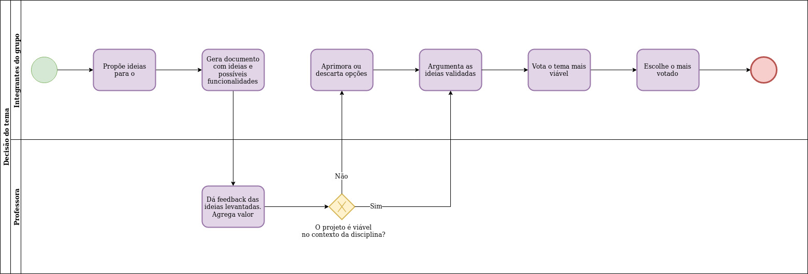

|**DG01** | **Decisão do tema**  |
|--|--|
| **Versão**| Atual: 1.1 (04/09)   Anterior: [1.0](#1-diagrama-bpm-decisao-do-tema_1) | 
| **Descrição** | Diagrama para ilustrar o processo de decisão do tema a ser trabalhado durante a disciplina. | 
|**Autor**| [Shayane Alcântara](https://github.com/shayanealcantara) |

### DG02 - Movimentação no Zenhub

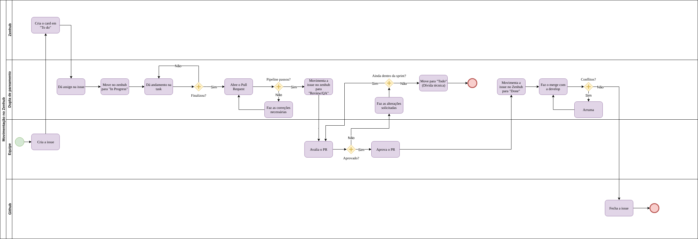

|**DG02** | **Movimentação no Zenhub**  |
|--|--|
| **Versão**| Atual: 1.1    Anterior: [1.0](#dg02-movimentacao-no-zenhub_1) (04/09) | 
| **Descrição** | Diagrama para ilustrar o processo de movimentação das issues utilizando o Zenhub. | 
|**Autor**| [Elias Bernardo](https://github.com/ebmm01) |

### DG03 - Elicitação de Requisitos

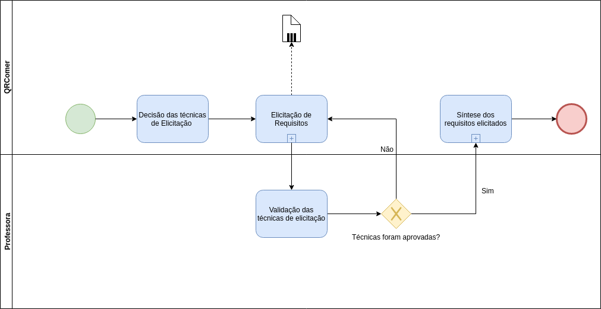

|**DG03** | **Elicitação de Requisitos**  |
|--|--|
| **Versão**| Atual: 1.0 (05/09)   Anterior: -- | 
| **Descrição** | Diagrama para ilustrar o processo de elicitação de requisitos, bem como sua síntese. | 
|**Autores**| [Matheus Blanco](https://github.com/MatheusBlanco), [Pedro Feo](https://github.com/Phe0), [Saleh Kader](https://github.com/devsalula) |

#### DG03.1 - Elicitação de Requisitos: Elicitação

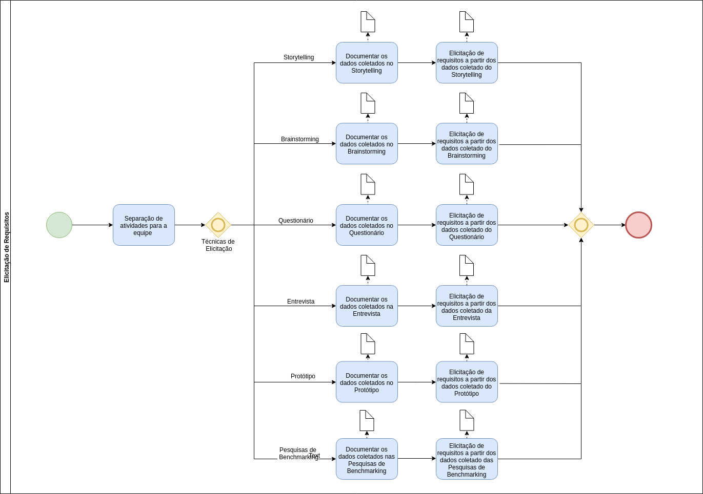

|**DG03.1** | **Elicitação de Requisitos**  |
|--|--|
| **Versão**| Atual: 1.0 (05/09)   Anterior: -- | 
| **Descrição** | Diagrama para ilustrar o subprocesso de elicitação de requisitos. |
|**Autores**| [Matheus Blanco](https://github.com/MatheusBlanco), [Pedro Feo](https://github.com/Phe0), [Saleh Kader](https://github.com/devsalula) |

#### DG03.2 - Elicitação de Requisitos: Síntese

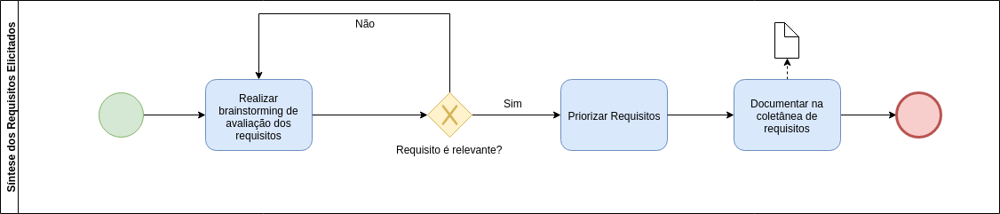

|**DG03.2** | **Elicitação de Requisitos**  |
|--|--|
| **Versão**| Atual: 1.0 (05/09)   Anterior: -- | 
| **Descrição** | Diagrama para ilustrar o subprocesso de síntese dos requisitos elicitados. |
|**Autores**| [Matheus Blanco](https://github.com/MatheusBlanco), [Pedro Feo](https://github.com/Phe0), [Saleh Kader](https://github.com/devsalula) |

### DG04 - Processo de Trabalho

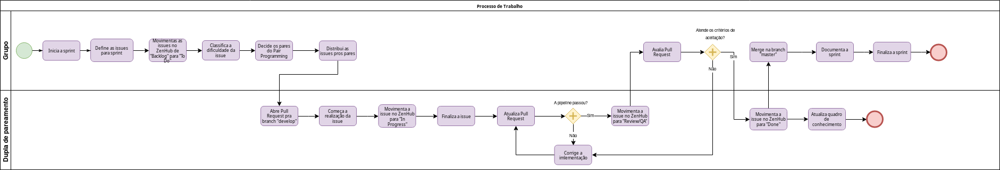

|**DG04** | **Processo de Trabalho**  |
|--|--|
| **Versão**| Atual: 1.1 (05/09)   Anterior: - | 
| **Descrição** | Diagrama para ilustrar o processo de trabalho da equipe | 
|**Autor**| [Sara Silva](https://github.com/silvasara) |

### DG05 -  Git Flow

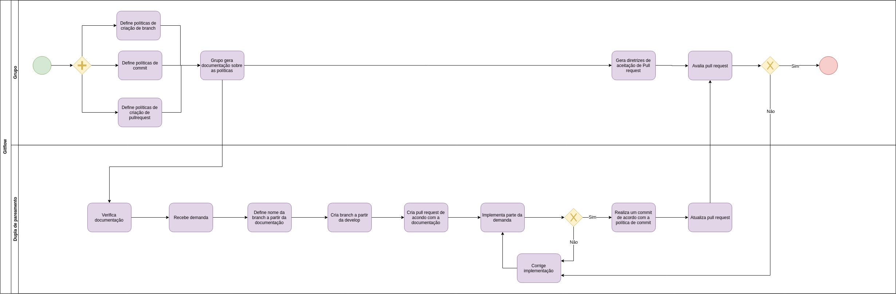

|**DG05** | **Git Flow**  |
|--|--|
| **Versão**| Atual: 1.0 (05/09)   Anterior: - | 
| **Descrição** | Diagrama para ilustrar o processo de git flow empregado pela equipe | 
|**Autor**| [Pedro Rodrigues](https://github.com/pedro-prp) |

### DG06 - Processo de Sprint

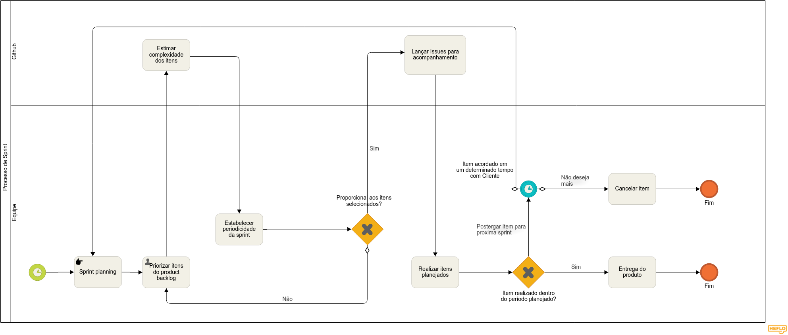

|**DG06** | **Processo de Trabalho**  |
|--|--|
| **Versão**| Atual: 1.1 (05/09)   Anterior: - | 
| **Descrição** | Diagrama para ilustrar o processo de elaboração e desenvolvimento de sprint |
|**Autor**| [Leonardo Barreiros](https://github.com/leossb36) |

### DG07 - Arquitetura

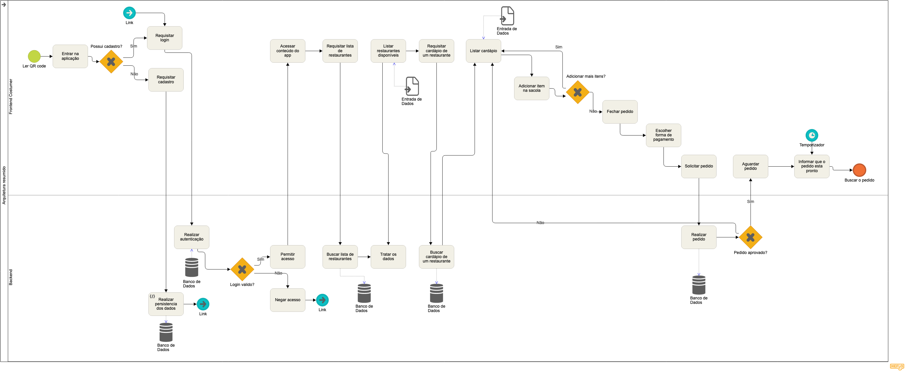

|**DG07** | **Arquitetura**  |
|--|--|
| **Versão**| Atual: 1.0(05/09)   Anterior: - | 
| **Descrição** | Diagrama para ilustrar o processo de arquitetura |
|**Autor**| [Alan Lima](https://github.com/alanrslima) |

## Versões anteriores

### DG02 -  Movimentação no Zenhub

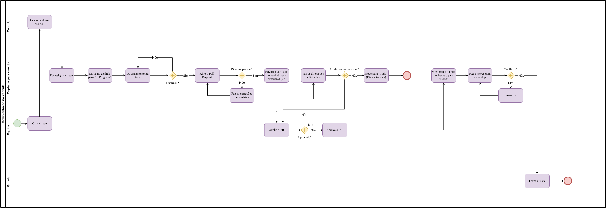

|**DG02** | **Movimentação no Zenhub**  |
|--|--|
| **Versão**| Atual: 1.0 (04/09)   Anterior: -- | 
| **Descrição** | Diagrama para ilustrar o processo de movimentação das issues utilizando o Zenhub. | 
|**Autor**| [Elias Bernardo](https://github.com/ebmm01) |

### 1 - Diagrama BPM - Decisão do tema
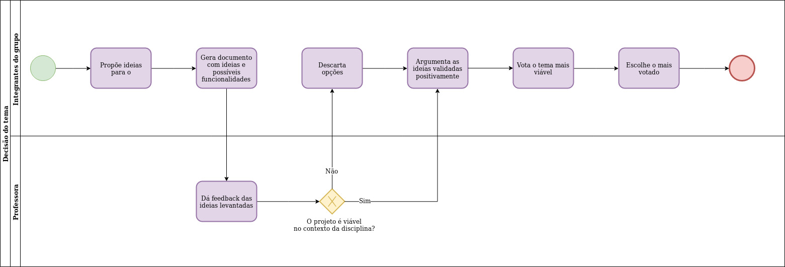

 **DG01** | **Decisão do tema**  |
|--|--|
| **Versão**| Atual: 1.0 (01/09)   Anterior: - | 
| **Descrição** | Diagrama para ilustrar o processo de decisão do tema a ser trabalhado durante a disciplina. | 
|**Autor**| [Shayane Alcântara](https://github.com/shayanealcantara) |

## Referências

Secretaria de Estado de Gestão e Planejamento. Manual de Modelagem de Processos Usando Bizagi. Disponível em: <http://www.sgc.goias.gov.br/upload/arquivos/2017-04/manual-de-modelagem-de-processos-usando-bizagi.pdf>. Acesso em: 01 de setembro de 2019.
