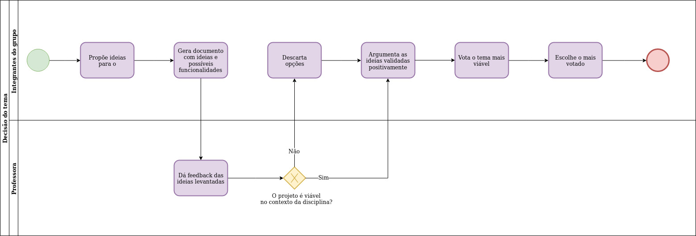

# Metodologia do projeto

## Histórico de Revisão:
|Data|Versão|Descrição|Autor|
|-|-|-|-|
|01/09/2019|0.1|Criação do documento, adição do diagrama de definição do tema a ser trabalhado durante o semestre | [Shayane Alcântara](https://github.com/shayanealcantara)|

## Introdução

## Metodologias 

## Adaptação das metodologias

## Diagramas

### Diagrama BPM - Decisão do tema

 **DG01** | **Decisão do tema**  |
|--|--|
| **Versão**| Atual: 1.0 (01/09)   Anterior: - | 
| **Descrição** | Diagrama para ilustrar o processo de decisão do tema a ser trabalhado durante a disciplina. | 
|**Autor**| [Shayane Alcântara](https://github.com/shayanealcantara) |

## Versões anteriores

## Referências

Secretaria de Estado de Gestão e Planejamento. Manual de Modelagem de Processos Usando Bizagi. Disponível em: <http://www.sgc.goias.gov.br/upload/arquivos/2017-04/manual-de-modelagem-de-processos-usando-bizagi.pdf>. Acesso em: 01 de setembro de 2019.
