## Histórico de Revisão

|Data|Versão|Descrição|Autor|
|-|-|-|-|
|12/09/2019|0.1|Criação do documento, adição da estrutura e diagramas de estado do Pedido|[Elias Bernardo](https://github.com/ebmm01)|
|19/09/2019|0.2| Adição do diagrama de colaboração referente a realização de pedido.| [Shayane Alcântara](https://github.com/shayanealcantara)|
|19/09/2019|0.3| Adição do diagrama de sequencia referente ao cadastro do usuário, do diagrama de sequencia referente ao login de usuário.| [Saleh Kader](https://github.com/devsalula)|
|19/09/2019|0.4| Adição do diagrama de colaboração referente a autenticação do usuário e do cadastro de cartões de credito.| [Guilherme Marques](https://github.com/guilhesme23)|

## 1. Introdução

Este documento tem por objetivo mostrar os seguintes diagramas dinâmicos: de __colaboração__, de __estado__ e de __sequência__

## 2. Diagrama de colaboração

Os diagramas a seguir de comunicação (chamado diagrama de colaboração na UML 1.x) é um tipo de diagrama de interação UML que mostra interações entre objetos e / ou partes (representadas como linhas de vida ) usando mensagens sequenciadas em um arranjo de forma livre [[1]](#referencias).

### 2.1 Microsserviço de Pedidos

O diagrama a seguir usa a notação UML de colaboração para descrever o fluxo de funcionamento de realização de um pedido.

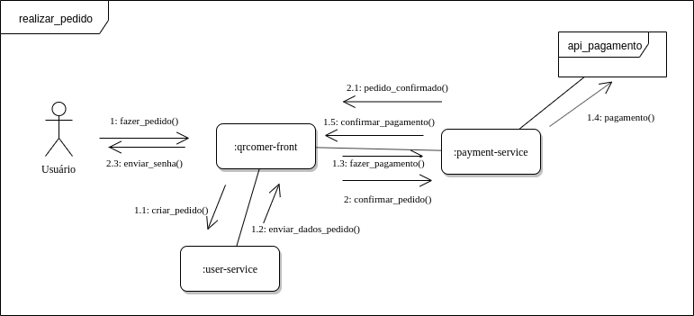

|**DS01** | **Diagrama de colaboração do microsserviço de pedidos**  |
|--|--|
| **Versão**| Atual: 1.0 (17/09)   Anterior: - |
| **Descrição** | Diagrama UML de colaboração do microsserviço de pedidos |
|**Autor**| [Saleh Kader](https://github.com/devsalula), [Matheus Blanco](https://github.com/MatheusBlanco)|

### 2.2 Microsserviço de Restaurante
z
O diagrama a seguir usa a notação UML de colaboração para descrever o fluxo de funcionamento do cadastro de um cardápio.

|**DC02** | **Diagrama de colaboração do microsserviço de Restaurante**  |
|--|--|
| **Versão**| Atual: 1.0 (19/09)   Anterior: - |
| **Descrição** | Diagrama UML de colaboração do microsserviço de restaurante |
|**Autor**| [Pedro Rodrigues](https://github.com/pedro-prp), [Sara Silva](https://github.com/silvasara)|

### 2.3 Microsserviço de Usuário

Os diagramas a seguir ilustram a relação do microsserviço de usuário com alguns cenários de uso.

#### 2.3.1 Realizar pedido

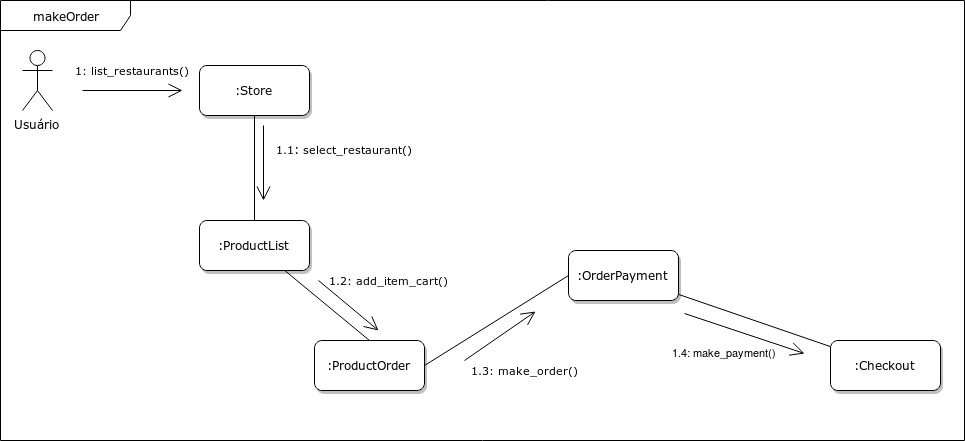

|**DC03** | **Diagrama de colaboração do microsserviço de Usuário - Realizar pedido**  |
|--|--|
| **Versão**| Atual: 1.0 (19/09)   Anterior: - |
| **Descrição** | Diagrama UML de colaboração do microsserviço de Usuário - Realizar pedido |
|**Autor**| [Shayane Alcântara](https://github.com/shayanealcantara) e [Guilherme Marques](https://github.com/guilhesme23)|

#### 2.3.2 Realizar autenticação

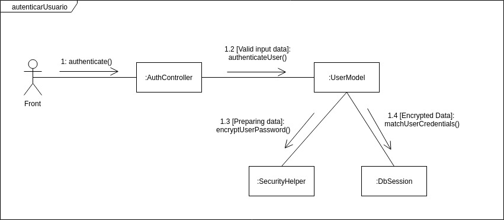

|**DC04** | **Diagrama de colaboração do microsserviço de Usuário - Realizar autenticação**  |
|--|--|
| **Versão**| Atual: 1.0 (19/09)   Anterior: - |
| **Descrição** | Diagrama UML de colaboração do microsserviço de Usuário - Realizar autenticação |
|**Autor**| [Shayane Alcântara](https://github.com/shayanealcantara) e [Guilherme Marques](https://github.com/guilhesme23)|

#### 2.3.4 Cadastrar Cartão de Crédito

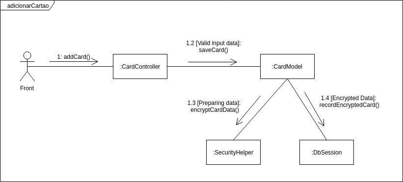

|**DC05** | **Diagrama de colaboração do microsserviço de Usuário - Cadastrar cartão de crédito**  |
|--|--|
| **Versão**| Atual: 1.0 (19/09)   Anterior: - |
| **Descrição** | Diagrama UML de colaboração do microsserviço de Usuário - Cadastrar Cartão de crédito |
|**Autor**| [Shayane Alcântara](https://github.com/shayanealcantara) e [Guilherme Marques](https://github.com/guilhesme23)|

## 3. Diagrama de estado

### 3.1 Pedidos

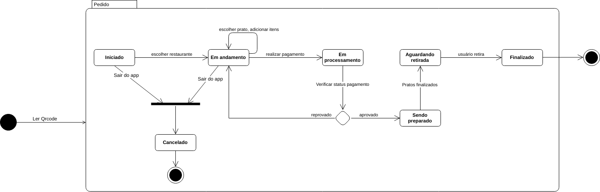

|**DE01** | **Diagrama de estado - Pedidos**  |
|--|--|
| **Versão**| Atual: 1.0 (18/09)   Anterior: - |
| **Descrição** | Diagrama de estado que exibe todos os possíveis estados para um pedido. |
|**Autor**| [Elias Bernardo](https://github.com/ebmm01) e [Leonardo Barreiros](https://github.com/leossb36)|

### 3.2 Instância VUE

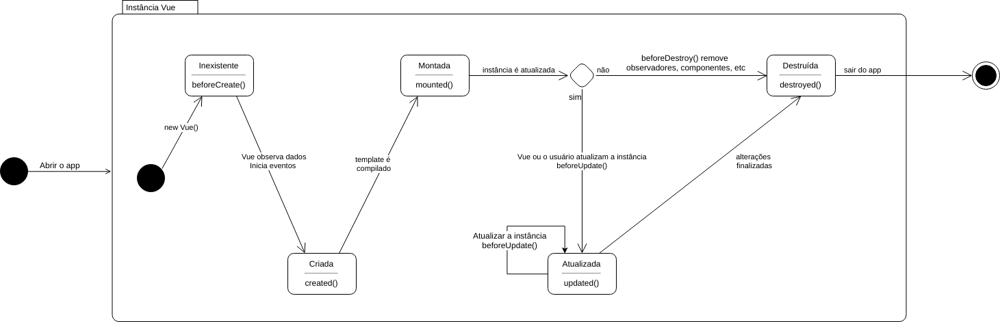

|**DE02** | **Diagrama de estado - Instância VUE**  |
|--|--|
| **Versão**| Atual: 1.0 (18/09)   Anterior: - |
| **Descrição** | Diagrama de estado que exibe o ciclo de vida de uma instância VUE. |
|**Autor**| [Elias Bernardo](https://github.com/ebmm01) e [Leonardo Barreiros](https://github.com/leossb36)|

## 4. Diagrama de sequência

### 4.1 Diagrama sequêncial do microsserviço de pedidos

#### 4.1.1 Fazer pedidos

O diagrama a seguir usa a notação UML sequêncial para descrever o fluxo de funcionamento de requerimento e pagamento de um pedido.

|**DS01** | **Diagrama de sequência de realização de pedidos**  |
|--|--|
| **Versão**| Atual: 2.0 (19/09)   Anterior: [1.0](../images/diagramas-uml/diagrama_sequencia_pedidos.png) |
| **Descrição** | Diagrama UML da sequência do microsserviço de pedidos |
|**Autor**| [Pedro Feo](https://github.com/Phe0), [Matheus Blanco](https://github.com/MatheusBlanco)|

#### 4.1.2 Checar pedidos antigos

O diagrama a seguir usa a notação UML sequêncial para descrever o fluxo de funcionamento de checagem de um pedido antigo.

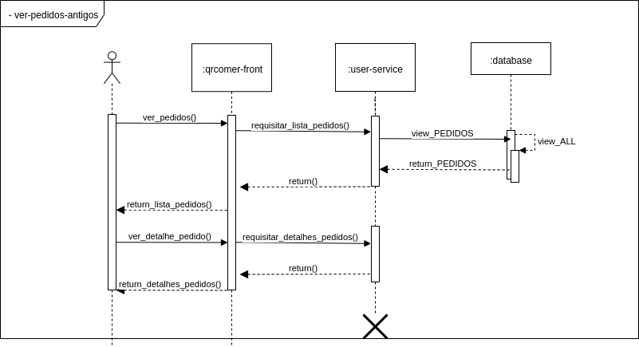

|**DS01** | **Diagrama de sequência de checagem de pedidos antigos**  |
|--|--|
| **Versão**| Atual: 1.0 (17/09)   Anterior: - |
| **Descrição** | Diagrama UML da sequência do microsserviço de checagem de pedidos antigos |
|**Autor**| [Pedro Feo](https://github.com/Phe0), [Matheus Blanco](https://github.com/MatheusBlanco)|

#### 4.1.3 Checar pedidos ativos

O diagrama a seguir usa a notação UML sequêncial para descrever o fluxo de funcionamento de checagem de um pedido antigo.

|**DS01** | **Diagrama de sequência de checagem de pedidos ativos**  |
|--|--|
| **Versão**| Atual: 2.0 (19/09)   Anterior: [1.0](../images/diagramas-uml/diagrama_sequencia_pedidos_ativos.png) |
| **Descrição** | Diagrama UML da sequência do microsserviço de checagem de pedidos ativos |
|**Autor**| [Pedro Feo](https://github.com/Phe0), [Matheus Blanco](https://github.com/MatheusBlanco)|

### 4.2 Diagrama sequêncial do microsserviço de usuários

#### 4.2.1 Cadastro de usuário

O diagrama a seguir usa a notação UML sequêncial para descrever o fluxo de funcionamento de cadastro do usuários.

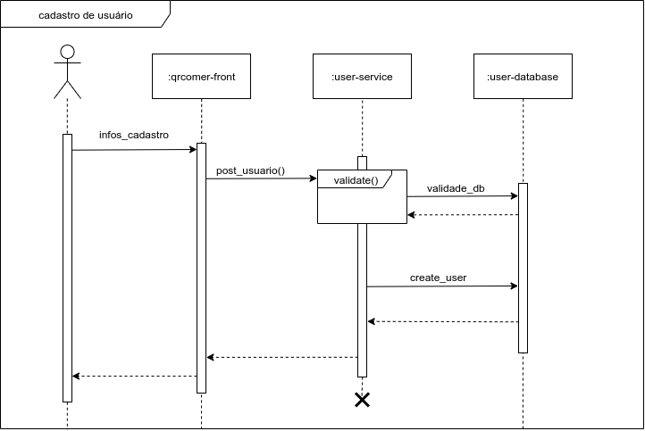

|**DS02** | **Diagrama de sequência de cadastro de usuário**  |
|--|--|
| **Versão**| Atual: 1.0 (19/09)   Anterior: - |
| **Descrição** | Diagrama UML da sequência do cadastro de usuários |
|**Autor**| [Pedro Feo](https://github.com/Phe0), [Saleh Kader](https://github.com/devsalula)|

#### 4.2.1 Login de Usuário

O diagrama a seguir usa a notação UML sequêncial para descrever o fluxo de login de usuários.

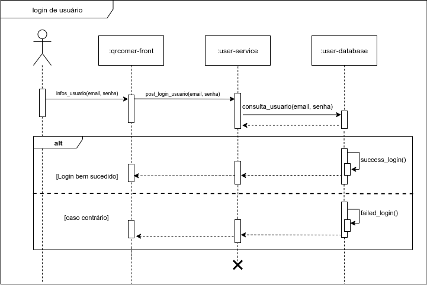

|**DS02** | **Diagrama de sequência de login de usuário**  |
|--|--|
| **Versão**| Atual: 1.0 (19/09)   Anterior: - |
| **Descrição** | Diagrama UML da sequência de login de usuários |
|**Autor**| [Saleh Kader](https://github.com/devsalula)|

#### 4.2.3 Cadastro de cartão

O diagrama a seguir usa a notação UML sequêncial para descrever o fluxo de funcionamento de cadastro de cartões.

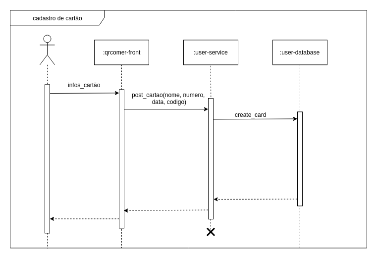

|**DS02** | **Diagrama de sequência de cadastro de cartão**  |
|--|--|
| **Versão**| Atual: 1.0 (19/09)   Anterior: - |
| **Descrição** | Diagrama UML da sequência do cadastro de cartão |
|**Autor**| [Pedro Feo](https://github.com/Phe0) |

## Referências

Diagramas de Colaboração. Disponível em: <https://www.uml-diagrams.org/communication-diagrams.html>. Acesso em: 19 de setembro de 2019.

VENTURA, Plínio. Entendendo o Diagrama de Sequência da UML: Entenda como especificar as interações entre as funcionalidades de um software. [S. l.], 10 fev. 2019. Disponível em: <https://www.ateomomento.com.br/diagrama-de-sequencia-uml/>. Acesso em: 17 set. 2019.

## Versões anteriores

### DS01 Diagrama de Sequência Microsserviço de pedidos

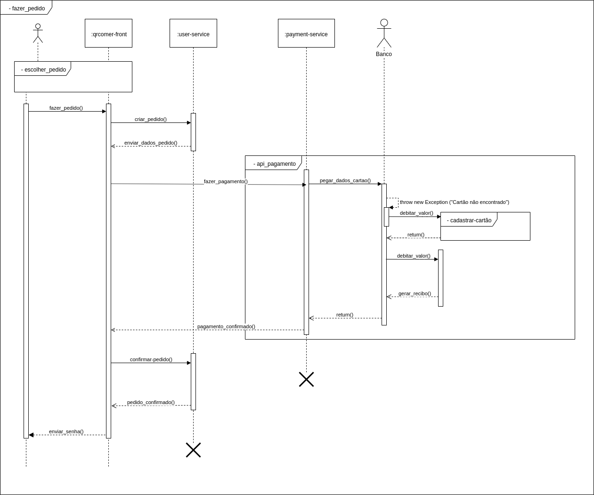

|**DS01** | **Diagrama de sequência de realização de pedidos**  |
|--|--|
| **Versão**| Atual: 1.0 (17/09)   Anterior: - |
| **Descrição** | Diagrama UML da sequência do microsserviço de pedidos |
|**Autor**| [Pedro Feo](https://github.com/Phe0), [Matheus Blanco](https://github.com/MatheusBlanco)|

### DS02 Diagrama de Sequência Microsserviço de pedidos ativos

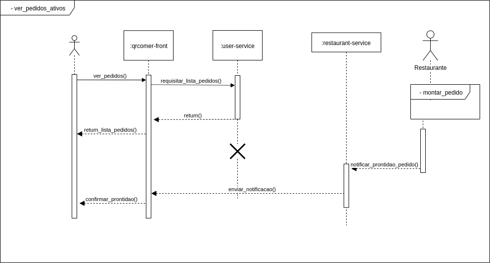

|**DS01** | **Diagrama de sequência de checagem de pedidos ativos**  |
|--|--|
| **Versão**| Atual: 1.0 (17/09)   Anterior: - |
| **Descrição** | Diagrama UML da sequência do microsserviço de checagem de pedidos ativos |
|**Autor**| [Pedro Feo](https://github.com/Phe0), [Matheus Blanco](https://github.com/MatheusBlanco)|