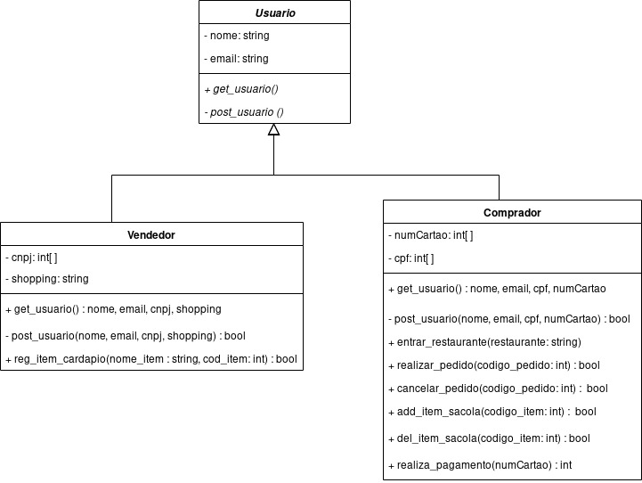

## Histórico de Revisão

|Data|Versão|Descrição|Autor|
|-|-|-|-|
|12/09/2019|0.1|Criação do documento, e adição da estrutura e diagramas de pacote|[Shayane Alcântara](https://github.com/shayanealcantara)|
|15/09/2019|0.2|Adição da 1ª versão do caso de uso sobre a aplicação|[Shayane Alcântara](https://github.com/shayanealcantara)|
|15/09/2019|0.3|Adição da 1ª versão do diagrama de classe do microserviço de usuário |[Sara Silva](https://github.com/silvasara)|
|15/09/2019|0.4|Adição do Diagrama de Pacotes do Front e do Back End e Adição do Diagrama de Classe de Pedidos|[Saleh Kader](https://github.com/devsalula)|

## 1. Introdução

## 2. Diagrama de Casos de Uso

### 2.1 Caso de Uso sobre a aplicação com requisitos de priorização Must have)

O diagrama a seguir foi realizado baseando-se na [elicitação de requisitos](../iniciativas_extras/elicitacao_de_requisitos/elicitacao_de_requisitos.md) realizada pela equipe. Este diagrama busca ilustrar os requisitos e suas relações, em específico os que foram priorizados com o nível **MUST HAVE**.

|**UC01** | **Caso de Uso dos Requisitos**  |
|--|--|
| **Versão**| Atual: 1.0 (15/09)   Anterior: - |
| **Descrição** | Caso de uso dos requisitos. |
|**Autor**| [Shayane Alcântara](https://github.com/shayanealcantara) |

### 2.2 Caso de Uso sobre o Restaurente

O diagrama a seguir foi construído visando demonstrar a visão do Restaurante e as ações do mesmo na aplicação.

#### Atores
    
* Restaurante  
* Cliente  

#### Fluxo básico
* Restaurante se cadastra
* Restaurante é divulgado pro cliente

#### Fluxos Alternativos
##### FA1 - Restaurante cadastra itens novos
1) Restaurante se cadastra  
2) Restaurante acessa a API  
3) Restaurante altera a API  
4) Restaurante cadastra seus itens no cardápio

#### Pré-condições
* Restaurante realizar cadastro na aplicação
* Restaurante possuir itens a cadastrar

#### Pós-condições
* Usuário tem acesso ao restaurante
* Restaurante cadastrado na aplicação

|**UC02** | **Caso de Uso do Restaurante**  |
|--|--|
| **Versão**| Atual: 1.0 (15/09)   Anterior: - |
| **Descrição** | Caso de uso do Restaurante. |
|**Autores**| [Pedro Rodrigues](https://github.com/pedro-prp), [Matheus Blanco](https://github.com/MatheusBlanco) |

## 3. Diagrama de pacotes

### 3.1 _Back-end_

O diagrama a seguir foi construído tomando como base o modelo de pacotes adotados, normalmente para projetos em Django Rest Framework.

|**DP01** | **Diagrama de pacotes do Back End**  |
|--|--|
| **Versão**| Atual: 1.1 (13/09)   Anterior: [1.0](#dp01-diagrama-de-pacotes-back-end) |
| **Descrição** | Diagrama de Pacotes para os Microserviços do Back End |
|**Autor**| [Shayane Alcântara](https://github.com/shayanealcantara) e [Saleh Kader](https://github.com/devsalula)|

### 3.2 _Front-end_

O diagrama a seguir foi construído tomando como base o modelo de pacotes adotados, normalmente para projetos em VueJs.

|**DP02** | **Diagrama de pacotes do Front End**  |
|--|--|
| **Versão**| Atual: 1.1 (13/09)   Anterior: [1.0](#dp02-diagrama-de-pacotes-front-end) |
| **Descrição** | Diagrama de Pacotes para o Front End |
|**Autor**| [Shayane Alcântara](https://github.com/shayanealcantara)|

## 4 Diagrama de classes e microserviços

### 4.1  Diagrama de classes do microsserviço de usuário

O diagrama a seguir usa a notação UML para descrever as classes do microserviço de usuário.

|**DC01** | **Diagrama de classes de usuário**  |
|--|--|
| **Versão**| Atual: 2.0 (18/09)   Anterior: [1.0](#dc01-diagrama-de-classes-de-usuario) |
| **Descrição** | Diagrama UML das classes do microserviço de usuário |
|**Autor**| [Sara Silva](https://github.com/silvasara)|

### 4.2  Diagrama de classes do microsserviço de Restaurante

O diagrama a seguir usa a notação UML para descrever as classes do microserviço de restaurante.

|**DC02** | **Diagrama de classes de pedido**  |
|--|--|
| **Versão**| Atual: 1.0 (16/09)   Anterior: - |
| **Descrição** | Diagrama UML das classes do microserviço de restaurante |
|**Autor**| [Elias Bernardo](https://github.com/ebmm01) e [Leonardo Barreiros](https://github.com/leossb36)|

### 4.3 Diagrama de classes do microsserviço de Pedidos

O diagrama a seguir usa a notação UML para descrever as classes do microserviço de restaurante.

|**DC03** | **Diagrama de classes de pedidos**  |
|--|--|
| **Versão**| Atual: 1.0 (13/09)   Anterior: - |
| **Descrição** | Diagrama UML das classes do microserviço de pedidos |
|**Autor**| [Matheus Blanco](https://github.com/MatheusBlanco)|

## 4 Diagrama de componentes

## Versões anteriores

### DP01 Diagrama de Pacotes Back End

|**DP01** | **Diagrama de pacotes do Back End**  |
|--|--|
| **Versão**| Atual: 1.0 (12/09)   Anterior: - |
| **Descrição** | Diagrama de Pacotes para os Microserviços do Back End |
|**Autor**| [Shayane Alcântara](https://github.com/shayanealcantara)|

### DP02 Diagrama de Pacotes Front End

|**DP02** | **Diagrama de pacotes do Front End**  |
|--|--|
| **Versão**| Atual: 1.0 (12/09)   Anterior: - |
| **Descrição** | Diagrama de Pacotes para o Front End |
|**Autor**| [Shayane Alcântara](https://github.com/shayanealcantara)|

### DC01 Diagrama de classes de usuário

|**DC01** | **Diagrama de classes de usuário**  |
|--|--|
| **Versão**| Atual: 1.0 (16/09)   Anterior: - |
| **Descrição** | Diagrama UML das classes do microserviço de usuário |
|**Autor**| [Sara Silva](https://github.com/silvasara) e [Pedro Rodrigues](https://github.com/pedro-prp)|
