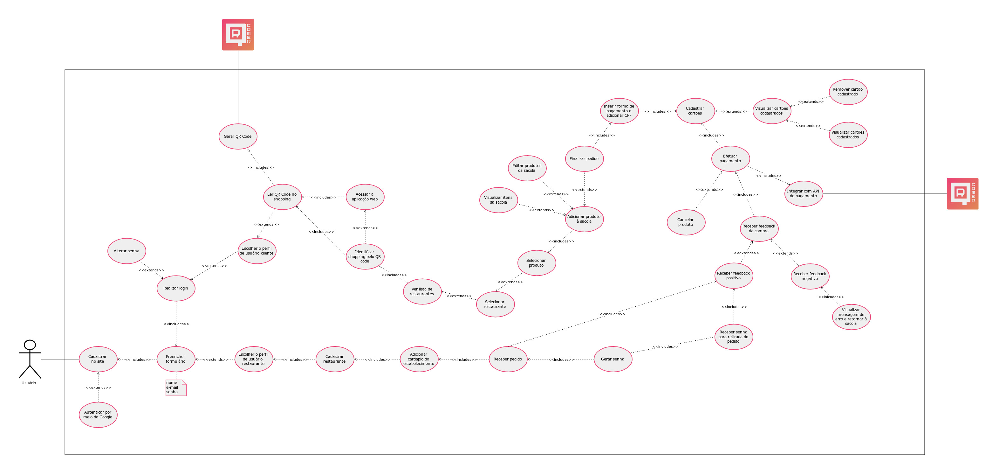
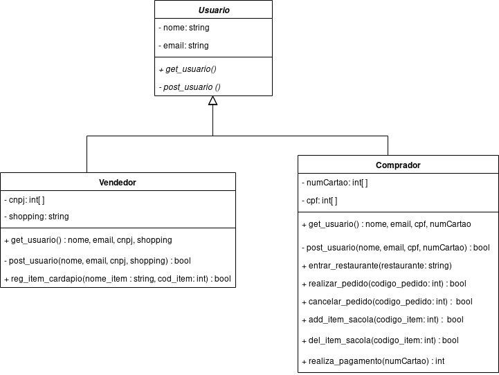

## Histórico de Revisão

|Data|Versão|Descrição|Autor|
|-|-|-|-|
|12/09/2019|0.1|Criação do documento, e adição da estrutura e diagramas de pacote|[Shayane Alcântara](https://github.com/shayanealcantara)|
|15/09/2019|0.2|Adição da 1ª versão do caso de uso sobre a aplicação|[Shayane Alcântara](https://github.com/shayanealcantara)|
|16/09/2019|0.3|Adição da 1ª versão do diagrama de classe do microserviço de usuário |[Sara Silva](https://github.com/silvasara)|

## 1. Introdução

### 1.1 Objetivo
### 1.2 Escopo
### 1.3 Definições, Acrônimos e Abreviações

## 2. Representação arquitetural

[Resumo conciso da tecnologia e um diagrama de cada subtópico abaixo]

### 2.1 Django REST Framework
### 2.2 Vue.js

## 3. Restrições e Restrições arquiteturais
[Esta seção descrever os requisitos de software e restrições que tem um impacto significante na arquitetura.]

## 4. Visão de Casos de Uso
[Esta seção lista as especificações centrais e significantes para a arquitetura do sistema em relação aos atores da aplicação.]

### 4.1 Caso de Uso sobre a aplicação com requisitos de priorização Must have)

O diagrama a seguir foi realizado baseando-se na [elicitação de requisitos](../iniciativas_extras/elicitacao_de_requisitos/elicitacao_de_requisitos.md) realizada pela equipe. Este diagrama busca ilustrar os requisitos e suas relações, em específico os que foram priorizados com o nível **MUST HAVE**.

|**UC01** | **Caso de Uso dos Requisitos**  |
|--|--|
| **Versão**| Atual: 1.0 (15/09)   Anterior: - |
| **Descrição** | Caso de uso dos requisitos. |
|**Autor**| [Shayane Alcântara](https://github.com/shayanealcantara) |

## 5. Visão Lógica
[Descrever uma visão lógica da arquitetura. Descrever as classes mais importantes, sua organização em pacotes de serviços e subsistemas. Diagramas de classes e sequência devem ser incluídos para ilustrar os relacionamentos entre as classes significativas na arquitetura, subsistemas, pacotes e camadas. Descrever também a relação de Vue.js com Django Rest no contexto do projeto e descrição breve dos pacotes.]

### 5.1 Diagrama de relações
[Relação macro dos componentes.]

### 5.2 Diagrama de pacotes
[Basta uma imagem do diagrama nos tópicos abaixo.]

#### 5.2.1 _Back-end_

#### 5.2.2 _Front-end_

## 6. Visão de implementação

### 6.1 Diagrama de classes e microserviços

#### 6.1.1  Diagrama de classes do microserviço de usuário

O diagrama a seguir usa a notação UML para descrever as classes do microserviço de usuário.

|**DC01** | **Diagrama de classes de usuário**  |
|--|--|
| **Versão**| Atual: 1.0 (16/09)   Anterior: - |
| **Descrição** | Diagrama UML das classes do microserviço de usuário |
|**Autor**| [Sara Silva](https://github.com/silvasara) e [Pedro Rodrigues](https://github.com/pedro-prp)|

### 6.2 Diagrama do banco de dados

## Referências
