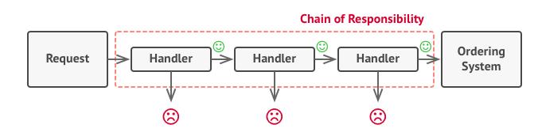
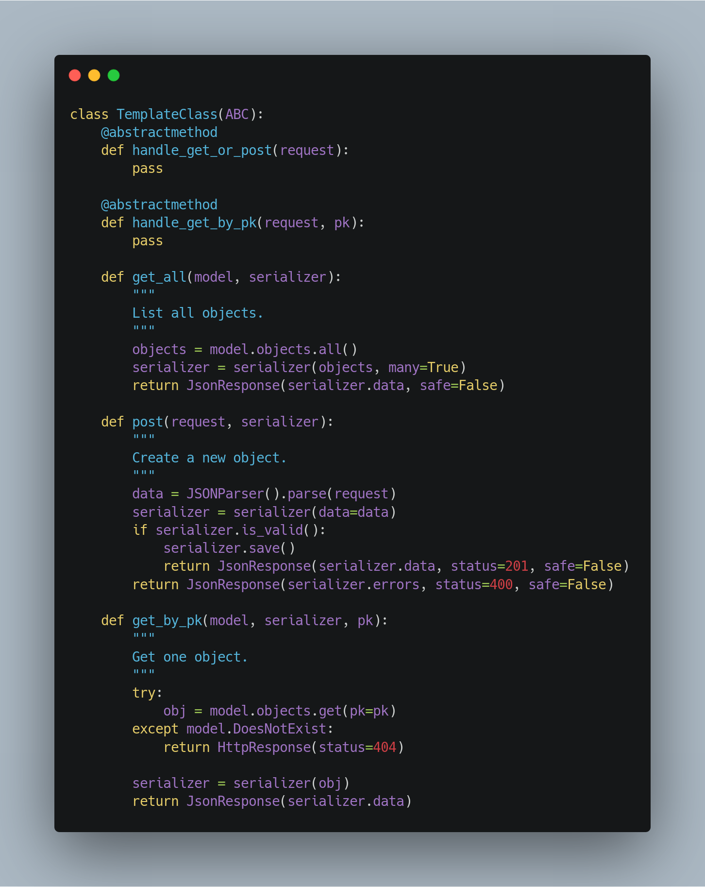
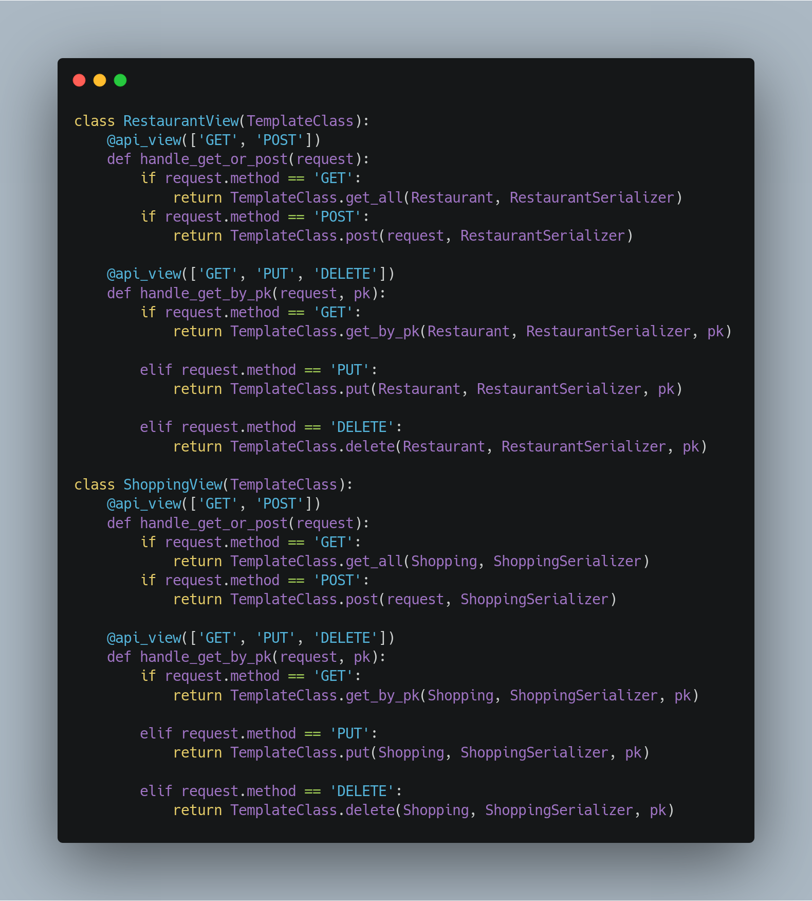

## Histórico de Revisão

| Data       | Versão | Descrição                                | Autor                                                                                                 |
| ---------- | ------ | ---------------------------------------- | ----------------------------------------------------------------------------------------------------- |
| 23/10/2019 | 0.1    | Criação do documento                     | [Elias Bernardo](https://github.com/ebmm01)                                                           |
| 24/10/2019 | 0.2    | Adição do Strategy                       | [Guilherme Marques](https://github.com/guilhesme23) [Saleh Kader](https://github.com/devsalula)       |
| 24/10/2019 | 0.3    | Adição do padrão de Factory Method       | [Shayane Alcantara](https://github.com/shayanealcantara) e [Sara Silva](https://github.com/sarasilva) |
| 25/10/2019 | 0.4    | Adição do padrão Chain of Responsibility | [Matheus Blanco](https://github.com/MatheusBlanco)                                                    |

## Introdução

Estes padrões lidam com o processo de comunicação, gerenciamento de relações, e responsabilidades entre objetos

Nesse documento iremos abordar os padrões que grupo utilizou, explicando como foi utilizado, o por quê e qual problema foi solucionado com a implementação.

## Chain of responsibility

Cadeia de responsabilidades é um padrão **comportamental** que permite ao programa passar para frente requisções ao longo de um caminho de **handlers**. Ao receber uma requisição, o **handler** decide se é o momento apropriado para processar os dados presentes na mesma. Caso não seja, ele a passará para o próximo **handler**.

### Como foi utilizado no projeto

A partir da existência de um sistema de autênticação e login, foi possível limitar a interação de um usuário não-registrado com o sistema, a partir da limitação de realizar pedidos, de maneira que os mesmos só são possíveis para os usuários que tiverem um cartão registrado em sua conta. O padrão não foi implementado em sua maneira mais completa ainda, entretanto foi utilizado de maneira indireta a partir do sistema de autenticação.

### Objetivo & problema sanado

A implementação ainda não foi possível de ser realizada, embora esteja nos planos realizar a codificação completa da mesma. Entretanto, apesar da falta de uma implementação direta, pode-se notar que o objetivo principal do padrão foi atingido, a partir do restringimento da realização do pedido por parte de um usuário não cadastrado.

## Observer

Observador é um padrão de design **comportamental** que permite definir um mecanismo de **inscrição** para notificar vários objetos sobre quaisquer eventos que ocorram no objeto que estão **observando**.

### Como foi utilizado no projeto

**The Django way!** O Django implementa [signals](https://docs.djangoproject.com/en/2.2/topics/signals/), o que ajuda a permitir que aplicativos dissociados sejam notificados quando ações ocorrem em outro local do framework ou em outro serviço no nosso caso. Em poucas palavras, os sinais permitem que certos remetentes notifiquem um conjunto de receptores de que alguma ação ocorreu. Eles são especialmente úteis quando muitas partes do código podem estar interessados nos mesmos eventos.

### Objetivo & problema sanado

Ao utilizarmos os signals, podemos fazer um sistema de subscrição de e-mails para que os usuários interessados em receber novidades possam ser notificados via e-mail. Somente irão receber as mensagens os usuários que vonluntariamente se cadastrarem no sistema de subscrição.

## Strategy

O Strategy é um padrão de projeto **comportamental** onde permite introduzir um família de classes para variações de algoritmo, ou seja, permitir realiza a mesma função de maneira diferentes.

### Como foi utilizado no projeto

O Padrão tem como plano a utilização de diferentes classes para diferentes comportamentos dentro do código. O intuito é que se utilize de uma classe Pai, para servir de base para construção das classes filhas. Nesse caso, foi pensado a implementação dentro do serviço de pagamentos do QRComer. A inteção era que as classes filhas descrevessem diferentes formas de pagamento utilizando a interface da classe pai. As classes filhas, seriam uma de pagamento por Boleto e outra de pagamento por Cartão de Crédito.

### Objetivo & problema sanado

A implementação não deu certo, por conta do objetivo do produto. O QRComer, leva em conta que o usuário pague por imediato a sua refeição, o que inviabilizaria a implementação de um tipo de pagamento como o de Boleto, onde o usuário só conseguiria receber a sua refeição após a confirmação desse pagamento, que normalmente demora bastante.

## Template Method

Template Method é um padrão de design **comportamental** que define o "esqueleto" de um algoritmo na superclasse, mas permite que as subclasses substituam etapas específicas do algoritmo sem alterar sua estrutura [[3]](https://refactoring.guru/design-patterns/template-method).

### Como foi utilizado no projeto

O padrão foi selecionado para auxiliar no aproveitamento de linhas de código, por tratar-se de dados semelhantes nas classes definidas, podendo ser reaproveitado quando e o que for necessário. Ou seja, ele permite a delimitação de passos na ordem a serem executados e de que forma eles serão executados a depender da condição.

### Objetivo & problema sanado

O principal problema observado no código implementado foi a duplicação de diversas linhas de código. Com a adaptação do padrão, foi possível reduzir esse fator e assim, permitir uma melhor legibilidade do código em questão. A seguir segue a adaptação da implementação de uma parte das regras de serviço.

## Referências

[1] https://docs.djangoproject.com/en/2.2/topics/signals/

[2] Erich Gamma, Richard Helm, Ralph Johnson, John Vlissides (1994). Design Patterns: Elements of Reusable Object-Oriented Software

[3] https://refactoring.guru/design-patterns/template-method
