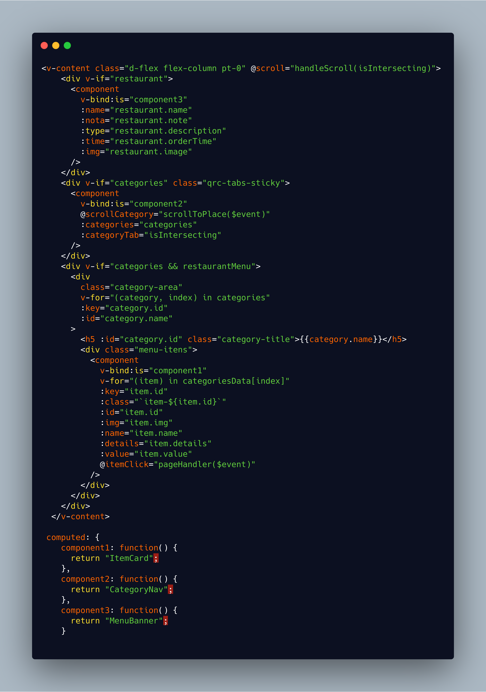
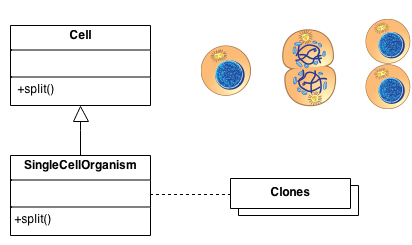
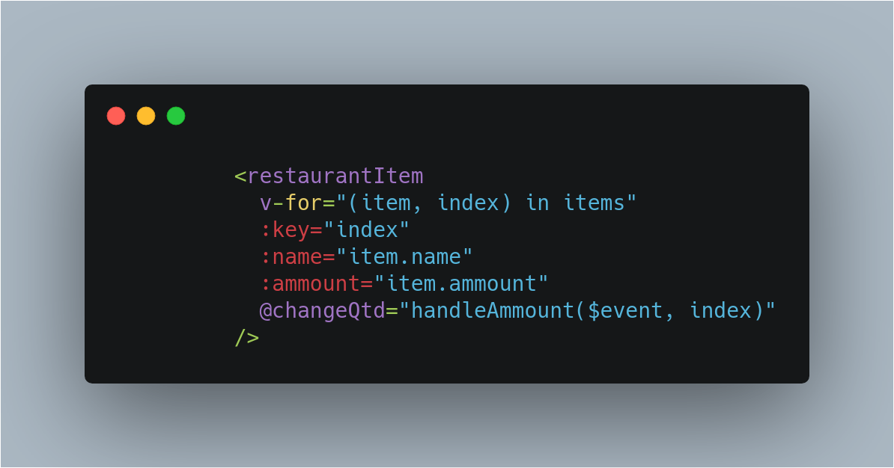

## Histórico de Revisão

| Data       | Versão | Descrição             | Autor                                             |
| ---------- | ------ | --------------------- | ------------------------------------------------- |
| 23/10/2019 | 0.1    | Criação do documento  | [Elias Bernardo](https://github.com/ebmm01)       |
| 24/10/2019 | 0.2    | Singleton e Multiton  | [Pedro Féo](https://github.com/phe0)              |
| 24/10/2019 | 0.3    | Inclusão do prototype | [Leonardo Barreiros](https://github.com/leossb36) |

## Introdução

Estes padrões lidam com o processo de criação de novos objetos de uma forma que ele pode ser desacoplado do seu sistema de implementação. Isso fornece mais flexibilidade em decidir quais objetos precisam ser criados para um determinado caso ou cenário

Nesse documento iremos abordar os padrões que grupo utilizou, explicando como foi utilizado, o por quê e qual problema foi solucionado com a implementação.

## Factory method

"_Defina uma interface para criar um objeto, mas deixe as subclasses decidirem qual classe instanciar. O método Factory permite que uma classe adie a instanciação usada nas subclasses_." (Gang of Four)

Esse padrão de design lida com a criação de objetos sem especificar explicitamente a classe real que a instância terá - pode ser algo que é decidido no tempo de execução com base em muitos fatores. Alguns desses fatores podem incluir sistemas operacionais, diferentes tipos de dados ou parâmetros de entrada. Dá aos desenvolvedores a tranqüilidade de apenas chamar um método, em vez de chamar um construtor concreto.

### Como foi utilizado no projeto

Foi criado uma factory de usuários utilizando a biblioteca [Factory boy](https://factoryboy.readthedocs.io/en/latest/)

### Objetivo & problema sanado

O **Factory method** foi utilizado nos testes, para evitar duplicação de código e facilitar a criação de personas de testes. Por exemplo,

Passa a ser:

E caso se precise de personas diferentes, não é preciso ficar criando vários datas, mas sim alterar determinado atributo da persona.

## Abstract Factory

O padrão fábrica abstrata é um padrão **criacional** que permite criar familias de objetos relacionados sem a necessidade de se especificar suas classes concretas.

### Como foi utilizado no projeto

O Abstract factory foi utilizado no projeto a partir da utilização de componentes dinâmicamente criados no **Front-end**. A partir de um componente próprio do **Vue.js**, `<component :is>`, foi possível utilizar dos componentes criados anteriormente sem necessariamente referenciá-los nos templates do Vue, o que permite maior facilidade de entendimento de código e renderização dinâmica. Ou seja, caso se mostre necessário, dois componentes podem ser intercalados de acordo com as necessidades do usuário.

[O código](https://github.com/fga-desenho-2019-2/qrcomer-front/blob/develop/src/views/MenuPage/RestaurantMenu.vue)

### Objetivos & problemas sanados

O objetivo da utilização deste padrão era o de se poder criar componentes dinamicamente renderizados, sendo que agora também é possível fornecer dois componentes em um mesmo espaço, permitindo que sejam usados de acordo com as necessidades do usuário.

## Prototype method

O padrão prototype tem a finalidade de criar novos objetos a partir de um que já tenha sido registrado anteriormente. Deste modo evita-se a necessidade de estar criando toda vez que for necessário. Em outras palavras realiza uma copia do objeto original, preservando sua identidade e podendo também ser realizado a sobrescrita nas filhas.

### Como foi utilizado no projeto

Para o serviço restaurantes este padrão se adequa muito bem, pois exite uma relação de muitos para muitos em relação ao item do cardápio com restaurante. Exemplo: arroz. Arroz é um objeto comum entre os restaurantes, portanto, para evitar o custo de cadastrar um registro por cada restaurante que possui arroz como item do cardápio é feito a copia do primeiro objeto para o restante.

### Objetivo & problema sanado

O django possui funções próprias para criar relacionamentos, portanto evitando o custo de ter que criar uma função que realize a copia do objeto. Para sanar este problema é utilizado as funções many to one ou many to many. Porém isto ocorre de maneira genérica, ou seja, será feito para todos. Deste modo, para poder restringir itens a um determido cardápio é necessario que seja realizado uma cópia.

## Singleton

Esse padrão tem a função de prover um ponto de acesso global para toda a aplicação, que tenha uma instancia única.

### Como foi utilizado no projeto

O uso de singleton se mostra inerente ao nosso projeto, tendo em vista que será utilizado do localStorage, que é um recurso da própria Web, para guardar variáveis globalmente. Além disso, optamos pelo uso do Vuex, que é responsável por prover uma store, capaz de guardar variáveis.

### Objetivo & problema sanado

O localstorage é utilizado para a comunicação entre páginas, para que uma página consiga receber variáveis de outros locais da aplicação.
Já o Vuex é usado para a comunicação entre componentes de difícil comunicação dentro de uma mesma página.

## Multiton

Esse padrão é uma generalização do Singleton, enquanto o singleton só permite a utilização de uma instância, o multiton permite a construção controlada de multiplas instâncias.

### Como foi utilizado no projeto

O multiton, assim como o singleton se mostra um padrão inerente à aplicação por conta das características composicionais do Vue. Permitindo que um v-for consiga controlar múltiplas instâncias de um mesmo componente, onde cada instanância possui uma chave única.

### Objetivo & problema sanado

O multiton permite a criação de diversos componentes iguais, que contenham informações diferentes. Como por exemplo na construção de itens na Sacola.

## Referências

[1] Erich Gamma, Richard Helm, Ralph Johnson, John Vlissides (1994). Design Patterns: Elements of Reusable Object-Oriented Software
