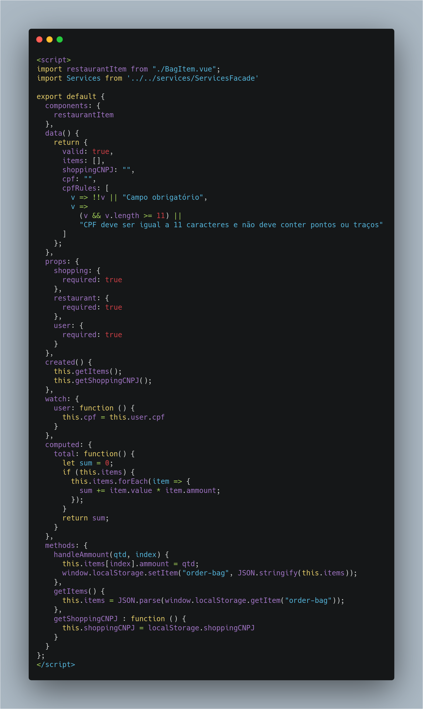
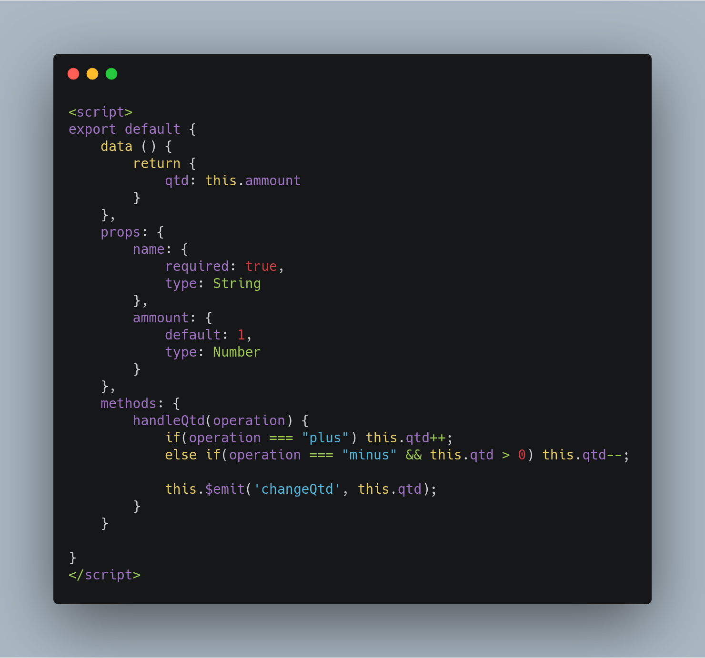
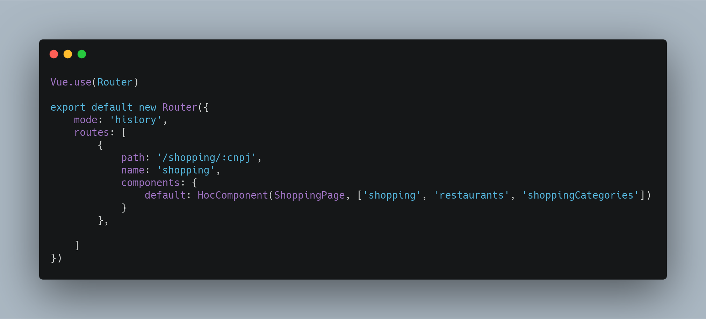
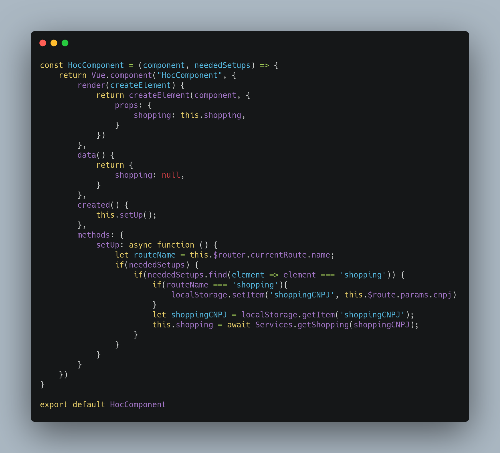

## Histórico de Revisão

|Data|Versão|Descrição|Autor|
|-|-|-|-|
|24/10/2019|0.1|Tópicos HOC e Container/Presentional components|[Pedro Féo](https://github.com/phe0)|

## Container/Presentional components

Esse padrão descreve como deve ser feita a comunicação entre os componentes do Vue. Os dividindo em duas categorias, __Containers__ e __Presentionals__. Os __Containers__ são responsáveis por conter toda a lógica do sistema e chamar os outros componentes, enquanto os __Presentionals__ são responsáveis apenas por demonstrar informação na tela.

Essa divisão dos componentes faz com que todo componente seja completamente independente, favorecendo a reutilização de componentes e facilitando o processo de teste de cada componente separado. 

### Como foi utilizado no projeto

Um exemplo é a página da sacola, onde o componente orderBagPage é o container e o BagItem é o presentional

orderBagPage.vue

BagItem.vue

O BagItem é responsável apenas em receber o nome e a quantidade do item e enviar eventos para o container dizendo se algum botão foi pressionado.
Enquanto isso o orderBagPage é responsável por toda manipulação dos dados.

### Objetivo & problema sanado

O HOC foi utilizado para facilitar o processo de construção dos Containers, tendo em vista que todos os containers precisavam de um método para abastecer suas variáveis com informações vindas do back-end, o HOCComponente passa a ser responsável por conter a lógica de inicialização de todas as páginas.

A descrição das rotas passa a ser:

então o HOCComponent recebe o __Container__ que deverá inicializar e um array de informações que são necessárias para a inicialização do __container__.

## HOC

__High Order Component__ ou HOC é um padrão de projeto aplicável em projetos com estrutura baseada em componentes. Um HOC é basicamente uma função em que suas entradas e saídas são componentes. Então a função "transforma" o antigo componente em um novo componente.

Esse padrão é muito comum em aplicações feitas em React, porém é facilmente adaptável para o Vue.

### Como foi utilizado no projeto

Foi criado um componente chamado __HOCComponent__, que é chamado na definição de rotas do sistema

### Objetivo & problema sanado

O HOC foi utilizado para facilitar o processo de construção dos Containers, tendo em vista que todos os containers precisavam de um método para abastecer suas variáveis com informações vindas do back-end, o HOCComponente passa a ser responsável por conter a lógica de inicialização de todas as páginas.

A descrição das rotas passa a ser:

então o HOCComponent recebe o __Container__ que deverá inicializar e um array de informações que são necessárias para a inicialização do __container__.