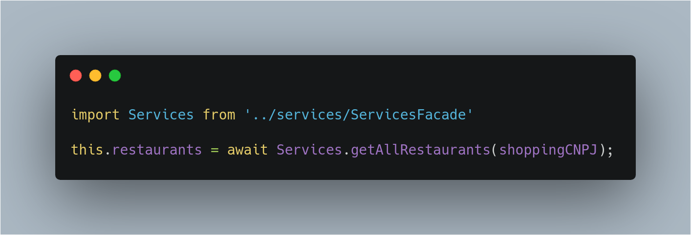

## Histórico de Revisão

|Data|Versão|Descrição|Autor|
|-|-|-|-|
|24/10/2019|0.1|Tópico Facade|[Pedro Féo](https://github.com/phe0)|

## Facade

Esse padrão é utilizado como uma forma de prover uma interação simplificada para um subsistema complexo da aplicação. O uso de __facade__ é adequado no caso da necessidade de se comunicar com dezesnas de features diferentes.

### Como foi utilizado no projeto

Foi criado um __Service Facade__, que possuia um conjunto de serviços a serem utilizados

### Objetivo & problema sanado

O __Facade__ foi utilizado para facilitar o processo de comunicação com os serviços do back-end, assim o desenvolvedor não precisa se preocupar com a localização e funcionamento do serviço em si, apenas em chama-lo da seguinte forma:

Passa a ser:

