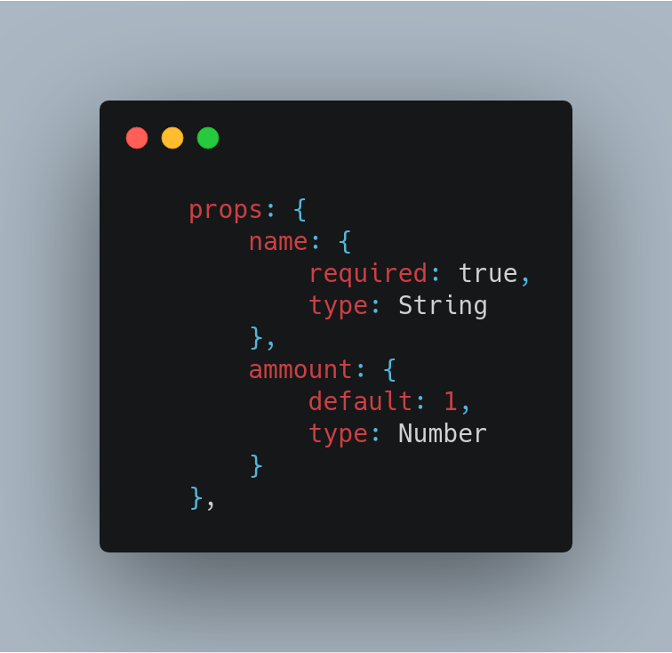
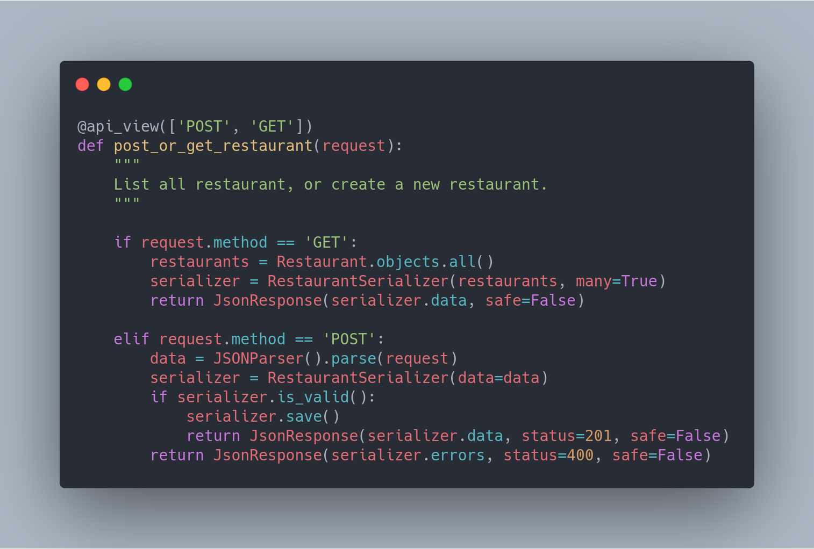

## Histórico de Revisão

|Data|Versão|Descrição|Autor|
|-|-|-|-|
|24/10/2019|0.1|Tópicos Facade, Composite e Flyweight|[Pedro Féo](https://github.com/phe0)|
|24/10/2019|0.1|Adição do Adapter |[Pedro Rodrigues](https://github.com/pedro-prp)|
|24/10/2019|0.2|Adição do Decorator| [Guilherme Marques](https://github.com/guilhesme23) [Saleh Kader](https://github.com/devsalula)|
|15/11/2019|0.5|Adicionar link ao código do Facade|[Pedro Féo](https://github.com/phe0)|

## Facade

Esse padrão é utilizado como uma forma de prover uma interação simplificada para um subsistema complexo da aplicação. O uso de __facade__ é adequado no caso da necessidade de se comunicar com dezesnas de features diferentes.

### Como foi utilizado no projeto

Foi criado um __Service Facade__, que possuia um conjunto de serviços a serem utilizados

### Objetivo & problema sanado

O __Facade__ foi utilizado para facilitar o processo de comunicação com os serviços do back-end, assim o desenvolvedor não precisa se preocupar com a localização e funcionamento do serviço em si, apenas em chama-lo da seguinte forma:

Passa a ser:

Encontrado no [front-end](https://github.com/fga-desenho-2019-2/qrcomer-front/blob/develop/src/services/ServicesFacade.js)

## Composite

Esse padrão permite a composição de objetos em uma estrutura de árvore, depois utilizando essas estruturas como objetos individuais.

### Como foi utilizado no projeto

O padrão composite faz parte da arquitetura padrão do Vue, onde componentes possuem uma estrutura de árvore, em que um componente é capaz de conter diversos outros.

### Objetivo & problema sanado

O uso de composite na arquitetura padrão do vue se deve a facilidade de reutilização de componentes, componentes individuais passam a poder ser utilizados em diversas partes do código, evitando reutilização de código.

## Flyweight

Esse padrão visa a performance do seu software, ele estabelece que informações podem ser compartilhadas entre objetos, em vez de fazer com que cada objeto precise inicializar esse dado.

### Como foi utilizado no projeto

O Flyweight, assim como o Composite faz parte da arquitetura padrão do Vue. O Vue utiliza o que chama de props para que possa passar informações pela sua estrutura de árvore, então um dado pode percorrer toda a árvore, assim uma mudança da informação no começo da árvore consegue afetar o seu restante. 

### Objetivo & problema sanado

O uso desse padrão tem como objetivo diminuir a quantidade de informação salva na aplicação, fazendo com que um dado seja compartilhado em diversos componentes.

## Decorator

O Decorator é um padrão de projeto __estrutural__, que permite acrescentar novos comportamentos a métodos de forma dinâmica. Os decoratos permitem estender o funcionamento de um método.

## Como foi utilizado no projeto

O Decorator foi utilizado pensando nos verbos de requisições do protocólo HTTP. Estendendo os métodos criados, para permitir a flexibilidade dos métodos de acordo com o tipo de requisição solicitada.

### Objetivo & problema sanado

O uso desse padrão permite o controle do tipo de requisição dentro dos métodos, garantindo a sua segurança e impedindo, por exemplo, que uma requisição do tipo 'DELETE' seja tratada por uma função concebida para o tratamento do tipo 'POST'.
## Adapter
Esse padrão como o próprio nome sugere se trata de um adaptador de um objeto para uma interface a qual ele seria incompatível. Ou seja ele tem como objetivo alterar um objeto até ele possa interagir com o subsequente desejado.

### Como foi utilizado no projeto
Ao utlizar Django Rest, ele proporciona os serializers, os quais transformam objetos *json* em objetos do tipo *Model Django*. No projeto é visto que os serviços possuem classes com seus atríbutos os quais são definidos em uma Model, assim sendo os serializer se fazem necessário uma vez que se deseje a adequação dos dados a um formato *json*.

### Objetivo & problema sanado
Essa funcionalidade é vista em praticamente todos os serviços. Já que eles demandam dados e uma modelagem dos mesmos em Models. Utilizando o padrão já oferecido pelo Django é possível enxergar o **adapter**. 

## Referências

[1] Erich Gamma, Richard Helm, Ralph Johnson, John Vlissides (1994). Design Patterns: Elements of Reusable Object-Oriented Software

