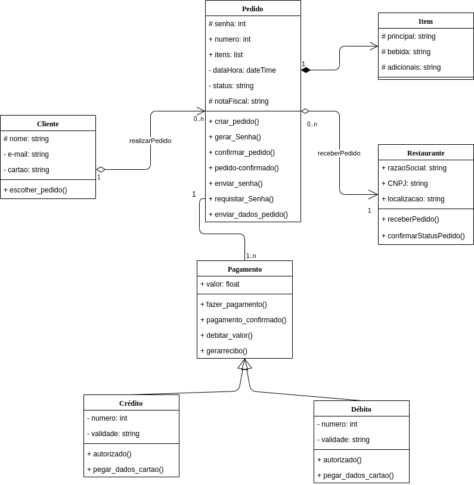

## Histórico de Revisão

| Data       | Versão | Descrição                                                               | Autor                                              |
| ---------- | ------ | ----------------------------------------------------------------------- | -------------------------------------------------- |
| 13/11/2019 | 0.1    | Estrutura do Documento, Introdução e Representação Arquitetural         | [Pedro Féo](https://github.com/phe0)               |
| 14/11/2019 | 0.2    | Casos de uso, visão de processo e visão de tamanho e desempenho         | [Matheus Blanco](https://github.com/MatheusBlanco) |
| 15/11/2019 | 0.3    | Refatorando diagramas e adicionando mais visões de processo             | [Matheus Blanco](https://github.com/MatheusBlanco) |
| 15/11/2019 | 0.4    | Requisitos e restrições arquiteturais, visão geral de classes e pacotes | [Matheus Blanco](https://github.com/MatheusBlanco) |
| 16/11/2019 | 0.5    | Modelos/Padrões Arquiteturais                                           | [Saleh Kader](https://github.com/devsalula)        |
| 17/11/2019 | 0.6    | Visão de dados                                                          | [Matheus Blanco](https://github.com/MatheusBlanco) |
| 17/11/2019 | 0.7    | Visão de implementação                                                  | [Pedro Féo](https://github.com/phe0)               |
| 17/11/2019 | 0.8    | Qualidade                                                               | [Saleh Kader](https://github.com/devsalula)        |
|17/11/2019|0.9|Visão de Implantação|[Matheus Blanco](https://github.com/MatheusBlanco)

## 1 Introdução

### 1.1 Finalidade

A intenção desse documento é documentar e transmitir informações relevantes ao QRComer do ponto de vista arquitetural. Facilitando a visualização e entendimento da estrutura do projeto.

### 1.2 Escopo

Este Documento de Arquitetura de Software se aplica ao Sistema QRComer. Desenvolvido na disciplina de Arquitetura e Desenho de Software da Universidade de Brasília.

### 1.3 Definições, Acrônimos e Abreviações

- UnB - Universidade de Brasília
- FGA - Faculdade do Gama
- QRComer - Sistema web com a intenção de reduzir filas em praças de alimentação
- Backend - Parte do sistema responsável por prover e organizar recursos para a interfáce do sistema
- Frontend - Parte do sistema responsável por ser a interfáce entre o sistema e o usuário
- HTTP - **Hypertext Transfer Protocol**
- API: **Application Programming Interface**

### 1.4 Referências

- [Translate-me](https://translate-me.github.io/docs/documentos/projeto/doc_de_arquitetura/)
- [Unigrade](https://ads-unigrade-2019-1.github.io/Wiki/dinamica06/DAS/#522-pacotes-de-design-significativos-do-ponto-de-vista-da-arquitetura)
- [Kalkuli](https://fga-eps-mds.github.io/2018.2-Kalkuli/docs/docArquitetura)
- [https://www.cin.ufpe.br/~gta/rup-vc/extend.formal_resources/guidances/examples/resources/sadoc_v1.htm](https://www.cin.ufpe.br/~gta/rup-vc/extend.formal_resources/guidances/examples/resources/sadoc_v1.htm)
- [https://www.cin.ufpe.br/~gta/rup-vc/core.informal_resources/guidances/examples/resources/ex_sad.htm](https://www.cin.ufpe.br/~gta/rup-vc/core.informal_resources/guidances/examples/resources/ex_sad.htm)
- [Redhat](https://www.redhat.com/pt-br/topics/microservices/what-are-microservices)
- [Movile](https://movile.blog/large-scale-javascript-arquitetura-de-componentes/)

## 2 Representação da Arquitetura

### 2.1 Componentes Importantes

#### Vue

Vue é um **framework progressivo** para a construção de interfaces para o usuário. O **framework** apresenta uma arquitetura baseada em componentes, permitindo a criação de telas completas e também pedaços de código isolados.

#### Sass

Sass é uma extensão de CSS que permite o uso de variáveis, regras de alinhamento, mixins e importações de outros arquivos. O Sass facilita a organização das folhas de estilo além de acelerar sua execução.

#### Django REST

O **framework** Django REST é um conjunto de ferramentas otimizada para a construção de Web APIs em Python.

#### Flask

Flask pe um micro-framework em Python que provê um modelo simples para desenvolvimento web.

#### Microserviços

A arquitetura de microserviços é uma solução arquitetural distribuída que desmembra o sistema da aplicação em pequenos blocos independentes, chamados de serviços. Cada um possuíndo seus próprios processos e banco de dados e se comunicam entre si através de requiisções HTTP.
Os serviços utilizados na aplicação serão:

- **Restaurante**, serviço responsável por conter as informações a respeito do shopping, restaurantes e cardápios. Desenvolvido utilizando Django REST
- **Pedidos**, serviço responsável por tratar toda a lógica que envolve um pedido, desde quando pe feito até ser concluído. Desenvolvido utilizando Django REST
- **Usuário**, serviço responsável por conter as lógicas de autenticação e armazenar as informações dos usuários e seus cartões. Desenvolvido utilizando Django REST
- **Gateway**, serviço responsável por intermediar a comunicação entre os demais serviços. Desenvolvido utilizando Flask
- **Frontend**, serviço responsável por ser a interface entre o sistema e o usuário. Desenvolvido em Vue

#### Comunicação entre serviços

A comunicação entre os serviços será realizada através da API Gateway, responsável por utilizar o protocolo HTTP para intermediar a comunicação.

### 2.2 Diagrama de Arquitetura

**Obs.**: Foi realizada uma mudança na arquitetura original do projeto, sendo removidas o Frontend de interação com o restaurante, sendo substituído por um acesso especializado ao backend do sistema, para que o QRComer possa ser facilmente integrado à sistemas já existentes. Além disso foi removido o serviço de pagamento, tendo em vista que para o escopo da disciplina o serviço se mostrou muito complexo.

## 3 Requisitos e Restrições Arquiteturais

| Requisito    | Solução                                                                                                                                                                                                                                                                                                                                                                                                                                                                   |
| ------------ | ------------------------------------------------------------------------------------------------------------------------------------------------------------------------------------------------------------------------------------------------------------------------------------------------------------------------------------------------------------------------------------------------------------------------------------------------------------------------- |
| Linguagem    | O front-end será feito em _JavaScript_, e o back-end em _Python_                                                                                                                                                                                                                                                                                                                                                                                                          |
| Plataforma   | O front-end será feito na plataforma _VueJS_ e o back-end será feito na plataforma _DjangoREST_                                                                                                                                                                                                                                                                                                                                                                           |
| Segurança    | Será implementado um sistema de token para que os dados sensíveis do usuário, shopping e restaurantes posssam permanecer seguros.                                                                                                                                                                                                                                                                                                                                         |
| Persistência | O sistema funcionará a partir de uma grande quantidade de transações entre o back-end e o front-end, onde dados de shoppings, restaurantes e pedidos serão a todo momento manipulados. Com foco nos dados relativos a pedidos, os quais serão continuamente criados ou deletados. Sendo assim, será utilizado um banco de dados relacional _PostgreSQL_, além de dados temporários _localstorage_ dos navegadores, para permitir uma utilização mais fluida e persistente |
| Arquitetura  | Será implementada uma arquitetura e microsserviços, para que os serviços separados possam se comunicar um com o outro de maneira simples e sem demanda de várias quantidades de memória e processamento, graças à sua natureza desacoplada.                                                                                                                                                                                                                               |

## 4 Visão de Caso de Uso

### 4.1 Caso de Uso da aplicação com requisitos de priorização Must have

Provindo da documentação referente ao [seminário 3](/../Wiki/docs/seminario3/diagramas_estaticos.md), este diagrama de caso de uso procura demonstrar o funcionamento geral da aplicação **QRComer**.

| **UC01**      | **Caso de Uso dos Requisitos**                                                                                                                 |
| ------------- | ---------------------------------------------------------------------------------------------------------------------------------------------- |
| **Versão**    | Atual: 1.2 (14/11)   Anterior: [1.1](#/seminario3/diagramas_estaticos/)                                                                     |
| **Descrição** | Caso de uso dos requisitos.                                                                                                                    |
| **Autor**     | [Shayane Alcântara](https://github.com/shayanealcantara), [Elias Bernardo](), [Leonardo](), [Matheus Blanco](https://github.com/MatheusBlanco) |

#### 4.1.1 Atores

| Atores               | Descrição                                                                                                                   |
| -------------------- | --------------------------------------------------------------------------------------------------------------------------- |
| Usuário              | Utilizador da plataforma, consumidor de produtos alimentícios presentes em _shoppings_ e praças de alimentação              |
| Gerador de QR-Code   | Funcionalidade geradora do QR-Code que permite o acesso à aplicação                                                         |
| Serviço de pagamento | Funcionalidade que simula um serviço real de pagamento                                                                      |
| Restaurante          | Utilizador do cadastro de informações, comerciante que pretende utilizar a aplicação para vender seus produtos alimentícios |

#### 4.1.2 Descrição dos Casos de Uso

| Casos de Uso                                           | Descrição dos Casos de Uso                                                                          |
| ------------------------------------------------------ | --------------------------------------------------------------------------------------------------- |
| UC01 - Cadastrar                                       | O usuário realiza o cadastro na aplicação                                                           |
| UC02 - Preencher Formulário                            | O usuário insere as informações necessárias                                                         |
| UC03 - Fazer Login                                     | O usuário acessa a aplicação                                                                        |
| UC04 - Alterar senha                                   | O usuário requisita uma alteração de senha                                                          |
| UC05 - Gerar QR-Code                                   | O gerador de QR-Code cria um link de acesso para o shopping                                         |
| UC06 - Ler QR Code no shopping                         | O usuário acessa o shopping a partir do link contido no QR-Code                                     |
| UC07 - Acessar a aplicação web                         | O gerador de QR-Code acessa a aplicação a partir da identificação do shopping                       |
| UC08 - Identificar shopping pelo QR-Code               | O gerador de QR-Code gera um código diferente para cada shopping, tornando o link seu identificador |
| UC09 - Ver lista de restaurantes                       | O usuário vê, na página do shopping, todos os restaurantes existentes no mesmo                      |
| UC10 - Selecionar restaurante                          | O usuário escolhe e abre um restaurante a partir da lista                                           |
| UC11 - Selecionar produto                              | O usuário escolhe e seleciona o produto na página de restaurante                                    |
| UC12 - Adicionar produto à sacola                      | O usuário confirma a seleção do produto e o mesmo é adicionado à sacola de pedidos                  |
| UC13 - Editar produtos da sacola                       | O usuário regula a quantidade de produtos na sacola                                                 |
| UC14 - Visualizar itens da sacola                      | O usuário pode ver, na sacola, todos os itens escolhidos                                            |
| UC15 - Finalizar pedido                                | O usuário confirma os itens na sacola e finaliza o pedido                                           |
| UC16 - Inserir forma de pagamento e adicionar CPF      | O usuário escolhe o cartão que deseja usar e adiciona o CPF para nota fiscal, na sacola             |
| UC17 - Cadastrar cartões                               | O usuário cadastra os seus cartões de crédito na conta da aplicação                                 |
| UC18 - Visualizar cartões cadastrados                  | O usuário pode visualizar todos os cartões cadastrados em sua conta                                 |
| UC19 - Remover cartões cadastrados                     | O usuário pode remover todos os cartões cadastrados em sua conta                                    |
| UC20 - Visualizar cartões cadastrados                  | O usuário pode visualizar todos os cartões cadastrados em sua conta                                 |
| UC21 - Efetuar pagamento                               | O usuário confirma o pedido e o serviço de pagamento debita o valor de seu cartão escolhido         |
| UC22 - Cancelar produto                                | O usuário deleta um ou todos os itens da sacola                                                     |
| UC23 - Integrar com API de pagamento                   | O serviço de pagamento simula uma API real de pagamento                                             |
| UC24 - Acessar o back-end para cadastro de dados       | O restaurante acessa o serviço de cadastro de informações do back-end                               |
| UC25 - Cadastrar restaurante                           | O restaurante adiciona as informações jurídicas necessárias para cadastrar o restaurante            |
| UC26 - Adicionar cardápio do estabelecimento           | O restaurante adiciona os itens ao seu cardápio, com valores, descrição e imagens                   |
| UC27 - Receber pedido                                  | O restaurante recebe o pedido criado pelo usuário, para preparação do alimento                      |
| UC28 - Gerar senha                                     | O usuário e o restaurante recebem uma senha gerada pela aplicação                                   |
| UC29 - Receber senha para retirada do pedido           | O usuário e o restaurante recebem uma senha gerada pela aplicação                                   |
| UC30 - Receber feedback da compra                      | O usuário deixa um feedback do produto para o restaurante                                           |
| UC31 - Receber feedback positivo                       | O restaurante recebe um feedback positivo                                                           |
| UC32 - Receber feedback negativo                       | O restaurante recebe um feedback negativo                                                           |
| UC33 - Visualizar mensagem de erro e retornar à sacola | O restaurante envia uma mensagem de erro caso o pedido não possa ser completado                     |

## 5 Visão Lógica

Modelagens em padrão UML, que representam os aspectos arquiteturais do sistema.

### 5.1 Diagramas de Pacotes

#### 5.1.1 _Back-End_

| **DP01**      | **Diagrama de pacotes do Back End**                                                                    |
| ------------- | ------------------------------------------------------------------------------------------------------ |
| **Versão**    | Atual: 2.0 (19/09)   Anterior: [1.1](#dp01-diagrama-de-pacotes-back-end)                            |
| **Descrição** | Diagrama de Pacotes para os Microserviços do Back End                                                  |
| **Autor**     | [Shayane Alcântara](https://github.com/shayanealcantara) e [Saleh Kader](https://github.com/devsalula) |

A API é dividida nas seguintes implementações:

- Models, que contém as declarações dos dados a serem utilizados;
- Serializer, que receberá os dados das models e permitirá a sua gravação nos bancos de dados;
- Views, que receberá dos serializers a lógica de gravação e permitirá a implementação de lógicas complementares de dados, além de definir quais ações _POST_, _GET_, _DELETE_ e _PATCH_ serão utilizadas;
- Urls, que irá declarar as rotas a serem acessadas tanto pelo microsserviço quanto pelo _front-end_;
- Test, onde se encontram os testes unitários das models e das views;
- Settings, que define a criação da aplicação, _hosts_ e outras dependências.

#### 5.1.2 _Front-end_

| **DP02**      | **Diagrama de pacotes do Front End**                                                                   |
| ------------- | ------------------------------------------------------------------------------------------------------ |
| **Versão**    | Atual: 3.0 (19/09)   Anterior: [2.0](../images/diagramas-uml/package_diagram_front_v3.png)          |
| **Descrição** | Diagrama de Pacotes para o Front End                                                                   |
| **Autor**     | [Shayane Alcântara](https://github.com/shayanealcantara) e [Saleh Kader](https://github.com/devsalula) |

A pasta principal _src_ contém as subpastas:

- assets, que contem imagens e css adicionados para ajustar a estética da User Interface para os padrões do protótipo;
- services, onde estão contidos alguns arquivos _.js_ que realizam certas funções e trabalhos repetitivos;
- utils, onde está contida a lógica de autenticação de usuário;
- screens, onde estão contidos:
  - os componentes principais, a serem reutilizados pelas várias telas do projeto;
  - as views, onde se encontram as implementações das telas, as quais fazem uso dos componentes;
  - o router, onde se encontram todas as rotas para as telas existentes.

### 5.2 Diagrama de classes e microserviços

#### 5.2.1 Diagrama de classes do microsserviço de usuário

| **DC01**      | **Diagrama de classes de usuário**                                            |
| ------------- | ----------------------------------------------------------------------------- |
| **Versão**    | Atual: 2.0 (18/09)   Anterior: [1.0](#dc01-diagrama-de-classes-de-usuario) |
| **Descrição** | Diagrama UML das classes do microserviço de usuário                           |
| **Autor**     | [Sara Silva](https://github.com/silvasara)                                    |

#### 5.2.2 Diagrama de classes do microsserviço de Restaurante

| **DC02**      | **Diagrama de classes de restaurante**                                                          |
| ------------- | ----------------------------------------------------------------------------------------------- |
| **Versão**    | Atual: 2.0 (19/09)   Anterior: [1.0](#dc02-diagrama-de-classes-de-restaurante)               |
| **Descrição** | Diagrama UML das classes do microserviço de restaurante                                         |
| **Autor**     | [Elias Bernardo](https://github.com/ebmm01) e [Leonardo Barreiros](https://github.com/leossb36) |

### 5.2.3 Diagrama de classes do microsserviço de Pedidos

O diagrama a seguir usa a notação UML para descrever as classes do microserviço de restaurante.

| **DC03**      | **Diagrama de classes de pedidos**                                            |
| ------------- | ----------------------------------------------------------------------------- |
| **Versão**    | Atual: 2.0 (13/09)   Anterior: [1.0](#dc03-diagrama-de-classes-de-pedidos) |
| **Descrição** | Diagrama UML das classes do microserviço de pedidos                           |
| **Autor**     | [Matheus Blanco](https://github.com/MatheusBlanco)                            |

diagramas de classe, diagramas de pacote, diagramas de de colaboração

tentar explicar a estrutura do projeto de uma forma lógica

## 6 Visão de Processo

### 6.1 Processo de cadastro de usuário:

| **DS02**      | **Diagrama de sequência de cadastro de usuário**                                  |
| ------------- | --------------------------------------------------------------------------------- |
| **Versão**    | Atual: 1.0 (19/09)   Anterior: -                                               |
| **Descrição** | Diagrama UML da sequência do cadastro de usuários                                 |
| **Autor**     | [Pedro Feo](https://github.com/Phe0), [Saleh Kader](https://github.com/devsalula) |

- O usuário acessa a plataforma;
- O usuário abre a página de cadastro;
- O usuário insere as informações de cadastro;
- O microsserviço de usuários realiza um POST para guardar as informações no banco;
- O microsserviço de usuários valida as informações com o banco de dados;
- O microsserviço de usuários cria o usuário com as informações salvas no banco;
- O usuário é redirecionado à página principal.

### 6.2 Processo de login de usuário:

| **DS02**      | **Diagrama de sequência de login de usuário**  |
| ------------- | ---------------------------------------------- |
| **Versão**    | Atual: 1.0 (19/09)   Anterior: -            |
| **Descrição** | Diagrama UML da sequência de login de usuários |
| **Autor**     | [Saleh Kader](https://github.com/devsalula)    |

- O usuário acessa a plataforma;
- O usuário abre a página de login;
- O usuário insere o e-mail e senha e aperta o botão de login;
- O microsserviço de usuário realiza um POST para verificar a existência do usuário no banco de dados;
- Se:
  - O usuário existir, com e-mail e senha corretos, o login é realizado;
  - O usuário não existir, ou e-mail ou senha errados, o login não é realizado;
- O usuário é redirecionado à página principal.

### 6.3 Processo de realização de pedido

| **DS01**      | **Diagrama de sequência de realização de pedidos**                                              |
| ------------- | ----------------------------------------------------------------------------------------------- |
| **Versão**    | Atual: 2.0 (19/09)   Anterior: [1.0](../images/diagramas-uml/diagrama_sequencia_pedidos.png) |
| **Descrição** | Diagrama UML da sequência do microsserviço de pedidos                                           |
| **Autor**     | [Pedro Feo](https://github.com/Phe0), [Matheus Blanco](https://github.com/MatheusBlanco)        |

- O usuário acessa a plataforma;
- O usuário abre a página de login;
- O usuário realiza o login e é redirecionado à página principal;
- O usuário acessa a página de shopping;
- O usuário seleciona um restaurante e abre sua página;
- O usuário escolhe e seleciona um item dentro do restaurante;
- O usuário adiciona o item escolhido à sua sacola;
- O usuário confirma o pedido e o mesmo é criado no microsserviço de pedidos;
- A aplicação chama o serviço de pagamento simulado;
- O serviço de pagamento simula um pagamento real, a partir dos dados.

### 6.4 Processo de cadastro de cartão

| **DS02**      | **Diagrama de sequência de cadastro de cartão** |
| ------------- | ----------------------------------------------- |
| **Versão**    | Atual: 1.0 (19/09)   Anterior: -             |
| **Descrição** | Diagrama UML da sequência do cadastro de cartão |
| **Autor**     | [Pedro Feo](https://github.com/Phe0)            |

- O usuário acessa a plataforma;
- O usuário abre a página de login;
- O usuário realiza o login e é redirecionado à página principal;
- O usuário acessa a página de cartão;
- O usuário clica no botão de adicionar cartão;
- O usuário insere as informações do cartão;
- O microsserviço de usuário realiza um POST para salvar os dados no banco de dados;
- O banco de dados cria um cartão a partir dos dados salvos.

### 6.5 Processo de cadastro de restaurante no back-end

| **DC02**      | **Diagrama de colaboração do microsserviço de Restaurante**                                 |
| ------------- | ------------------------------------------------------------------------------------------- |
| **Versão**    | Atual: 1.0 (19/09)   Anterior: -                                                         |
| **Descrição** | Diagrama UML de colaboração do microsserviço de restaurante                                 |
| **Autor**     | [Pedro Rodrigues](https://github.com/pedro-prp), [Sara Silva](https://github.com/silvasara) |

- O restaurante deve acessar o serviço back-end de CRUD de restaurante;
- O restaurante cria um texto em JSON com as informações do restaurante, incluindo informações jurídicas e nome fantasia;
- O restaurante então cria um texto em JSON para cadastrar uma categoria;
- O restaurante então cria um texto em JSON para cadastrar um item de seu menu;
- O restaurante repete as duas últimas ações para criar a quantidade necessária de categorias e de itens do menu.

### 6.6 Processo de checagem de pedidos antigos

| **DS01**      | **Diagrama de sequência de checagem de pedidos antigos**                                                |
| ------------- | ------------------------------------------------------------------------------------------------------- |
| **Versão**    | Atual: 2.0 (17/09)   Anterior: [1.0](../images/diagramas-uml/diagrama_sequencia_pedidos_antigos.png) |
| **Descrição** | Diagrama UML da sequência do microsserviço de checagem de pedidos antigos                               |
| **Autor**     | [Pedro Feo](https://github.com/Phe0), [Matheus Blanco](https://github.com/MatheusBlanco)                |

- O usuário acessa a plataforma;
- O usuário abre a página de login;
- O usuário realiza o login e é redirecionado à página principal;
- O usuário acessa a página de histórico de pedidos;
- O front-end realiza uma requisição ao serviço de pedidos;
- O serviço de pedidos busca no banco de dados os pedidos anteriormente realizados;
- Os pedidos são enviados e renderizados no front-end;
- O front-end mostra para o usuário os pedidos anteriormente realizados.

### 6.7 Processo de checagem de pedidos ativos

| **DS01**      | **Diagrama de sequência de checagem de pedidos ativos**                                                  |
| ------------- | -------------------------------------------------------------------------------------------------------- |
| **Versão**    | Atual: 3.0 (15/11)   Anterior: [2.0](../images/diagramas-uml/diagrama_sequencia_pedidos_ativos-2.png) |
| **Descrição** | Diagrama UML da sequência do microsserviço de checagem de pedidos ativos                                 |
| **Autor**     | [Pedro Feo](https://github.com/Phe0), [Matheus Blanco](https://github.com/MatheusBlanco)                 |

- O usuário acessa a plataforma;
- O usuário abre a página de login;
- O usuário realiza o login e é redirecionado à página principal;
- O usuário acessa a página de histórico de pedidos;
- O front-end realiza uma requisição ao serviço de pedidos;
- O serviço de pedidos busca no banco de dados os pedidos que estão ativos;
- Os pedidos são enviados e renderizados no front-end;
- O front-end mostra para o usuário os pedidos ativos.

## 7 Visão da Implantação

A implantação do sistema será realizada a partir do seguimento das seguintes etapas. Ela terá como objetivo garantir que as funcionalidades entregues para o produto sejam da melhor possível qualidade.

| **DIA01**      | **Diagrama de implantação**                                                  |
| ------------- | -------------------------------------------------------------------------------------------------------- |
| **Versão**    | Atual: 1.0 (17/11)  |
| **Descrição** | Diagrama representando as fases de implantação do sistema                             |
| **Autor**     | [Matheus Blanco](https://github.com/MatheusBlanco)                |

## 8 Visão da Implementação

A implementação do sistema é composto de 6 componentes externos, sendo eles servidores e o smartphone do usuário.
Cada um dos microserviços apresenta um servidor próprio, onde se encontra sua rest API e seu banco de dados. Enquanto isso o servidor do frontend apresenta apenas um componente, sendo ele o próprio frontend em Vue, já que não necessita de um banco de dados.
Toda comunicação entre servidores é feita através protocolo http, enquanto a comunicação entre api e banco de dados é realizada via tcp/ip.

| **DI01**      | **Diagrama de implementação**                                                  |
| ------------- | -------------------------------------------------------------------------------------------------------- |
| **Versão**    | Atual: 1.0 (17/11)  |
| **Descrição** | Diagrama UML representando os componentes do sistema e sua comunicação                             |
| **Autor**     | [Pedro Feo](https://github.com/Phe0)                |

## 9 Visão de Dados

### 9.1 Diagramas

### 9.1.1 Costumer Service

Diagrama que representa o microsserviço de usuário, suas entidades, **usuário** e **cartão**, e seu respectivo relacionamento. No caso, um **usuário** pode conter um ou mais cartões, sendo que um cartão só póde ser utilizado por um usuário. O **cartão** recebe do **usuário** a chave primária CPF, a qual restringe e identifica o **usuário** cadastrado na aplicação, e os cartões que o mesmo possui.

O **usuário** possui como atributos cpf como chave primária, e-mail, nome e senha, sendo que estes últimos são necessários para a realização do cadastro na aplicação e todos, menos e-mail e cpf, podem ser alterados.

#### Diagrama Entidade Relacionamento

| **DER01** | **DER**  |
|--|--|
| **Versão**| Atual: 1.0 (16/09)   Anterior: - | 
| **Descrição** | Diagrama Entidade Relacionamento para o microserviço de usuário | 
|**Autor**| [Alan Lima](https://github.com/alanrslima) | 

### 9.1.2 Restaurant Service

O microsserviço de restaurante faz uso de uma série de entidades e relacionamentos, pelo fato de necessitar de uma quantidade maior de dados para que seu funcionamento seja otimizado. A entidade **restaurante** possui **horários de funcionamento**, **categorias** e **cardápios**, além de estar inserida dentro de um **shopping**. Ela recebe a chave primária CNPJ do **shopping** para utilizar como identificador, além de ter seu próprio CNPJ, que transmite para outras entidades. As entidades **horário de funcionamento**, **categoria** e **cardápio** possuem seus identificadores próprios, além de **nome/descrição/horaFinal** e **horaInicial** para utilização nos modelos de dados. 

A entidade **cardápio** possui dentro de sim uma série de **itens**, que possuem seus próprios atributos de identificação. Diferentemente das outras entidades, **itens** também possui o atributo valor, o qual irá definir os preços dos **itens** específicos. **Itens** pode ser classificado, ainda, em **categorias de itens**, as quais irão filtrar ainda mais a entidade.

Em relação a funcionamento, **shopping** possui **restaurantes** cadastrados em seu banco de dados, o qual tem **horarios de funcionamento** e é filtrado por **categorias**. O **restaurante** possui um **cardápio** de **itens**, cada qual contendo sua própria **categoria**, valores, descrição e tempo de preparo. O usuário é capaz de interagir com a plataforma graças a este banco de dados, em sua maior parte. O fluxo de interação com o serviço de restaurante se inicia após o login/cadastro, quando o usuário consegue acessar o shopping e seus respectivos restaurantes. Quando em um restaurante, o usuário escolhe um item e o adiciona à sacola de pedidos.

#### Diagrama Entidade Relacionamento

#### Versão 1.0

| **DER02** | **DER**  |
|--|--|
| **Versão**| Atual: 2.0 (17/09)   Anterior: - | 
| **Descrição** | Diagrama Entidade Relacionamento para o microserviço de restaurante | 
|**Autor**| [Alan Lima](https://github.com/alanrslima) | 

#### Versão 2.0

| **DER02** | **DER**  |
|--|--|
| **Versão**| Atual: 1.0 (16/09)   Anterior: - | 
| **Descrição** | Diagrama Entidade Relacionamento para o microserviço de restaurante | 
|**Autor**| [Alan Lima](https://github.com/alanrslima) | 

### 9.1.3 Order Service

O microsserviço de pedidos é o microsserviço que compôe a interação final do usuário com a aplicação. O modelo de dados do mesmo gira em torno da entidade **pedidos**, a qual possui identificador, hora da realização, cnpj do restaurante, cpf do comprador, preço entre outros. Um **pedido** possui os seus **itens** que o compôem, e os mesmos são derivados dos itens existentes no cardápio do restaurante. Um **pedido** também possuirá uma **senha**, a qual é responsável por identificar se o pedido está sendo preparado, foi entregue e demais ações que dependem da interação entre o usuário e o restaurante.

Em relação a funcionamento, um usuário, em sua sacola de pedidos, confirma todos os itens que deseja comprar. Ele também é capaz de escolher o cartão de crédito que será utilizado no pagamento do mesmo, além de poder adicionar um CPF na nota. Ao confirmar o pedido, o banco de dados o microsserviço receberá uma nova tupla com as informações a serem passadas para o restaurante em questão. Posteriormente, o pedido e o restaurante poderão ser avaliados pelo comprador.

#### Diagrama Entidade Relacionamento

#### Versão 1.0

| **DER03** | **DER**  |
|--|--|
| **Versão**| Atual: 1.0 (16/09)   Anterior: - | 
| **Descrição** | Diagrama Entidade Relacionamento para o microserviço de pedidos | 
|**Autor**| [Alan Lima](https://github.com/alanrslima) | 

#### Versão 2.0

| **DER03** | **DER**  |
|--|--|
| **Versão**| Atual: 2.0 (16/09)   Anterior: [1.0](https://i.imgur.com/30hWV8J.png) | 
| **Descrição** | Diagrama Entidade Relacionamento para o microserviço de pedidos | 
|**Autor**| [Alan Lima](https://github.com/alanrslima), [Matheus Blanco](https://github.com/MatheusBlanco) | 

### 9.2 Diagrama geral

#### 9.2.1 Modelo Entidade Relacionamento

| **Entidade** | **Atributo**|
|:--:|:--:|
| SHOPPING | <u>cnpj</u> nomeShopping telefone(multivalorado) endereco(composto)|
| CATEGORIARESTAURANTE | <u>idCategoria</u> nomeCategoria descricao |
| RESTAURANTE | <u>cnpjRestaurante</u> nomeRestaurante numero bloco descricao idCategoria |
| USUARIO | <u>cpf</u> nomeUsuario email senha |
| CARDAPIO | <u>idCardapio</u> nomeCardapio descricao cnpjRestaurante |
| CARTAO | <u>numero</u> nomeTitular validade cvv |
| CATEGORIAITEM | <u>idCategoriaItem</u> nomeCategoriaItem descricao |
| ITEM | <u>idItem</u> nomeItem descricao valorUnitario quantidade idCategoriaItem cnpjRestaurante idCardapio |
| PEDIDO | <u>codigo</u> dataHoraRealizado valorTotal statusPedido cpf cnpjShopping cnpjRestaurante |

| **Entidade** | **relação** | **Entidade**| **Descrição** | **Cardinalidade**|
|:--:|:--:|:--:|:--:|:--:|
| **SHOPPING** | possui | **RESTAURANTE** |Um shopping possui um ou mais restaurantes cadastrados. Um restaurante pode estar associado a um ou mais shoppings | **N:M** |
| **RESTAURANTE** | possui | **CATEGORIARESTAURANTE** | Um restaurante possui uma ou mais categorias. Uma categoria pode estar associada a um ou mais restaurantes. | **N:M** |
| **RESTAURANTE** | possui | **CARDAPIO** | Um restaurante possui um ou mais cardapios. Um cardapio pode estar associada a um ou mais restaurante. | **N:M** |
| **RESTAURANTE** | possui | **ITEM** | Um restaurante possui um ou mais itens. Um item pode estar associada a um ou mais restaurantes. | **N:M** |
| **CARDAPIO** | possui | **ITEM** | Um cardapio possui um ou mais itens. Um item pode estar associada a um ou mais cardapios. | **N:M** |
| **ITEM** | possui | **CATEGORIAITEM** | Um item possui um ou mais categorias. Uma categoria pode estar associada a um ou mais itens. | **N:M** |
| **USUARIO** | realiza | **PEDIDO** | Um usuario realiza um ou mais pedidos. Um pedido pode estar associada a um ou mais usuarios. | **N:M** |
| **PEDIDO** | possui | **ITEM** | Um pedido possui um ou mais itens. Um item pode estar associado a um ou mais pedidos. | **N:M** |

| **MER01** | **MER**  |
|--|--|
| **Versão**| Atual: 1.0 (16/09)   Anterior: - | 
| **Descrição** | Modelo Entidade Relacionamento | 
|**Autor**| [Leonardo Barreiros](https://github.com/leossb36) | 

#### 9.2.2 Diagrama Entidade Relacionamento

#### Versão 1.0

| **DER01** | **DER**  |
|--|--|
| **Versão**| Atual: 1.0 (26/08)   Anterior: - | 
| **Descrição** | Diagrama Entidade Relacionamento para a aplicação | 
|**Autor**| [Alan Lima](https://github.com/alanrslima) | 

#### Versão 2.0

| **DER01** | **DER**  |
|--|--|
| **Versão**| Atual: 2.0 (26/08)   Anterior: [1.0](https://i.imgur.com/t8GjGTu.png) | 
| **Descrição** | Diagrama Entidade Relacionamento para a aplicação | 
|**Autor**| [Alan Lima](https://github.com/alanrslima), [Matheus Blanco](https://github.com/MatheusBlanco)| 

### 9.3 Dicionário de dados

#### 9.3.1 Entidade: Cartão

**Descrição**: Modo de pagamento utilizado pelo cliente

|Atributo|Propriedades do Atributo| Tipo de dado|Tamanho|Descrição|
|-|-|-|-|-|
|numero|chave primária obrigatória|bigint|16|Número da frente do cartão|
|cpfcnpj|obrigatória|bigint|20|Dados jurídicos do dono|
|validade|obrigatória|date||Validade do cartão|
|cvv|obrigatória|int||Código de segurança|
|nomeTitular|obrigatória||varchar|50|Nome do titular da conta do cartão|
|email|chave estrangeira obrigatória|varchar|50|E-mail do usuário|

#### 9.3.2 Entidade: Usuário

**Descrição**: Usuário da aplicação, público-alvo

|Atributo|Propriedades do Atributo| Tipo de dado|Tamanho|Descrição|
|-|-|-|-|-|
|nome|obrigatória|varchar|50|Nome do Usuário|
|email|chave primária obrigatória|varchar|50|E-mail do Usuário|
|senha|obrigatória|varchar|20|Senha do Usuário na aplicação|

#### 9.3.3 Entidade: Avaliação_Pedido

**Descrição**: Momento de visualização do pedido pelo restaurante

|Atributo|Propriedades do Atributo| Tipo de dado|Tamanho|Descrição|
|-|-|-|-|-|
|id|chave primária obrigatória|bigint|16|Identificação do pedido|
|nota|obrigatória|varchar|200|Nota fiscal|
|descricao|obrigatória|varchar|200|Descrição do pedido|
|dataHora|obrigatória|date time||Hora e dia do registro do pedido|
|numero|obrigatória|int||Número do pedido a ser chamado|
|horaRealizado|obrigatória|time||Hora da montagem do pedido|
|formaPagamento|obrigatória|enum('Debito', 'Credito', 'Dinheiro')||Forma na qual o pedido foi pago|
|email|chave estrangeira obrigatória|varchar|50|E-mail do usuário|

#### 9.3.4 Relacionamento: possui

**Descrição**: Possessão de status de pedido

|Atributo|Propriedades do Atributo| Tipo de dado|Tamanho|Descrição|
|-|-|-|-|-|
|id|chave estrangeira obrigatória|int|3|Identificação do status do pedido|
|id|chave estrangeira obrigatória|bigint|16|Identificação do pedido|

#### 9.3.5 Entidade: Senha

**Descrição**: Senha de um pedido

|Atributo|Propriedades do Atributo| Tipo de dado|Tamanho|Descrição|
|-|-|-|-|-|
|id|chave primária obrigatória|int|3|Identificação da senha do pedido|

#### 9.3.6 Relacionamento: possui

**Descrição**: Possessão de item no cardápio referente ao pedido

|Atributo|Propriedades do Atributo| Tipo de dado|Tamanho|Descrição|
|-|-|-|-|-|
|id|chave estrangeira obrigatória|bigint|16|Identificação do item no cardápio|
|id|chave estrangeira obrigatória|bigint|16|Identificação do pedido|

#### 9.3.7 Entidade: ItemCardapio

**Descrição**: Representa um item contido no cardápio

|Atributo|Propriedades do Atributo| Tipo de dado|Tamanho|Descrição|
|-|-|-|-|-|
|id|chave primária obrigatória|bigint|16|Identificação do item no cardápio|
|nome|obrigatória|varchar|50|Nome do item|
|valor|obrigatória|float||Preço do item|
|descricao|obrigatória|varchar|200|Descrição do item|
|observação|obrigatória|varchar|200|Observação em referência ao item pedido|

#### 9.3.8 Relacionamento: possui

**Descrição**: Possessão de categoria referente a cardápios

|Atributo|Propriedades do Atributo| Tipo de dado|Tamanho|Descrição|
|-|-|-|-|-|
|id|chave estrangeira obrigatória|bigint|16|Identificação do item no cardápio|
|id|chave estrangeira obrigatória|bigint|16|Identificação da categoria de cardápio|

#### 9.3.9 Entidade: CategoriaCardapio

**Descrição**: Representa uma categoria que identifica o cardápio

|Atributo|Propriedades do Atributo| Tipo de dado|Tamanho|Descrição|
|-|-|-|-|-|
|id|chave primária obrigatória|bigint|16|Identificação da categoria de cardápio|
|descricao|obrigatória|varchar|200|Descrição da categoria do cardápio|

#### 9.3.10 Relacionamento: possui

**Descrição**: Possessão de cardápios referente a categorias

|Atributo|Propriedades do Atributo| Tipo de dado|Tamanho|Descrição|
|-|-|-|-|-|
|id|chave estrangeira obrigatória|bigint|16|Identificação do cardápio em questão|
|id|chave estrangeira obrigatória|bigint|16|Identificação da categoria de cardápio|

#### 9.3.11 Entidade: Cardapio

**Descrição**: Representa um cardápio de determinado restaurante

|Atributo|Propriedades do Atributo| Tipo de dado|Tamanho|Descrição|
|-|-|-|-|-|
|numero|obrigatória|int||Número id do restaurante|
|descricao|obrigatória|varchar|200|Descrição do cardápio e seus itens|
|id|chave primária obrigatória|bigint|16|Identificação do cardápio em questão|

#### 9.3.12 Relacionamento: possui

**Descrição**: Possessão de cardápios referente a estabelecimentos

|Atributo|Propriedades do Atributo| Tipo de dado|Tamanho|Descrição|
|-|-|-|-|-|
|cnpj|chave estrangeira obrigatória|bigint|20|CNPJ do estabelecimento|
|id|chave estrangeira obrigatória|bigint|16|Identificação do cardápio em questão|

#### 9.3.13 Entidade: Estabelecimento

**Descrição**: Representa um estabelecimento restaurante

|Atributo|Propriedades do Atributo| Tipo de dado|Tamanho|Descrição|
|-|-|-|-|-|
|cnpj|chave primária obrigatória|bigint|20|CNPJ do estabelecimento|
|nome|obrigatória|varchar|50|Nome do estabelecimento|
|numero|obrigatória|int||Número da loja, em questão de endereço|
|descricao|obrigatória|varchar|200|Descrição do estabelecimento e seus alimentos|
|tempoPreparo|obrigatória|time||Tempo necessário para se preparar um alimento|

#### 9.3.14 Relacionamento: possui

**Descrição**: Possessão de estabelecimentos em relação a categorias

|Atributo|Propriedades do Atributo| Tipo de dado|Tamanho|Descrição|
|-|-|-|-|-|
|cnpj|chave estrangeira obrigatória|bigint|20|CNPJ do estabelecimento|
|id|chave estrangeira obrigatória|bigint|16|Identificação da categoria|

#### 9.3.15 Entidade: CategoriaEstabelecimento

**Descrição**: Representa a categoria de um estabelecimento

|Atributo|Propriedades do Atributo| Tipo de dado|Tamanho|Descrição|
|-|-|-|-|-|
|id|chave primária obrigatória|bigint|16|Identificação da categoria|
|descricao|obrigatória|varchar|200|Descrição da categoria do estabelecimento|

#### 9.3.16 Relacionamento: realiza

**Descrição**: Realização de pedidos

|Atributo|Propriedades do Atributo| Tipo de dado|Tamanho|Descrição|
|-|-|-|-|-|
|email|chave estrangeira obrigatória|varchar|50|E-mail do Usuário|
|id|chave estrangeira obrigatória|bigint|16|Identificação do pedido|

#### 9.3.17 Relacionamento: em

**Descrição**: Possessão de local de realização de pedidos

|Atributo|Propriedades do Atributo| Tipo de dado|Tamanho|Descrição|
|-|-|-|-|-|
|cnpj|chave estrangeira obrigatória|bigint|20|CNPJ do estabelecimento|
|id|chave estrangeira obrigatória|bigint|16|Identificação do pedido|

#### 9.3.18 Relacionamento: possui

**Descrição**: Possessão de categoria de itens

|Atributo|Propriedades do Atributo| Tipo de dado|Tamanho|Descrição|
|-|-|-|-|-|
|id|chave estrangeira obrigatória|bigint|16|Identificação do item no cardápio|
|id|chave estrangeira obrigatória|bigint|16|Identificação da categoria do item|

#### 9.3.19 Entidade: CategoriaItem

**Descrição**: Representa a categoria de um item

|Atributo|Propriedades do Atributo| Tipo de dado|Tamanho|Descrição|
|-|-|-|-|-|
|titulo|obrigatória|varchar|50|Título da categoria do item|
|descricao|obrigatória|varchar|200|Descrição da categoria do item|
|statusObrigatório|obrigatória|enum('S','N')||?|
|id|chave primária obrigatória|bigint|16|Identificação da categoria do item|

#### 9.3.20 Relacionamento: tem

**Descrição**: Possessão de item por categoria

|Atributo|Propriedades do Atributo| Tipo de dado|Tamanho|Descrição|
|-|-|-|-|-|
|id|chave estrangeira obrigatória|bigint|16|Identificação da categoria do item|
|id|chave estrangeira obrigatória|bigint|16|Identificação do item da categoria|

#### 9.3.21 Entidade: ItemCategoria

**Descrição**: Representa o item de uma categoria

|Atributo|Propriedades do Atributo| Tipo de dado|Tamanho|Descrição|
|-|-|-|-|-|
|titulo|obrigatória|varchar|50|Título do item da categoria|
|descricao|obrigatória|varchar|200|Descrição do item da categoria|
|valor|obrigatória|float||Preço do item da categoria|
|id|chave primária obrigatória|bigint|16|Identificação do item da categoria|

#### 9.3.22 Relacionamento: possui

**Descrição**: Possessão de horários

|Atributo|Propriedades do Atributo| Tipo de dado|Tamanho|Descrição|
|-|-|-|-|-|
|diaSemana|chave estrangeira obrigatória|varchar|16|Dias da semana que o estabelecimento funciona|
|cnpj|chave estrangeira obrigatória|bigint|20|CNPJ do estabelecimento|

#### 9.3.23 Entidade: HorarioFuncionamento

**Descrição**: Representa o horário de funcionamento de um estabelecimento

|Atributo|Propriedades do Atributo| Tipo de dado|Tamanho|Descrição|
|-|-|-|-|-|
|diaSemana|chave primária obrigatória|varchar|16|Dias da semana que o estabelecimento funciona|
|horaInicial|obrigatória|time||Hora de abertura|
|horaFinal|obrigatória|time||Hora de fechamento|

#### 9.3.24 Relacionamento: possui

**Descrição**: Possessão de horários por parte do Shopping

|Atributo|Propriedades do Atributo| Tipo de dado|Tamanho|Descrição|
|-|-|-|-|-|
|diaSemana|chave estrangeira obrigatória|varchar|16|Dias da semana que o Shopping funciona|
|cnpj|chave estrangeira obrigatória|bigint|20|CNPJ do Shopping|

#### 9.3.25 Entidade: Shopping

**Descrição**: Representa o shopping que abriga um estabelecimento

|Atributo|Propriedades do Atributo| Tipo de dado|Tamanho|Descrição|
|-|-|-|-|-|
|nome|obrigatória|varchar|50|Nome do shopping|
|cnpj|chave primária obrigatória|bigint|20|CNPJ do Shopping|
|telefone|chave estrangeira obrigatória|varchar|30|Identificação do telefone do shopping|

#### 9.3.26 Entidade: telefone

**Descrição**: Representa o telefone de um shopping

|Atributo|Propriedades do Atributo| Tipo de dado|Tamanho|Descrição|
|-|-|-|-|-|
|telefone|chave primária obrigatória|varchar|30|Identificação do telefone do shopping|
|telefone|obrigatória|varchar|30|Identificação do telefone do shopping|

#### 9.3.27 Relacionamento: possui

**Descrição**: Possessão de endereço por parte do Shopping

|Atributo|Propriedades do Atributo| Tipo de dado|Tamanho|Descrição|
|-|-|-|-|-|
|cnpj|chave estrangeira obrigatória|bigint|20|CNPJ do Shopping|
|latitude|chave estrangeira obrigatória|bigint|16|Latitude da localização do endereço|
|longitude|chave estrangeira obrigatória|bigint|16|Longitude da localização do endereço|

#### 9.3.28 Entidade: Endereço

**Descrição**: Representa o endereço de um shopping

|Atributo|Propriedades do Atributo| Tipo de dado|Tamanho|Descrição|
|-|-|-|-|-|
|rua|obrigatória|varchar|20|Rua do shopping|
|numero|obrigatória|int||Número do shopping|
|logradouro|obrigatória|varchar|20|Logradouro do shopping|
|cidade|obrigatória|varchar|20|Cidade onde o shopping se localiza|
|estado|obrigatória|varchar|20|Estado onde o shopping se localiza|
|pais|obrigatória|varchar|20|Pais onde o shopping se localiza|
|latitude|chave estrangeira obrigatória|bigint|16|Latitude da localização do endereço|
|longitude|chave estrangeira obrigatória|bigint|16|Longitude da localização do endereço|
|bairro|obrigatória|varchar|20|Bairro onde o shopping se localiza|

## 10 Qualidade

No padrão de qualidade da arquitetura, o modelo arquitetural escolhido para o projeto facilita na escalabilidade da aplicação. A arquitetura de microsserviços por atuar de forma desacoplada ela distribui as responsabilidades da aplicação em pequenos serviços, descomplicando o desenvolvimento. O desacoplamento também contribui para a manutenabilidade da aplicação. Por fim, o padrão de microsserviços possui uma boa Reliabilidade, por permitir que caso um dos pequenos serviços que esteja atuando sofra algum problema, ele não prejudica todo o resto da aplicação, permitindo que outros microsserviços funcionem de maneira independente. 

<!-- Mostrar formas de medir qualidade do código e do produto, cobertura de testes por exemplo -->

## 11 Tamanho e Desempenho

O WebApp QRComer possui um tamanho médio de 200MB. O mesmo foi desenvolvido para funcionar em navegadores tanto em formato desktop quanto formato mobile, com foco maior em mobile. Pelo fato de ser um site acessível a partir de navegadores, não existe a necessidade de instalação de nenhum serviço, sejam eles o front-end ou as APIs dos microsserviços.

Sendo assim, o mesmo não ocupa espaço físico nos aparelhos dos usuários, restringindo-se apenas a memória temporária e CACHE. O sistema funciona a partir de requisições feitas entre as APIS e o front-end, todas realizadas pela internet. Sendo assim, espera-se que o tamanho físico do projeto não seja um diferencial significativo nos aparelhos de seus consumidores, nem que o desempenho seja comprometido por questões parecidas.

<!-- Mostrar volume de dados do sistema, tamanho do projeto, explicar e determinar normas de desempenho -->

## 12 Modelos/Padrões Arquiteturais

### Microsserviços

A arquitetura escolhida pelo grupo foi a arquitetura de microsserviços. Com essa arquitetura, a aplicação do QrComer foi desmembrada em pequenos componentes responsáveis por executar uma função diferente da aplicação. Os microsserviços podem criados e implantados de maneira independentes, assim caso um dos microsserviços seja comprometido, os microsserviços remanescentes continuarão funcionando normalmente e a aplicação não ficará tão prejudicada.

O grupo escolheu a arquitetura de microsserviços pela facilidade de desenvolvimento. Além disso, essa arquitetura permite que o desenvolvimento possa ser simultâneo, diminuindo o tempo de entrega e tornando a aplicação facilmente escalável.

### Padrão Arquitetural no Back

A tecnologia utilizada na construção dos microsserviços foi o Django Rest Framework, que é um framework Python, muito utilizado para criar Rest APIS de maneira rápida e prática. O Django Rest é orientado a MVT (Model, View, Template), padrão semelhante ao MVC (Model, View, Controller). No caso de nossa utilização, foi removido o Template do padrão, por ser justamente, uma camada de visualização o que não será necessário, já que o framework está sendo utilizado no backend.

Além do Django Rest, o grupo optou por utilizar do Flask, outro framework Python, para a construção do Gateway. O Gateway é responsável por atuar como um ponto de comunicação do back com o front, gerenciando as requisições da aplicação por meio de métodos do protocolo HTTP. A opção pelo Flask, foi feito por ser um microframework, diminuindo a necessidade de realizar tanta configurações que muitas vezes não serão utilizadas.

### Padrão Arquitetural no Front

No front a opção foi feita pelo VueJS, framework javascript, com uma arquitetura orientada a componentes. A Arquitetura de Componentes está baseada em pequenos objetos da interface, que são reutilizáveis e independentes, otimizando o processo de desenvolvimento da aplicação.
